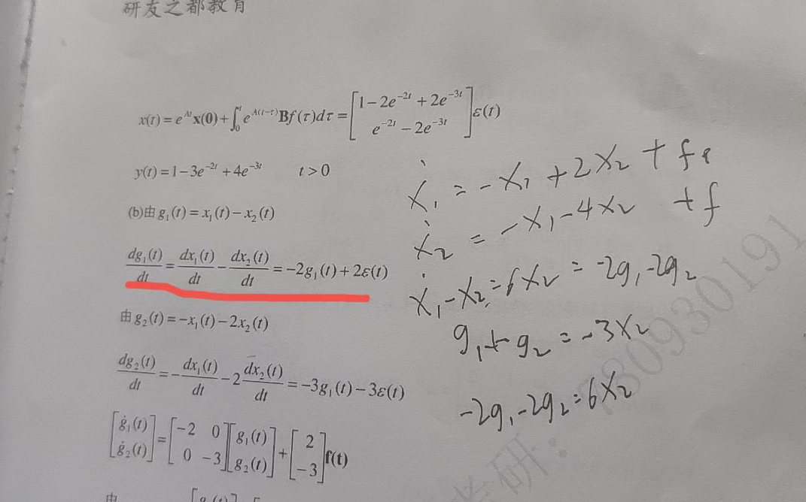

# 专业课笔记

## 关于阶跃函数的拉普拉斯延时效应：

如果在用留数法求出来逆变换的冲激响应发现了e的a(t-b)，那么会出现阶跃的t-b

如果在象函数里出e的at，那么会出现阶跃的t-a

## 阶跃函数的化简

遇到阶跃的傅里叶变换最好求导进行化简

## 线性与时变的判断  因果与稳定性（时域）

**线性**：（记住两个f1，f2比较）

非线性

1.出现==常数==的就不是线性（常数）

2.出现==输入输出的一个式子组合==就不是线性（输入输出函数组合），==出现变系数就是线性==

举个例子sint*y（t)这个就是线性时变系统

==线性系统中出现初始状态了，那么就要氛围状态线性和输入线性，分别判断线性才能线性==

==时不变系统中出现初始状态了，那么不用管，因为时不变系统是看输入线性的==

**时变**：记住ft的自变量时移，因变量时移

1. 变系数tf(t)
2. 尺度变换f（at）

**注意**：遇到积分ft判断时变时不变要看ft在哪接入的

**因果**：

只要出现x(n-k)减号就行

**稳定系统**

如果输入有界，那么输出也有界就是稳定系统

## 记忆系统

记忆系统：任意时刻的输出仅取决于该时刻的输入

**判断方法**：这个需要看情况，如果是微分方程，感觉一下，应该就是有延时性，如果有移位系统，也是有延时性，如果特别简单直观，那么就是无记忆

## 罗斯准则与朱里准则

### 罗斯阵列判断正实数个数

在写完罗斯阵列要判断符号变了几次，变了几次就有几个正实根 ==如果遇到0就用ebosino来代替==

**罗斯排列判稳**适用于**连续时间系统**，通过构造一个罗斯表来检查系统极点的位置（是否位于左半平面）来判断稳定性。

==口诀0 2 4==

   ==1 3 5==

**朱里准则**适用于**离散时间系统**，通过构造朱里表并递推计算系统极点的位置来判断系统的稳定性，确保所有极点位于单位圆内

**罗斯排列判稳**：通过直接使用系统特征方程的系数来构造罗斯表，进行符号分析。这是一个逐步递推的过程，涉及到解出特征方程的系数矩阵并对其进行符号检查。

1. 多项式全部系数都为正值
2. 罗斯阵列第一列符号相同

**朱里准则**：基于特征方程的系数，进行数值递推，得到一个矩阵（朱里表），通过检查这个矩阵中的元素来判断系统的稳定性。具体而言，朱里准则涉及到递归计算与迭代过程。

1. 首先判断必要性
2. 必要性成功之后在根据系数进行排列 **第一行正排，第二行倒排，第三行的第一个是第一列与最后一列的行列式，第二个是第一列与倒数第二列的行列式，依次推，第三行是倒序**
3. 完成之后要求奇数行的第一个大于最后一个

==一共2n-3行==

## 留数法求逆变换

### S域求逆变换

就是正常求，没有任何问题把我好公式就行

### Z域求逆变换

这里需要值得注意的一点是Z域逆变换会有一个Z的n-1次方根s域不同，那么需要讨论

1. 首先X（Z）与Z的n-1次方相乘，判断是否Z的n-1次方是否贡献极点，如果不贡献，那么正常求
2. 如果贡献了那么就要讨论n=0和n=1的时候
3. 在求n=1的时候一定不要把Z的n-1次方拆开，正常算就行，算出来一个常数的n次方
4. 分别求出来两种情况然后在相加就好

## 利用留数法求系数

==这里求系数的时候一定要让他最高次方变成1==

## S域求系数

就是正常求

### Z域求系数的时候

1. Fz/Z 求出来这个表达式

2. 然后把他整体（这个整体就是FZ/Z变成一个式子进行运算）利用留数求出来系数

3. 然后Z乘进去进行逆变换
   $$
   S(\Omega)
   =\sum_{m=-\infty}^{\infty}\frac{\sin(\Omega_c m)}{\pi m},e^{-j\Omega m}
   $$
   

## 函数通过Sa函数的规律

长成这样就是频率响应就是幅值为一，函数为1，一般来说Wc/π*Sa函数就是幅值为1的

## 给了f导数的傅里叶变换求f的傅里叶变换的小心点

就是不能直接除以jw，因为除以jw的过程是积分，你积分是有两部分的，必须用积分定理求不能直接除以jw

## 零极点分布图求什么

技巧，把他转成分子分母的分式

然后分子有谁就是什么滤波器

分子没有谁就是不通什么滤波器

1. 求系统函数记着有K
2. 求稳定性
3. 看频域特性
   *    首先可以最简单的用公式法去求出来模和相位进行函数分析
   * ​    第二就是几何分析，当w=0.零点模除以（极点模相乘）画出图，零点相位减去（极点相位相加）求出来相位图

## 频域分析的知识

1. 如果一个信号是实信号，你发现他的极点有一个是复数，那么一定是成对存在

## 关于求逆变换

如果Y（jw)是一个很复杂的函数，那么就直接用定义，把H（Jw)变成模和相位，然后分别和输入函数的傅里叶变换去求然后再用一些性质逆变换去求出来yt ==如果输入里头有cos和sin用这一招特别方便==

## 无失真的要求

时域要求Kf（t-t0）

频域要求H(jw)=k

==计算步骤==

1. 一般求出来频域函数h(jw)，然后让他等于k，如果要保证无失真传输那么必须要求 ==分子是分母的k倍==，在实际的计算过程中一班是 ==要求实部之比等于虚数之比==！！！

## 卷积和判断下标

就是对应下标相加就是那个位置

## Sa函数

分为时域Sa和频域Sa

### 时域Sa

如果是时域Sa那么频率就是一个理想的低通滤波器

通过Wc/π*Sa（w(t-t0)),频域就是Wc

### 频域Sa

频域Sa，就让频域为Sa（π）求出来带宽

## 戴维宁定理

在使用戴维南定理进行电路分析计算时，有3个步骤：

（1）求出有源二端网络的开路电压uoc；

（2）将有源二端网络的所有独立电源置零，即将电压源短路，电流源开路，求出无源二端网络的等效电阻Req。

（3）画出戴维南等效电路图。

https://blog.csdn.net/MSJqm/article/details/127898259

## 节点电压法

## 求截止频率

截止频率，也称为临界频率，是指一个电子电路或系统开始显著衰减信号能量的频率点。在电子滤波器中，截止频率定义了信号能够通过和被阻挡的频率边界。

一般看一下这个最高幅值，截止频率使它变成最高的二分之根号倍，根据这个关系求出来求好了

## 时域函数进行卷积计算

转到频域去求就好了，取样记得利用==等比函数==

## 全响应求输入响应

一般是根据全响应的特征根求出来状态响应，然后一减去就求出来输入响应了

## 傅里叶级数与傅里叶系数的讨论

首先从傅里叶系数角度讨论，傅里叶级数的系数前面也就是有一个T分之一

其次他的积分上下限是一个周期内

再者就是他的被积函数里是一个e的-jwnt，有一个n。

他俩的转换就是一般是傅里叶变换到傅里叶级数（也就是傅里叶系数）那么就是Fn=t分之一*（f(w)）w取n*基波周期

## 在画冲激函数的平移时候小心尺度变换，是他的a倍分之一

## 希尔伯特变换

希尔伯特变换是将一个信号 $f(t)$ 转换成一个相位延迟 $\pi/2$ 的信号。对于一个实信号，希尔伯特变换可以通过与 $\frac{1}{\pi t}$ 卷积来实现，得到一个与原信号不同的复信号，它是原信号的解析信号（analytic signal）的一部分。

在频域中，$\frac{1}{\pi t}$ 对应的函数是一个常见的**理想低通滤波器**的频率响应，它在信号处理中用于产生复数信号的解析部分。

总的来说，$\frac{1}{\pi t}$ 是一个典型的分布，常用于信号的频域处理，尤其在进行**希尔伯特变换**等时，能够给出与原信号相位偏移的结果。

==出现希尔伯特变换，也就是ft与这个πt分之一进行卷积会将原信号进行延迟二分之π==

## 复指数信号经过系统

如果一个信号是复指数信号那么经过系统就是H（e的jw）*这个复指数信号。

## 构造全通系统

这里简单点就会出现一阶二阶的全通系统

我只会简单的一阶，那么首先呢你先构造一个T系统，比如是K（z+a),那么把他乘到一个系统里然后把他变成频率响应，然后通过实数和虚数进行比例变换就能求出来这个常数a，然后构造成功 

## 求状态方程

> 一般用两种方法求状态方程
>
> 1. 系统函数法
> 2. 中间变量法（==这里推荐用中间变量法==)

### 系统函数法

根据一些办法求出来系统函数

然后去画信号流图

标状态变量，一般是s输出之后也就是积分器输出之后标状态变量，标xn,标xn的下一状态

根据信号流向列方程，最后写出来状态方程和输出方程

### 中间变量法

1. 首先给状态变量设置设置中间变量
2. 列些中间变量方程
3. 写下时状态变量（最后一个需要根据输入输出方程求出来最后一个下时状态变量）
4. 然后列些状态变量方程

==输出方程小妙计==一般来说是输入右边的逆顺序

### 状态方程求解问题

## 电路方程求解

### ==选量定理==

电感必须选电流，电容必须选电压，否则会少一个冲击量

直接根据kcl和kvl求出来x方程，y方程

#### 连续方程用拉普拉斯变换求解

首先X（S)=$\phi$(x)  * (x(0-)  +  BF(s)

$\phi\\$(s)=$(sI-A)^{-1}$

1. 一般是求出来预解矩阵
2. 然后求出来X（s)
3. 最后逆变换求出来X（t)
4. y（t)直接带入就好

### 复频域求解全响应

**输入方程	**	

这个输入方程首先需要求出来Hs，根据电路方程求出来Hs，然后乘以Fs，求出来Fs，算出来Ys逆变换

**状态方程·	**	

这个状态方程要求输入为0，且这个动态元件有了初始状态，根据公式算出来y，然后一加求出来全响应

==我们习惯用串联==，然后电感的电压方向和电流相同，电容的方向跟电流方向相反

#### 求系统函数

==这里求系统函数是给你状态方程让你求系统函数==，不过呢题目一般不这么出

但是有一点特别重要，就是==预解矩阵的逆就是系统函数的A (s)也就是特征方程，根据这一点让你判稳啊，让你求各种东西比较重要==

## 周期功率与能量功率

### 功率谱

是2π乘以Fn的平方

### 功率

是fn平方和

### 周期信号的功率

算一个周期的能量然后除以一个周期就是功率

## 对称分析

### 半波反对称（半周期反演）偶谐函数

– 如果f(t+T/2)=-f(t)，则所有偶次谐波（ 偶数）完全消失，只剩奇次谐波。
– 例如标准的 50% 占空比方波。

### 半波对称（半周期平移不变）奇谐函数

– 如果 f(t+T/2)=f(t)，则所有奇次谐波（ 为奇数）消失，只剩偶次谐波。

这个问题问得特别好 👍。其实这类题的“快解”就是：**看图 → 找对称性**。我教你一个判断顺序，你以后只要顺着走，就能一眼看出“纯实 / 纯虚 / 都不是”。

------

## 🔑 判断步骤

1. **先看直流分量 $C_0$**
   - 如果波形在一周期内“正负面积相等”，那么 $C_0=0$。
   - 比如方波、对称三角波，正负对称 → $C_0=0$。
2. **看是不是偶函数** $f(t)=f(-t)$
   - 波形关于纵轴对称（左右镜像）。
   - 如果是 → 傅里叶系数全 **实数**（只余弦）。
3. **看是不是奇函数** $f(t)=-f(-t)$
   - 波形关于原点对称（180°旋转对称）。
   - 如果是 → 傅里叶系数全 **虚数**（只正弦）。
4. **看是不是半波对称** $f(t+T/2)=-f(t)$
   - 半个周期和另半个周期互为相反。
   - 如果是 → **偶次谐波为 0**。
5. **如果既不是偶函数也不是奇函数**
   - 那么系数里一般既有实部也有虚部（“都不是”）。
   - 这时就要依靠“半波对称”判断能不能进一步简化。

------

## 🎯 拿 (a) 举例

- 图像：0~~T/2 是 +1，T/2~~T 是 -1。
- 积分面积正负相等 → $C_0=0$。
- 关于纵轴看：不是偶函数（不对称）。
- 关于原点看：是奇函数 → 所以系数是 **纯虚数**。
- 同时它还有半波对称 → 所以偶次谐波全消失。

------

## ✨ 总结口诀

- **纵轴对称 → 纯实数**
- **原点对称 → 纯虚数**
- **半波对称 → 偶次谐波消失**
- **正负面积相等 → 直流分量为 0**
- **都不对称 → 系数“既不是纯实也不是纯虚”**

------

要不要我帮你把 (a)–(f) 六个图都用这个方法“看图判断”一遍？

## 出现a+jw放分之系数怎么办

==如果系数是常数那么就用公式==

如果是含有w==就用留数定理求系数==

## 幅度谱与变换谱

> 幅度谱是一种对于周期信号进行处理的
>
> 变换谱是任何信号的谱
>
> 这里的谱频谱，包含幅度谱+相位谱

幅度谱与变换谱的关系是2π即2π乘以幅度谱=变换谱

==易错点：一点进行了傅里叶变换，那么谱子就是变换谱==

## 冲激函数的化简性质

根据公式化简

## 状态变量组合问题

如果G(t)=M*X(t)遇到这种问题，然后让你求出来这个新的状态变量的解

解题思路就是把每一个gi用xi表示出来

让你求解其实就是让你求解Gi导，那么gi用xi表示，求导就能gi导用xi导代替，之后xi导通过变形把xi导用g代替，然后求出来这个解。

