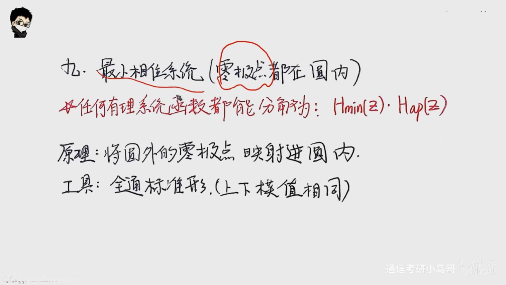
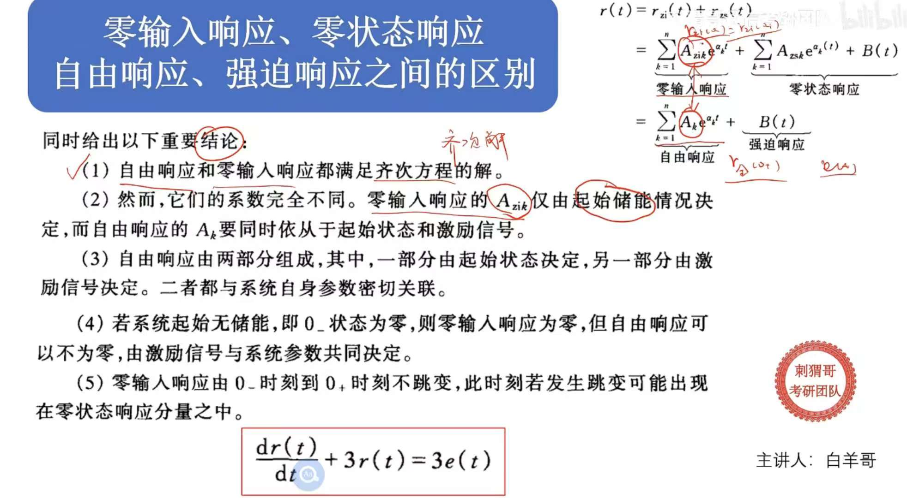
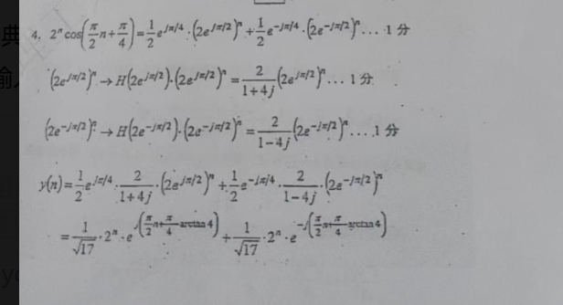
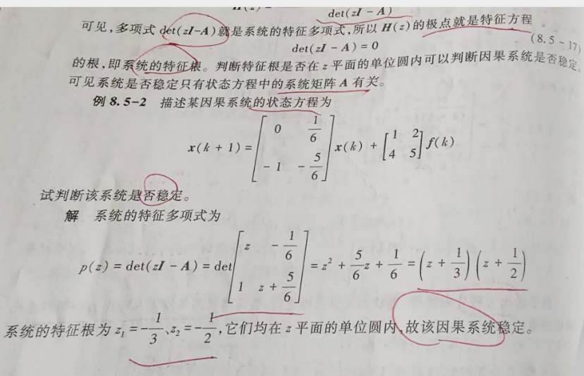

# 专业课笔记

> 变换前后一定要写表达式

## 杂项

傅里叶已确定值，就不能再改了

滤波器幅值一定要对应

时移的时候必须是最后时移

收敛域不包含极点，且是零极点相消掉的

用性质以及求导都会丢掉直流分量

基波有两个，w=1与w=-1

有幅度才有相位

xt-x(t-T)=xt卷积（δ（t)-δ（t-T))也就是延时相加可以用卷积得到门

滤波器内恢复采样信号要小心不是奈奎斯特频率

## 奈奎斯特对周期信号采样会抵消两边

周期信号的傅里叶变换都是冲激，所以时移动2个截止频率就会出现抵消（也不是还没有研究彻底，只是他的相位正好是相反数，那么在这里多留意一下）！

## 几何画图的微分和积分的误区！

**有一个核心理解**，微分的本质其实是对交流进行微分，也就是微分之后没有直流了，所以f（-无穷）为0以及微分无直流本质上是去掉拿出来直流单独分析，用性质求出来交流，比如我的图。

然后微分吧话就是要用公式求出来直流分量，这个公式也可以是第二个公式，只是这个公式更快。

积分的话必须是要f（-无穷）为0，那么此时求出来导数的时候用积分性质就是完全对的

## 反因果信号的响应

我们一般就是把他根据与1的关系求出来因果信号的响应，把反因果的响应全部转化为因果响应

反因果信号的物理意义：本质上其实在输入之前加了个初始状态，只是这个初始状态是反因果信号产生的，就算是初始状态为0，反因果也会让他初始状态不为0，这就是物理意义！

## 求系统函数的三大方式以及卷积系统的理解

**这三种时域卷积，频域相乘以及δ输入求**

卷积等式的时移只能移动一个！

卷积必须是线性时不变，**否则就不能卷积**

这是一个非常好的基础概念问题。答案需要分开来看：

1. 关于线性（Linear）和时不变（Time-Invariant）

卷积运算（Convolution）是描述线性时不变（LTI）系统的唯一方式。

时不变性（Time-Invariant）和线性（Linear）：

卷积是LTI系统的定义： 只有当一个系统同时满足线性和时不变性时，它的零状态响应（Zero-State Response）才能完全由输入信号 $x(t)$ 与系统的冲激响应 $h(t)$ 的卷积来表示：

$$y(t) = x(t) * h(t)$$

结论： 如果一个系统不是线性的，或者不是时不变的，就不能用卷积来描述其输入输出关系。因此，卷积必须用于LTI系统。

2. 关于因果性（Causality）

不是，卷积本身并不要求系统是因果的。

卷积的普适性： 卷积只是一种数学运算，它可以描述所有 LTI 系统，包括因果系统和非因果系统（Non-Causal System）。

因果性的约束条件： 因果性是施加在系统的冲激响应 $h(t)$ 上的一个约束条件，而不是卷积运算本身的约束。

因果系统的条件： 一个 LTI 系统是因果的，当且仅当它的冲激响应 $h(t)$ 满足：

$$\mathbf{h(t) = 0 \quad \text{for } t < 0}$$

非因果系统： 如果 $h(t)$ 在 $t<0$ 时有非零值，那么这个系统就是非因果的，但我们仍然使用卷积 $y(t) = x(t) * h(t)$ 来描述它。

总结

特性卷积是否必须？解释线性必须卷积是线性时不变系统的定义基础。时不变性必须卷积是线性时不变系统的定义基础。因果性非必须卷积适用于所有LTI系统。因果性只是对 $h(t)$ 的一个额外限制（$h(t)=0, t<0$）。

## 极点与特征根的关系

极点有两种情况，因果选交集区间，不是因果就是极点之间 **输出才是稳定的**。

**极点就是分母为0的点。特征根是齐次方程的点**，极点的产生可能是时域积分产生了一个极点或者其他极点！

好的，我们用一个简化的**一阶系统**作为例子，来清晰地说明 $H(s)$ 极点多余的问题。

**示例：输入包含积分（卷积）的系统**

1. 真实的系统动态（齐次解的来源）

假设系统的**固有特性**（即齐次微分方程）由以下一阶常系数微分方程决定，但其输入 $f(t)$ 是经过处理的：

$$\frac{dy(t)}{dt} + 2y(t) = f(t)$$

* **特征方程 (Characteristic Equation)：** $s + 2 = 0$
* **真正的特征根：** $s_c = -2$
* **正确的零输入响应形式 $y_{zi}(t)$：** $C e^{-2t}$

2. 非标准输入与 $H(s)$ 的构造

现在假设系统对**实际输入 $x(t)$** 进行了一个**积分操作**（即在 $t$ 域是卷积，在 $s$ 域是乘以 $\frac{1}{s}$），然后才输入到微分方程的右边：

$$f(t) = \int_{-\infty}^{t} x(\tau) \, d\tau$$

在 $S$ 域中，这意味着 $F(s) = \frac{1}{s} X(s)$。

我们将这个输入关系代入 $S$ 域的系统方程：
$$Y(s)(s+2) = F(s) = \frac{1}{s} X(s)$$

3. 结果：多出来的极点

由此得到系统的总**传递函数 $H(s)$**：

$$\Large H(s) = \frac{Y(s)}{X(s)} = \frac{1}{s(s+2)}$$

* **$H(s)$ 的极点：** $s_1 = 0$ 和 $s_2 = -2$。

4. 陷阱与结论

| 概念                  | 结果        | 结论                          |
| :-------------------- | :---------- | :---------------------------- |
| **$H(s)$ 的全部极点** | $s=0, s=-2$ | 包含 $s=0$ 这个**额外极点**。 |
| **系统真正的特征根**  | $s_c = -2$  | 只有 $-2$ 是系统固有的根。    |

**警告的体现：**

如果错误地按照“99.9%的题可以直接通过 $H(s)$ 的极点直接设零输入的形式”的经验 来判断，就会误认为零输入响应 $y_{zi}(t)$ 的形式是 $C_1 e^{0t} + C_2 e^{-2t}$（即 $C_1 + C_2 e^{-2t}$）。

**但正确的零输入响应**形式只由真正的特征根 $s_c = -2$ 决定，即 $C_2 e^{-2t}$。

这个 $s=0$ 的极点是由于输入端引入的**积分（卷积）**操作 $\left(\frac{1}{s}\right)$ 所致，它只影响系统的**零状态响应**，与系统的**齐次解**无关。因此，必须回到**原始的微分方程左边等于 0** ($s+2=0$) 来求取特征根。

## 全时域解法

> 小心拉普拉斯变换的解法，因为收敛域没有交集，全时域求法没有初始状态！

初始状态可以用零时刻之前来求，记住有冲激

## 差分方程

x(n+2)注意两个，一个是减号，一个是n与z的系数为2，就是z方XZ-x(0)z^2^-x(1)z

## 实信号的三个理解

实偶对实偶，实奇对虚奇，这么是时域ft对应的频域

实信号的定义式子：ft等于ft的共轭，FW对应F（-W）的共轭

这个很重要啊，除了有Hjw的组成，实信号的偶分量就是实部，奇分量就是JXw。

**实信号，偶信号与奇函数的零极点关系**

实信号是关于实轴（即共轭对称）对称，然后偶信号是关于原点对称，奇信号是关于虚轴对称

-X（s)=X(-s)

## 傅里叶级数的两个求法

**周期的信号**：

1.要么通过求一个周期内的傅里叶变换，然后根据公式去求（**我们一般是周期是一个周期傅里叶变换凑成f0t卷积周期冲激信号**）比如冲激信号（t-2n+1)傅里叶级数，我们就把他变成δ（t+1）卷积Σδ（t-2n)然后就是周期为2，把δ（t+1）变成f0t，然后呢求他傅里叶变换，在套用傅里叶变换变成傅里叶级数的公式，**这个是不能看出来的，有的一眼就能看出来直接找了也就是说F0有两个找法**

Fn=T/F0(nW0)这里是一个周期是傅里叶变换

2.要么通过定义

别忘了这个是要包含Fn为0（我的习惯就是F0=2分之a0）与Fn不为0

**非周期信号**

只能求这个非周期信号的傅里叶变换，然后根据前面那个等式去求

## 重叠问题

重叠分低通以及带通，记着想边界

奈奎斯特定律本质上就是Wm的两倍就能完全过滤掉原信号（属于低通滤波器）

带通就是有公式，别忘了是在带通信号内是m个完整信号（别的定义不一样，可能是包含带通的m个信号）

然后看图片，一般来说这种问题不是低通的我们都会想边界，fL

> 这个图片比如就是人家定义m为w2就是包含原信号的m个，然后根据最小边界就是-w1加上m-1的ws<=w1然后再根据-w2+(m-1)ws>=w2求得ws的范围！

## 卷积凑定义

上下限用阶跃处理成无穷，然后变成卷积的定义式子，求出卷积，后面s变换

**本质上是凑上下限为无穷**：当然用阶跃处理求出来系统函数！

## 矩形卷积公式

两个矩形卷积那么画图就是上底为宽带之差，下底为宽度之和，高为两个高和最小矩形的宽乘积

## 阶跃函数和1的区别

阶跃函数是0时刻之后为1

1就是然后时候都为1，那么1得用特征函数去解决！  

## 相位怎么找

如果随便给一个H（jw）信号，怎么找他的相位呢

要记住这个相位是负责正负号的，模是判断幅值的

一般来说是看正负号位0的边界点

## 常见的傅里叶变换

## 级数0开头的两个理解

一个是后面一项减去见面一项化简求出来xn

第二个是里头那个函数卷积上阶跃，级数就变成负无穷了，那么就是两个信号卷积，然后就是fk的z变换乘以阶跃的z变换

（用性质前n项和）

## 双边Z变换(与单边变换的区别)

**单边变换**：就是ft乘以ut，记住一点他会忽略输入信号在0时刻之前的所有值！

一般双边Z变换需要让fk乘以e(k)+fk乘e(-k-1)

反因果公式：正常因果z变换加个负号就行

双边z变换遇到绝对值的时候就直接破掉绝对值，分类讨论，这里一遍分类讨论带着阶跃函数就行

**记得ek和e（-k-1)变换之后的范围**

## f(at)的频率

a是多少倍，那么f（at）傅里叶变换的频率就是多少倍！

## 逆变换的三个方法（注意事项）

1. 用变换域的性质解决
2. 用留数法解决
3. 用待定系数（一般处理分子高阶比较适合）

**逆变换必须要标明作用域**

## 调制的注意事项

当信号与三角函数相乘的时候，则这个信号的幅度就会除以2，每次相乘都会除以2，这是个坑

## 输入信号经过线性时不变系统注意事项

当系统是线性时不变系统的时候，输入信号时移，输出信号的==阶跃函数也一定要时移动！==

如果输入移动，输出移动

输入系数 输出系数

输入求导 输出求导

输入卷积 输出卷积（看我这个图片，输入求和输出求和，输入与冲击信号卷积（相当于移位）也就是频域也会移位相加！！！

## 滤波器判断类型

如果是模拟的话，那么就分为分子一个的，分子两个的

**分子一个**的：留低为低通，留高为高通，留中为带通

**分子两个的**：没有什么就不通什么，比如没有中间的就是不通带通就是带阻，没有高系数就是不通高通就是低通

如果是离散的，就是0<a<1就是低通，-1<a<0就是高通，a=0就是全通

**第二个计算方法**：算出来H（jw)，然后求出来这个模公式，来分析这个变化过程！

## 交错冲激信号与ft的抽样

周期冲激信号有一个误区 **就是周期信号抽样ft，频域就是平移，但是交错信号抽样ft，并不是+1是平移，-1那个位置就是对应翻转平移，这是不对的**，

我们根据定义来求

**注意两点**：第一点就是他跟ft×周期信号一样，前面都是t分之一，注意交错的是奇数才有，偶数为0，最后就是周期是nw，这个是交错的周期变大了两倍，所以w变为二分之一，原先是n2π/t,现在是周期缩小二分之一，变成nπ/T

### 系统结论

1. 非因果信号进入了因果系统，那么他的响应会有出现非因果的响应
2. 卷积定义可以求系统，如果输出是一个卷积的定义式子，那么我们根据ft*h(t)的定义形式，来找到哪一部分是ht的转化形式，进而推测ht这个具体系统

## 输入函数

小心输入是因果还是全时域！

### 求导注意的地方

输入函数求导要包括两部分，一定要注意阶跃函数e（t)左边不求，这个e（t)要求导变成德塔t

### 输入响应快点的办法

我们在求解hz的过程中，构建输入方程的时候一般是把fk当做冲击函数，然后y直接就是hz，所以方程直接求出来hz，hz在于fz相乘，在逆变换求出来y输入响应，然后单独再求一下状态响应，最后求出来全响应

**快点的办法**：快点的办法就是fk直接变成fz，然后左边就是y输入响应。其实是等价的，分母移过来，然后间接乘以hz*fz了，

## 波形图注意事项

波形图的ft正常去画，但是这个冲激函数，这个跟随at的系数变化

如果ft的周期扩大两倍， 冲激函数的系数也将扩大两倍

### f(2分之k)的z变换

这个是没有性质的，只能转化为定义去求，然后找到什么z方那种

### 单边z变换

单边z变换一般我们用定义去解决，Xz=Σ零到正无穷，f(k)*z^-k^

### 单边周期拉普拉斯变换

就是把他换简称分子1-e^-sT^分之F（s),时域进行ft与Σ进行卷积

## 复数根的逆变换

**模拟逆变换**：

**离散逆变换**

离散的讲一讲，首先一定要把常数变成1，然后根据式子找到对应z=什么z，然后在根据这个cos结论去凑逆过去

## 全通，最小相移，以及非最小相移系统

> 全通：**幅度响应不变**：==对所有频域分量的幅度都是成同一个常数==
>
> 全通：**相位响应改变**：虽然全通系统不改变信号的幅度，但是它会改变信号的相位。其目的是通过调整信号的相位来实现特定的系统特性，信号经过系统只会改变相位，幅度乘以一个常数，正常来说还有可能会添加新的e的幅度因子
>
> 最小相移系统：**所有具有相同幅频特性曲线的传递函数」**下，也就是同一条线（因为同一条==幅频==线可以有不同的H(jw)方程），最小相移系统能够时所有的H（jw)在同一条幅频曲线下使得相位移动最小

全通系统特点就是：1.模拟的就是零点和极点对称关于虚轴（**这里的意思是一个零点和一个极点对称！）**。2.离散就是共轭倒数

最小相移系统特点就是：1.模拟就是零点极点都在左边2.离散就是所有零点极点都在单位元内（就==是延时小，稳定性小==）

1. 对同样的输入，其输出的相位延迟最小。
2. 非最小相位系统相对于最小相位系统具有滞后的特性。通俗地讲，系统比较"钝"。

**所有的具有相同幅频特性曲线的传递函数」非最小相移系统**均可以被表达成最小相位系统与全通函数级联的形式

## 频域遇到e的st0次方怎么逆过去

> 一定要记住，我们遇到e的st0一定要分开，因为留数法无法解决，先用留数法，然后再时移

一般我们就用时域来解决，别忘了还有e！，留数法只能求系数后面还得在处理时移这块

## 特征函数重要结论

>  如果一个函数经过一个系统，他只有系数上的改变，我们说这个函数就叫特征函数
>
>  特征输入法只能求全时域，如果遇到ut非要用求得就是稳态的！

我们可以直接判断这个输入信号的s值是一个H（s)的一个解，那么直接带入

**注意：**这里有一个误区，以为s0是系统极点，其实是不是这样的，他就是一个特点，s0可以为任意的，经过系统只会有个H（s0）的系数

**特征函数解决非因果信号特别好**

## 模拟框图的画法

### 三种形式的系统图以及注意事项

三种形式的系统图，直接型，串联型，并联型

一般来说用梅森画出来的都是直接型，串联型和并联型的注意地方重点提醒

**级联型**：级联一定是要让分母大于等于分子，且中间别忘了多一个线！一般是一次的

**并联型**：并联重根必须要花在同一条支路，比如这个，部分分式相加，求出来（s+2)平方用两个形式

那么先画一次的，然后再画二次的有一个-1，他们在同一条支路！

### 梅森公式

把H（s)化简成梅森形式，然后画出流图，最后转化为模拟框图就好了

### 辅助变量法

这种只能处理H（s)一般来说分母直接变成q‘’与f的关系，分子变成y与q的关系，根据这两个关系，建立两个求和器，自己在算算

## H（S)/H(z)的差分方程与等式方程

我们求出来Hs的时候，可以直接去求出来差分方程，分母就是输出，分子就是输入

**等式方程**：是求状态方程q用到的，一般来说分母是输出对应的ft，分子是输入对应的ft，根据这个能列状态方程并求解

### 周期移动问题

一般来说图像的周期平移，我们都用冲激函数进行卷积（卷积具有平移）然后用周期平移冲激函数的傅里叶或者z变换

## 周期信号的傅里叶变换

>  Fn=1其实是冲激信号序列（即e^jwnt^)

重点掌握两个变换一个是Fn（周期延拓）的，一个是ft卷积的

这两个都是同一个公式，Fn周期延拓的我们理解为Fn傅里叶变换关系差个T，然后转成傅里叶变换的，就跟ft卷积一模一样，我们重点把握周期延拓e^jnwt^这种形式

## 周期信号的计算

> 两个周期信号相加的最小公倍数就是新的周期
>
> 因果信号无周期！
>
> 基波必须是周期的最小公倍数，注意是周期！

**离散信号**

这里分为一个周期信号，与两个周期信号相加

**单周期信号：**如果是单周期信号那么根据N/M选择最简的分子找出来最合适的周期信号

**相加周期信号：**如果是两个周期信号相加，那么先把两个单周期信号的周期找出来，然后算他的最小公倍数

**复数周期信号的计算**：把他转化为e指数来共同求解公倍数，别忘了单周期都是找N

**模拟信号**：

**单周期信号**：没有特殊的部分正常算

**相加周期信号**：如果两个周期信号相加，最小公倍数就行，跟离散的不一样

==最小公倍数的计算==：

==分式计算==：

1. 分母找到最小公倍数
2. 分子分母进行通分
3. 分子找到最小公倍数，然后找到之后除以分母的最小公倍数

>  我们在求分式计算过程中往往遇到三项的最小公倍数，经常出错，是因为我们不懂含义
>
> 最小公倍数：要求我们就是每一项的有一个整数倍相乘就能得到最小公倍数，还是最小的
>
> 最大公因数：是他们的限制的因数最大的

==三项以及多项整数的最小公倍数==

最小公倍数里有一个就是三个里头两两没有公因式

比如这里算到10,12,15并没有结束，因为2* 5,2 * 6,3*5还能两两消掉，直到最简1,2有关系，1,3还有关系这是不行的，继续化简

==注意还得消掉公共的，也就是必须一下子消掉最多个，不能随便消任意的==

## 零输入响应和零状态响应与强迫和自由响应的关系

这里重点解释自由和强迫响应（==出现受迫响应的叫法也比较多==！

自由响应也就是全部的齐次部分，这里它既可能受到0状态，也会受到输入一部分影响的齐次解

强迫就是完全的特解！

注意：**零状态里的齐次部分和特解，齐次是受到了输入的影响！**

比如这题，起始状态为0，那么输入响应还有特解一部分，零状态就是0了A错

激励信号为0，输入响应就是0，受迫就是0，状态不为0，B错误

输入为0，那么特解为0，受迫为0，C错

起始状态为0，输入也有齐次的一部分（==注意这里的齐次部分是受输入影响的==）输入大于受迫，D错误

**强迫和自由的寻找！**：含有特征根（注意不是极点！）就是自由响应，不含特征根的就是强迫响应，从他的组成里也能看出来

## 画幅频特性曲线的画法

> 幅频特性曲线有两种，如果是Hs，那么就是jw型，HZ就是e的jw然后带值一般是三个

一般来说把他转化为H（e^jw^)

特性曲线有这么几个步骤

**模的画法**：

一般画数字系统的，数字系统范围是-π到π，==根据模是偶函数画0-π==

1. 初值，终值求出来 **谨慎还要有初值的右边的无穷小**
2. 求单调性：这个单调性可以求导也可以根据几何知识画出来，通过分子和分母的关系，上面是 **复指数，复指数的模和相位画出来**

**相位的画法argH**：

一般画数字系统的，数字系统范围是-π到π，==根据奇函数画0-π==

H（jw）=|H|e^jargH(jw)^

也是初值和终值确定，然后再根据几何或者求导算出来单调性

## 构建输入输出响应方程

题目给了f 给了y全响应

1. 构建x1+r=y1 x2+r=y2

2. 然后两式子一减x1-x2=y1-y2，根据==线性不变的性质==求出来x1与x2关系，然后求出来x1=y解出来x，然后解出来r

   **最无脑的方案**：在求解的过程中通常是x1,与x2很难建立确切的方程，那么万能的方程就是让x=fs*h（s),f一定能有，那么带着hs

   两个式子一相减就能求出来hs这个系统方程了

## 冲激函数的所有

我经常搞混！

三大性质：卷积，筛选，取样

卷积性：ft*δ（t-t$_0$)=f(t-t0) 这个是卷积

**冲激化简的重要性质**

这个是冲激复合函数的公式

## 关于阶跃函数的拉普拉斯延时效应：

如果在用留数法求出来逆变换的冲激响应发现了e的a(t-b)，那么会出现阶跃的t-b

如果在象函数里出e的at，那么会出现阶跃的t-a

## 阶跃函数的化简

遇到阶跃的傅里叶变换最好求导进行化简

阶跃无法统一时移

这里必须拆开不能用性质因为阶跃无法统一时移

## 线性与时变的判断  因果与稳定性以及系统特性

**线性**：（记住两个f1，f2比较）

非线性

1.出现==常数==的就不是线性（常数）

2.出现==输入输出的一个式子组合==就不是线性（输入输出函数组合），==出现变系数就是线性==

举个例子sint*y（t)这个就是线性时变系统

==线性系统中出现初始状态了，那么就要氛围状态线性和输入线性，分别判断线性才能线性==

==时不变系统中出现初始状态了，那么不用管，因为时不变系统是看输入线性的==

**时变**：记住ft的自变量时移，因变量时移

1. 变系数tf(t)
2. 尺度变换f（at）

**注意**：遇到积分ft判断时变时不变要看ft在哪接入的

**因果**：

只要出现x(n-k)减号就行（**记住是输入信号出现，其他信号出现没有关系**）

**如果出现f（at)** 一定是非因果的

分子比分母高阶那么一定是非因果

**稳定系统**

如果输入有界，那么输出也有界就是稳定系统

绝对可积就是稳定，包括虚轴和单位圆

微分，积分的系统都不稳定

**离散稳定两个判断**：1.必须是包含单位圆2.如果是因果系统，那么极点都在单位圆就行

**连续稳定两个判断**：1.必须包含虚轴

**记忆系统**

记忆系统：任意时刻的输出仅取决于该时刻的输入

**判断方法**：这个需要看情况，如果是微分方程，感觉一下，应该就是有延时性，如果有移位系统，也是有延时性，如果特别简单直观，那么就是无记忆

## 罗斯准则与朱里准则

> 快速求稳的方法
>
> 罗斯：三阶就是b1b2＞b3b0且都大于0
>
> 朱里：二阶就是A（1）>0,A(-1)>0,a2>|a0|

### 罗斯阵列判断正实数个数

**罗斯缺陷**：如果发现一行都是0，那么要求上一行的s关系进行求导

在写完罗斯阵列要判断符号变了几次，变了几次就有几个正实根 ==如果遇到0就用ebosino来代替==

**罗斯排列判稳**适用于**连续时间系统**，通过构造一个罗斯表来检查系统极点的位置（是否位于左半平面）来判断稳定性。

==口诀0 2 4==

   ==1 3 5==

**朱里准则**适用于**离散时间系统**，通过构造朱里表并递推计算系统极点的位置来判断系统的稳定性，确保所有极点位于单位圆内

**罗斯排列判稳**：通过直接使用系统特征方程的系数来构造罗斯表，进行符号分析。这是一个逐步递推的过程，涉及到解出特征方程的系数矩阵并对其进行符号检查。

1. 多项式全部系数都为正值
2. 罗斯阵列第一列符号相同

**朱里准则**：基于特征方程的系数，进行数值递推，得到一个矩阵（朱里表），通过检查这个矩阵中的元素来判断系统的稳定性。具体而言，朱里准则涉及到递归计算与迭代过程。

1. 首先判断必要性
2. 必要性成功之后在根据系数进行排列 **第一行正排，第二行倒排，第三行的第一个是第一列与最后一列的行列式，第二个是第一列与倒数第二列的行列式，依次推，第三行是倒序**
3. 完成之后要求奇数行的第一个大于最后一个

==一共2n-3行==

## 利用留数法求系数

> 留数法顶住两个
>
> 离散：离散要z为1且是否贡献z，齐次应该是没有冲激
>
> 模拟：系数为1且是否看齐次，齐次多冲激

==这里求系数的时候一定要让他最高次方变成1==，

用留数的时候是留数的阶数和分母的阶数为一个最高常数，把握这个就好了

## S域求系数

就是正常求

### Z域求系数的时候

1. Fz/Z 求出来这个表达式

2. 然后把他整体（这个整体就是FZ/Z变成一个式子进行运算）利用留数求出来系数

3. 然后Z乘进去进行逆变换

## 留数法求逆变换

> 逆变换必须要注意范围，收敛域
>
> 如果分子有一个极点是S-1,那么逆变换一定会出现-e(t)**ε(-t)**

==都要变成假分式！==（经过检验，hz不需要变成假分式子，也就是齐次就行）

### S域求逆变换

==要变成假分式！==

就是正常求，没有任何问题把我好公式就行

### Z域求逆变换

这里需要值得注意的一点是Z域逆变换会有一个Z的n-1次方根s域不同，那么需要讨论

1. 首先X（Z）与Z的n-1次方相乘，判断是否Z的n-1次方是否贡献极点，如果不贡献，那么正常求
2. 如果贡献了那么就要讨论n=0和n=1的时候
3. 在求n=1的时候一定不要把Z的n-1次方拆开，正常算就行，算出来一个常数的n次方
4. 分别求出来两种情况然后在相加就好

$$
S(\Omega)
=\sum_{m=-\infty}^{\infty}\frac{\sin(\Omega_c m)}{\pi m},e^{-j\Omega m}
$$

## 给了f导数的傅里叶变换求f的傅里叶变换的小心点

就是不能直接除以jw，因为除以jw的过程是积分，你积分是有两部分的，必须用积分定理求不能直接除以jw

## 零极点分布图求什么

技巧，把他转成分子分母的分式

然后分子有谁就是什么滤波器

分子没有谁就是不通什么滤波器

1. 求系统函数记着有K
2. 求稳定性
3. 看频域特性
   *    首先可以最简单的用公式法去求出来模和相位进行函数分析
   * ​    第二就是几何分析，当w=0.零点模除以（极点模相乘）画出图，零点相位减去（极点相位相加）求出来相位图

## 复频域分析的结论

1. 如果一个信号是实信号，你发现他的极点有一个是复数，那么一定是成对存在
1. 
1. 

## 关于求逆变换

如果Y（jw)是一个很复杂的函数，那么就直接用定义，把H（Jw)变成模和相位，然后分别和输入函数的傅里叶变换去求然后再用一些性质逆变换去求出来yt ==如果输入里头有cos和sin用这一招特别方便==

## 无失真的要求

时域要求Kf（t-t0）

频域要求H(jw)=k

==计算步骤==

1. 一般求出来频域函数h(jw)，然后让他等于k，如果要保证无失真传输那么必须要求 ==分子是分母的k倍==，在实际的计算过程中一班是 ==要求实部之比等于虚数之比==！！！

## 卷积和判断下标

就是对应下标相加就是那个位置

## Sa函数

Sa函数三大体系

1. 第一个就是图片这俩个，

2. 第二个就是我现在

   

### 函数通过Sa函数的规律

> 三角脉冲一个特点，如果顶峰是a，那么频域就乘以a就好了

长成这样就是频率响应就是幅值为一，函数为1，一般来说Wc/π*Sa函数就是幅值为1的

分为时域Sa和频域Sa

### 时域Sa

如果是时域Sa那么频率就是一个理想的低通滤波器

通过Wc/π*Sa（w(t-t0)),频域就是Wc

### 频域Sa

频域Sa，就让频域为Sa（π）求出来带宽

## 戴维宁定理

在使用戴维南定理进行电路分析计算时，有3个步骤：

（1）求出有源二端网络的开路电压uoc；

（2）将有源二端网络的所有独立电源置零，即将电压源短路，电流源开路，求出无源二端网络的等效电阻Req。

（3）画出戴维南等效电路图。

https://blog.csdn.net/MSJqm/article/details/127898259

## 节点电压法

> 电路求解的时候我们一般是遇到电源一定要看电流流到电源的正负极，负就-，正就+，别忘了这是在一个方程里！比如你假设电流顺时针，那么电阻好说，正常供电电源一般都是-，等于0，你放到方程右边就是正了，正好符合常见认知！

**注意**：这个每一个支路是电阻和的导数！第二呢，右边这个是电流的汇聚方程，如果是流入就是正，流出就是负

比如我构建的方程里根据电流的流向你好发现都是流入电压源的﹣位置，那么他们就是同向，那么电压相加然后除以s就是电流，也就是说每一个支路都是电压除以这个支路的电阻变成电流！（电压正向一般是电流流出，根据这个图就是流入了）

## 求截止频率

截止频率，也称为临界频率，是指一个电子电路或系统开始显著衰减信号能量的频率点。在电子滤波器中，截止频率定义了信号能够通过和被阻挡的频率边界。

一般看一下这个最高幅值，截止频率使它变成最高的二分之根号倍，根据这个关系求出来求好了

## 时域函数进行卷积计算

转到频域去求就好了，取样记得利用==等比函数==

## 全响应求输入响应

一般是根据全响应的特征根求出来状态响应，然后一减去就求出来输入响应了

## 傅里叶级数与傅里叶系数的讨论

首先从傅里叶系数角度讨论，傅里叶级数的系数前面也就是有一个T分之一

其次他的积分上下限是一个周期内

再者就是他的被积函数里是一个e的-jwnt，有一个n。

他俩的转换就是一般是傅里叶变换到傅里叶级数（也就是傅里叶系数）那么就是Fn=t分之一*（f(w)）w取n*基波周期

## 在画冲激函数的平移时候小心尺度变换，是他的a倍分之一

## 希尔伯特变换

希尔伯特变换是将一个信号 $f(t)$ 转换成一个相位延迟 $\pi/2$ 的信号。对于一个实信号，希尔伯特变换可以通过与 $\frac{1}{\pi t}$ 卷积来实现，得到一个与原信号不同的复信号，它是原信号的解析信号（analytic signal）的一部分。

在频域中，$\frac{1}{\pi t}$ 对应的函数是一个常见的**理想低通滤波器**的频率响应，它在信号处理中用于产生复数信号的解析部分。

总的来说，$\frac{1}{\pi t}$ 是一个典型的分布，常用于信号的频域处理，尤其在进行**希尔伯特变换**等时，能够给出与原信号相位偏移的结果。

==出现希尔伯特变换，也就是ft与这个πt分之一进行卷积会将原信号进行延迟二分之π==

## 复指数信号经过系统

如果一个信号是复指数信号那么经过系统就是H（e的jw）*这个复指数信号。

## 构造全通系统

这里简单点就会出现一阶二阶的全通系统

我只会简单的一阶，那么首先呢你先构造一个T系统，比如是K（z+a),那么把他乘到一个系统里然后把他变成频率响应，然后通过实数和虚数进行比例变换就能求出来这个常数a，然后构造成功 

## 求状态方程

### 状态变量的选取

我们一般选取积分器之后的为状态变量，然后从输入最近的选取x1，有几个积分器就有几个状态变量，看图所示

> 一般用两种方法求状态方程
>
> 1. 系统函数法
> 2. 中间变量法（==这里推荐用中间变量法==)

### 系统函数法

根据一些办法求出来系统函数

然后去画信号流图

标状态变量，一般是s输出之后也就是积分器输出之后标状态变量，标xn,标xn的下一状态

根据信号流向列方程，最后写出来状态方程和输出方程

### 中间变量法

1. 首先给状态变量设置设置中间变量
2. 列些中间变量方程
3. 写下时状态变量（最后一个需要根据输入输出方程求出来最后一个下时状态变量）
4. 然后列些状态变量方程

==输出方程小妙计==一般来说是输入右边的逆顺序

### 状态方程求解问题

> 这里求解状态转移函数的时候一定要注意看分母最初是几阶，到最后如果发现消掉了，那么就加回来（**状态方程求解系统函数有坑**他会出现零极点相消，只需要找到消掉的那个极点，分母分母加上就行！

**H（S)函数求解**

一般根据sI-A的行列式为0求出来稳定性这块，H(S)=Cφ（s）^-1^B+D

一般来说我们是求出来X（S），然后拉普拉斯逆变换求出来X（t)然后带入输出方程求出来y（t)，

**离散H（Z)求解**

H（Z）的范围不能有等号

### 状态模型求信号流图

这道题一定要画出来输出输入状态前后的节点，然后根据系数进行信号流图，别忘了系数就是逆过来的数

### 状态矩阵在时域求法

## 电路方程求解

> 电路一定要注意，求系统函数的时候输出相应的是不需要考虑状态也就是初始条件，你变换域就不用加电源了！加了就是求全响应了！
>
> 状态方程本质是就是微分方程的变形式，一般让你求电路方程的状态方程这块的时候，让你求微分方程，你画图的时候就不要让他变到变换域了，直接画原图，然后根据导数也就是微分去构建方程！

### 放大器和受控源

放大器本质上就是受控源，不就是k嘛，输入阻抗为无穷大，输出阻抗为0，一般是前面的电压乘以k就是后面的电压

**受控源的重要理解**：本质上是一个受控的电源！特点是被控制一个量，另外一个量随便，你就当做正常分析！

### 电路的开关模型

核心思想就是开关前求得就是稳态电压和电流，然后根据开关后画出来变换域模型就行了！

> 记住两个，开关前电容断路和电流断路，开关后瞬时，电容电压不变，电感电流不变。这都是瞬时，时间一久电感电容就不起作用了，慢慢趋向稳态了！

### ==选量定理==

电感必须选电流，电容必须选电压，否则会少一个冲击量

直接根据kcl和kvl求出来x方程，y方程

#### 连续方程用拉普拉斯变换求解

首先X（S)=$\phi$(x)  * (x(0-)  +  BF(s)

$\phi\\$(s)=$(sI-A)^{-1}$

1. 一般是求出来预解矩阵
2. 然后求出来X（s)
3. 最后逆变换求出来X（t)
4. y（t)直接带入就好

### 复频域求解全响应

**输入方程	**	

这个输入方程首先需要求出来Hs，根据电路方程求出来Hs，然后乘以Fs，求出来Fs，算出来Ys逆变换

**状态方程·	**	

这个状态方程要求输入为0，且这个动态元件有了初始状态，根据公式算出来y，然后一加求出来全响应

==我们习惯用串联==，然后电感的电压方向和电流相同，电容的方向跟电流方向相反

#### 求系统函数

==这里求系统函数是给你状态方程让你求系统函数==，不过呢题目一般不这么出

但是有一点特别重要，就是==预解矩阵的逆就是系统函数的A (s)也就是特征方程，根据这一点让你判稳啊，让你求各种东西比较重要==

## 直流分量的求解

> 直流分量分为周期 和非周期的信号
>
> 非周期的用2T，周期的用T

## 周期功率与能量功率

> 能量与功率的关系：能量有限功率为0；功率有限，能量无穷
>
> 能量分时域和频域！

### 功率谱

> 自相关函数的傅里叶变换就是功率谱（一般都这么求，但是需要记住自相关函数的公式）

是2π乘以Fn的平方

### 功率

> 这个也分周期信号还是不是周期信号
>
> 如果是周期信号就用Fn方
>
> 如果不是周期信号那么就用非周期的公式除以T

是fn平方和（只有周期信号有）

### 周期信号的功率

算一个周期的能量然后除以一个周期就是功率

## 对称分析

### 半波反对称（半周期相同）偶谐函数

– 如果f(t+T/2)=f(t)，则所有奇次谐波（ 偶数）完全消失，只剩偶次谐波。
– 例如标准的 50% 占空比方波。

### 半波对称（半周期对称）奇谐函数

– 如果 f(t+T/2)=-f(t)，则所有偶次谐波（ 为奇数）消失，只剩奇次谐波。

这个问题问得特别好 👍。其实这类题的“快解”就是：**看图 → 找对称性**。我教你一个判断顺序，你以后只要顺着走，就能一眼看出“纯实 / 纯虚 / 都不是”。

------

## 🔑 判断步骤

1. **先看直流分量 $C_0$**
   - 如果波形在一周期内“正负面积相等”，那么 $C_0=0$。
   - 比如方波、对称三角波，正负对称 → $C_0=0$。
2. **看是不是偶函数** $f(t)=f(-t)$
   - 波形关于纵轴对称（左右镜像）。
   - 如果是 → 傅里叶系数全 **实数**（只余弦）。
3. **看是不是奇函数** $f(t)=-f(-t)$
   - 波形关于原点对称（180°旋转对称）。
   - 如果是 → 傅里叶系数全 **虚数**（只正弦）。
4. **看是不是半波对称** $f(t+T/2)=-f(t)$
   - 半个周期和另半个周期互为相反。
   - 如果是 → **偶次谐波为 0**。
5. **如果既不是偶函数也不是奇函数**
   - 那么系数里一般既有实部也有虚部（“都不是”）。
   - 这时就要依靠“半波对称”判断能不能进一步简化。

------

## 🎯 拿 (a) 举例

- 图像：0~~T/2 是 +1，T/2~~T 是 -1。
- 积分面积正负相等 → $C_0=0$。
- 关于纵轴看：不是偶函数（不对称）。
- 关于原点看：是奇函数 → 所以系数是 **纯虚数**。
- 同时它还有半波对称 → 所以偶次谐波全消失。

------

## ✨ 总结口诀

- **纵轴对称 → 纯实数**
- **原点对称 → 纯虚数**
- **半波对称 → 偶次谐波消失**
- **正负面积相等 → 直流分量为 0**
- **都不对称 → 系数“既不是纯实也不是纯虚”**

------

要不要我帮你把 (a)–(f) 六个图都用这个方法“看图判断”一遍？

## 出现a+jw放分之系数怎么办

==如果系数是常数那么就用公式==

如果是含有w==就用留数定理求系数==

## 幅度谱与变换谱

> 幅度谱是一种对于周期信号进行处理的
>
> 变换谱是任何信号的谱
>
> 这里的谱频谱，包含幅度谱+相位谱

幅度谱与变换谱的关系是2π即2π乘以幅度谱=变换谱

==易错点：一点进行了傅里叶变换，那么谱子就是变换谱==

## 状态变量组合问题

如果G(t)=M*X(t)遇到这种问题，然后让你求出来这个新的状态变量的解

解题思路就是把每一个gi用xi表示出来

让你求解其实就是让你求解Gi导，那么gi用xi表示，求导就能gi导用xi导代替，之后xi导通过变形把xi导用g代替，然后求出来这个解。

## 稳态响应

**正弦稳态响应**

这里呢如果一个信号coswt+φ或者sin到这个系统，==稳态响应本质上是输入响应==，把w带入到H（jw$_0$)，求出来这个模，和相角

模很简单，**相角**一般是artctan（上面角减去下面角），然后要带入e的j **相角**，在这里正弦比较特殊，就直接cos里头角φ就好了

**稳态响应的寻找**：

* 在分析系统的**响应（Response）**时，通常可以将其分解为两个主要部分：**暂态响应（Transient Response）**和**稳态响应（Steady-State Response）**。
    
    要判断响应中哪个部分是**稳态响应**，需要关注**时间趋于无穷大**时的行为。
    
    ---
    
    ## 🧐 响应的分解与定义
    
    **大概就是t趋于无穷的时候y保持一个稳定的值，特点就是于输入信号保持一致（这与生活常识一样）**
    
    * **稳态响应 ($y_{ss}(t)$) - The Long-Term Behavior**
        * 定义：指系统在**足够长的时间**后，**不再发生明显变化**或**呈现周期性重复**的响应部分。
        * 特点：它与系统的**输入信号**形式（如阶跃、斜坡、正弦等）通常**保持一致**（或者在线性系统中，形式与输入函数的形式相似）。
        * 数学上：它是当 $t \to \infty$ 时，响应 $y(t)$ 的**极限行为**。
    
    * **暂态响应 ($y_{tr}(t)$) - The Initial Adjustment**
        * 定义：指系统在**施加输入信号或初始条件改变**后，**最初一段时期内**发生的响应部分。
        * 特点：它由系统的**固有特性**（如极点位置）决定，随着时间**迅速衰减**并趋于零。
        * 数学上：它是当 $t \to \infty$ 时， $y_{tr}(t) \to 0$ 的部分。
    
    ---
    
    ## 🔬 如何判断稳态响应？
    
    假设系统的**总响应**为 $y(t)$，则有：
    $$y(t) = y_{tr}(t) + y_{ss}(t)$$
    
    ### 1. 理论分析 (通过求解微分方程)
    
    对于一个**线性定常系统**，其响应通常由两部分组成：
    
    * **齐次解（Homogeneous Solution）**或**自由响应（Natural Response）**：对应于微分方程的齐次部分，这部分通常包含**指数衰减项**（如 $e^{-\alpha t}$、 $e^{-\alpha t} \cos(\omega t)$ 等）。**这部分就是暂态响应**。
    * **特解（Particular Solution）**或**受迫响应（Forced Response）**：对应于**输入信号**（forcing function）形式的解。如果系统稳定，**这部分就是稳态响应**。
    
    > **🌟 关键词：** 观察响应函数中**不包含** $e^{-at}$ ($a>0$) 形式衰减项的部分。
    
    ### 2. 实践观察 (通过看曲线图)
    
    如果给你一个响应的**时间曲线图** ，你可以这样判断：
    
    1.  **初始阶段 (Transient Phase)：** 曲线在 $t=0$ 附近**剧烈变化**，可能发生振荡或快速上升/下降。
    2.  **过渡阶段：** 曲线的**波动或变化幅度明显减小**。
    3.  **稳态阶段 (Steady-State Phase)：** 曲线在**经过一段时间 $T$ 之后**，**基本稳定**在一个**恒定值**、**以固定频率振荡**（如正弦输入）或**以固定斜率增长**（如斜坡输入）。
        * **稳态值：** 如果输入是阶跃信号，稳态响应就是一个**常数**。
        * **稳态振荡：** 如果输入是正弦信号，稳态响应是**同频率的正弦信号**。
    
    > **记住：** 稳态响应是**暂态过程结束后**剩余的、**由输入信号形式所决定**的那部分响应。
    
    ---
    
    * ## 💡 例子
    
      假设一个系统的阶跃响应（输入 $u(t)=1$）的解析式为：
      $$y(t) = \underbrace{5 - 2e^{-3t} \cos(4t)}_{\text{总响应}}$$
    
      * **暂态响应 $y_{tr}(t)$：** $-2e^{-3t} \cos(4t)$。因为 $e^{-3t}$ 随着 $t \to \infty$ 会**衰减到零**。
      * **稳态响应 $y_{ss}(t)$：** $5$。因为当 $t \to \infty$ 时，总响应 $y(t)$ 趋向于 $5$。
