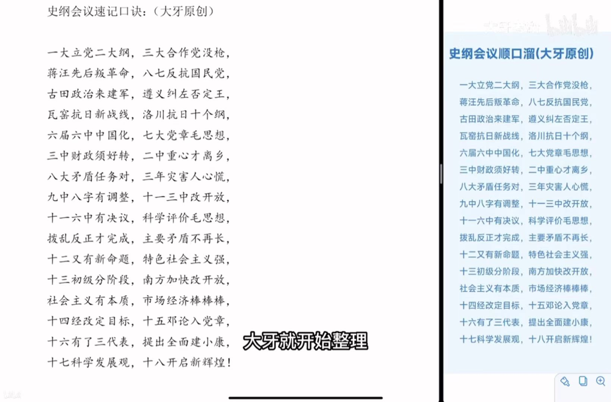
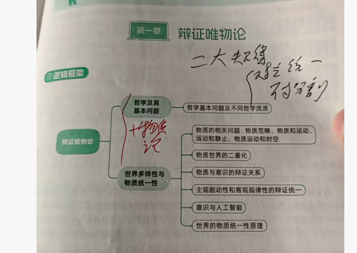
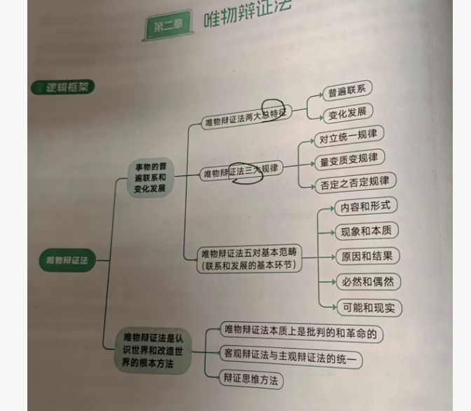
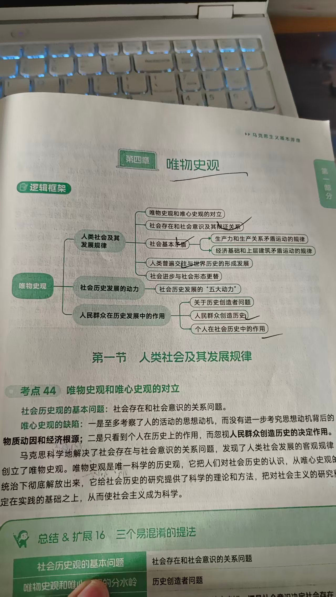
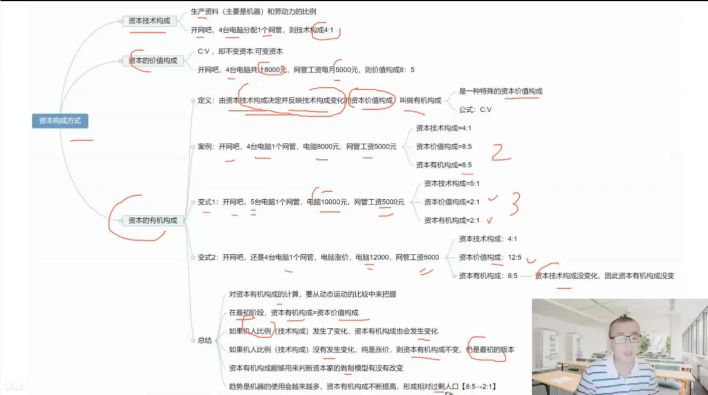
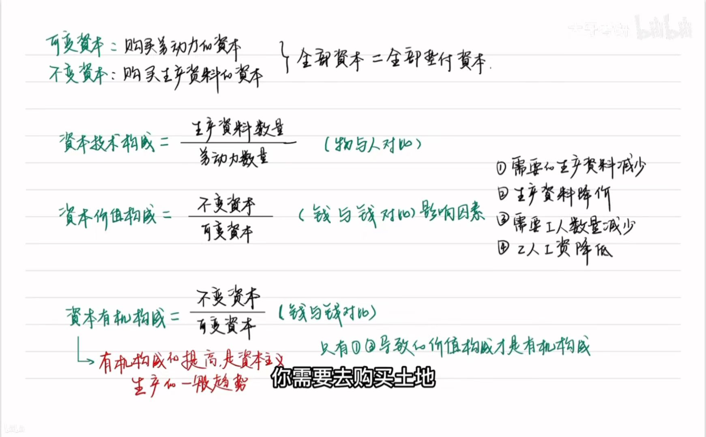
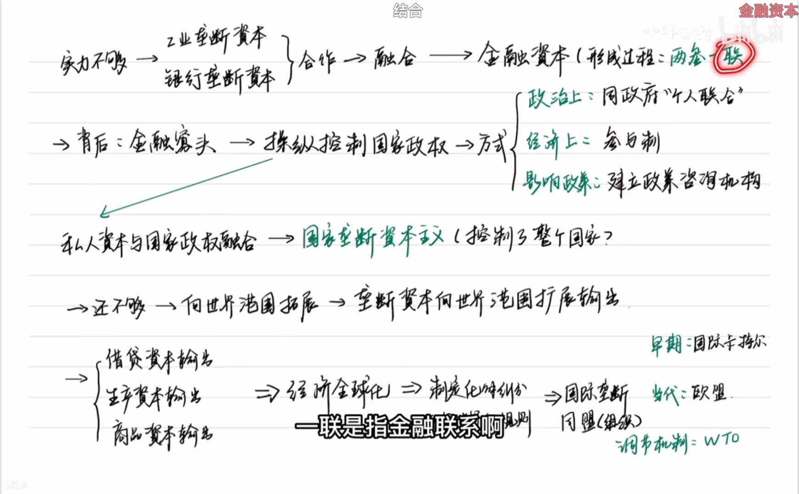

# 政治杂记

## 大纲

> 
>
> 这都是十一届六中全会的东西：1.论十大关系有两个：一个是重工业建设二是他标明了社会主义建设的开端！
>
> 2.《关于建国以来若干历史问题这个文章》的意义是提出了建成什么社会主义国家以及怎么建设，十一届六中全会也有拨乱反正。
>
> 八七确定仿真 武装起义和土地革命

## 资本

> 价格下降都不是有机构成（数量是）即技术影响的价值才是有机
>
> 技术构成的是数量，价值构成的是价值。

> 这里必要劳动就是可变资本，他就是工资！也就是再生产劳动价值有两层，一层是可变资本一层是工资！
>
> 然后一般给投资：包括不变资本加可变资本。利润率是m/v，一般求出来v可变资本，然后投资减去可变变成不变，不变比可变就是有机了！

