# 笔记

> 没有为什么一切都是那么自然

##  线性代数

### 线性方程组和平面点和法向量的关系

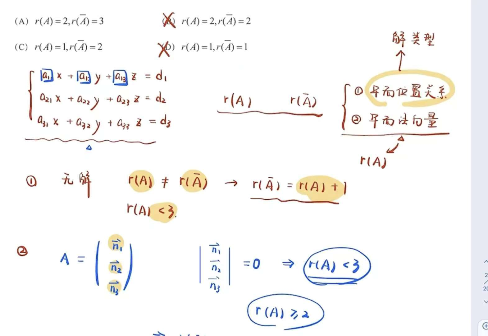

> 两个平面的点关系就决定了解的类型，比如三平面有一个交点就是一个解，无穷交点，没有交点，这里的交点是公共交点
>
> 判断好相交类型之后，平面法向量就是系数，法向量的空间关系，立体就是秩3，平面就是2，确定出来A，根据点关系求出来A增广

### 可逆线性变换，合同变换，以及正交变换的特点x=cy

首先可逆线性变换前后就是的矩阵就是合同矩阵，经历的变换就是合同变换，这就意味着可逆线性变换前后唯一不变的就是惯性定理！正交变换前后不改变特征值，合同变换以及可逆线性变换不能保证特征值相同，这是很重要的一点，合同相似正交满足三角变换，合同与相似并列，公共部分是正交

### 基础解系就能求出来A

一般给出来特征值，特征向量之后，通过A=P对角P-1求出来A

### 极大线性无关的个数以及误区

==误区==：在行阶梯的时候很多时候就开始盲目的从每行选一个，就误认为是极大线性方程组了，其实这是错误的！只能保证每行第一个是极大线性方程组

**个数寻求：** 首先确定他的秩，那么确定他的秩就意味着极大线性方程组里有多少个，然后在从第一行逐个选n个，拿出来看看是否行列式为0，为不为0就是线性无关，为0就是线性相关，只能这么求!!

### 两个二次型怎么用X=PY变换矩阵P

这里就是给你两个二次型，我想要你找到一个P，使得他俩能从X变换到Y

==这里跟对角化的思路类似==，对角化是让你找到共同的对角矩阵，这里就是让你找到共同的规范性 **注意，前提是能有共同的规范性，如果规范性也就是正负惯性指数不同那么就无法转到另外一个二次型**

如果是正交变换矩阵，那么标准型都是一样的，思路也是一样的，注意 **先决条件是特征值相同，才能找到Q正交矩阵**

x=q1z  y=q2z

### P（X>Y)的分析

这里如果让求出来P（X>Y)我们应该怎么去解呢，定义i和j，也就是ΣP（x=i,y=j)，i大于j去求解

求解的过程中要保证先i后j，来两次等比q^n^数列求和，注意判断首项和q的倍数，求出来这个概率

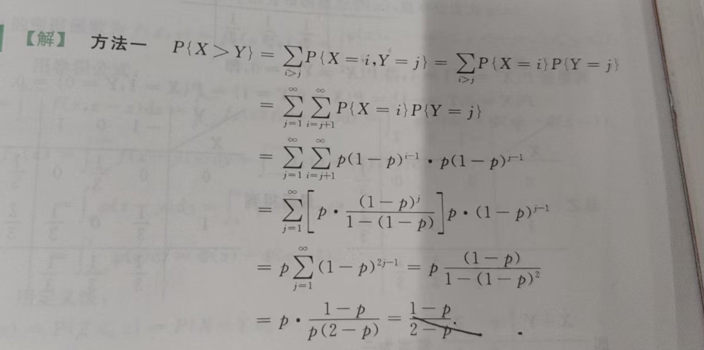

### 同一个向量的坐标与基关系

==一个向量=基乘坐标== `根据这一点就可以求出来一个向量在不同基下的坐标了`

### Ax=b与XA=b的关系

这种情况，最后就是转置一下，求出来At的解，然后X转置

### 行阶梯遇到参数问题

为了保证不漏解，最后化简到最后一列，否则很容易出现少解问题，求出来的多解最后又要排除一个

### 行列式，Ax=0与特征值的关系

行列式为0则特征值为0

Ax=0则特征值为0

### 快速寻找特征值的方法与公式

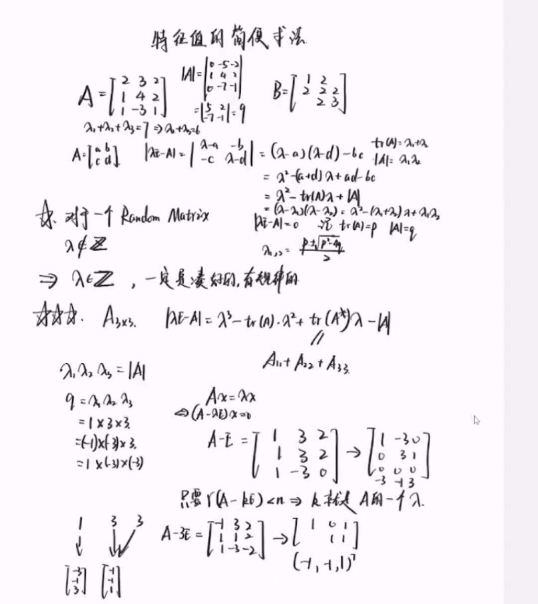

套路是这样的，你得相信特征值大概率是整数，那么首先求出来迹，行列式，然后看看能不能猜出来，如果猜出来感觉不信，那么带一个试试，符合了那么大概率猜出来的特征值是对的，如果还是猜不出来，**尤其是带参数的特征值**，就最好套用公式，基本上不带参数秒了，带参数就猜 ==有个小提示，也许公式出来他会某个值就直接把a消掉，简而言之与a无关==

### 行列以及n与m关系含义

这个一列有多少个，代表一个向量的维数

一共多少列代表这个空间的向量个数

n<m是没有解的,n=m是唯一解，n>m是无穷解

### 向量组的线性表示

有必要表示和充要表示

向量组等价就是R（a)=R(b)=R(a|b)

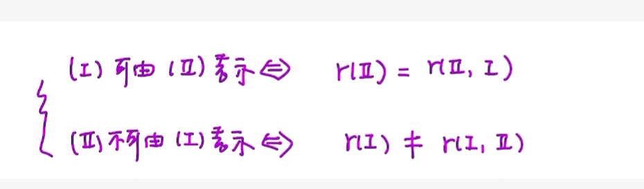

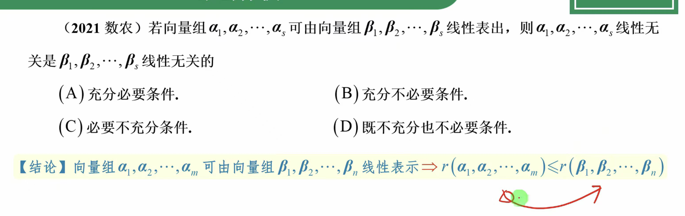

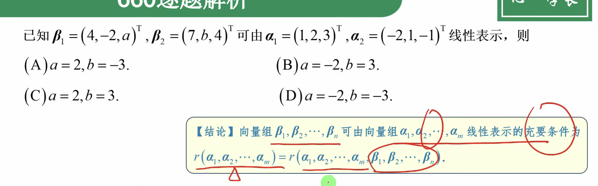

### AB=C的结论以及两种解法

**秩的结论**：如果A列满秩，那么R（B）=R（C)

**线性相关理论：**如果A线性无关，那么B的相关性决定了C。如果a线性相关，那么B和C线性相关。

**第一种解法**：首先就是AB1=C1，求出来一个X,然后有几个列向量就再同时构造几个列向量，然后求出来！

**第二种解法**：

### 基础解系与等价的特点

基础解系要求：线性无关，且维数相同！

等价的特点：==本质上是形成的向量空间是一致的==

### P^-1^AP=B的P组合问题

P可以是特征向量组成的，也可以是P可以是特征向量 **组合**组成的。满足一下特点

1. 本身必须可逆
2. 本身必须跟特征值对应上，比如对角矩阵是2，2,1那么组合的特征向量必须是同一个特征值下的组合，不能混合组合，而且要对应。

### 行列式求参数要讨论

==求出来一个或者两个参数一定要带入进行讨论！！==

### 线性相关定理

1. 一堆向量线性相关=>行列式为0=>秩<n=>ax=0有无穷多解 抽象矩阵用定义，k不全为0
2. 一堆向量线性无关=>行列式不为0=>秩=n=>ax=0只有零解  抽象矩阵用定义，k只能全为0

### 基础解系解的结构

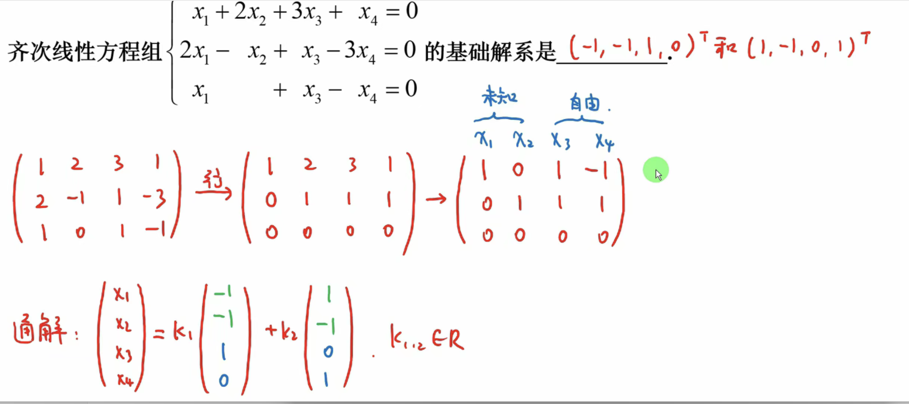

矩阵的秩决定了未知量，n-r就是这个自由量

在求基础解系的时候要求自由量，选择自由量，让自由量1,0  0,1求出来未知量

==选择自由量求未知量==，一共n-r个（或者n-r+1）

### AB=O

设B为n阶矩阵，每一个用Ax=b，求出来的是解y1=k1a+k2b，B是由y1，yn的向量组成

把B看成每一个yi跟A相求，然后进行组合，也就是n阶里有n个变量呗

### 基础解系与特征向量的关系

1. 基础解系他的解k为任何数
2. 特征向量的解是k不全为0
3. 他们的解都是一堆组合，也就是y=什么，必要的时候把ki带进去，求出来y是真正这个组合解，局部向量是为y服务且是一部分

### 秩为0的重要理论

秩为0就是O矩阵

### 四秩相等与At与A同解

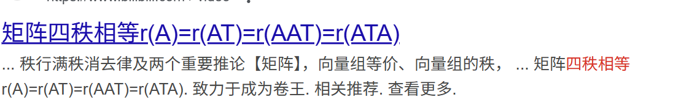

### 两大消去！

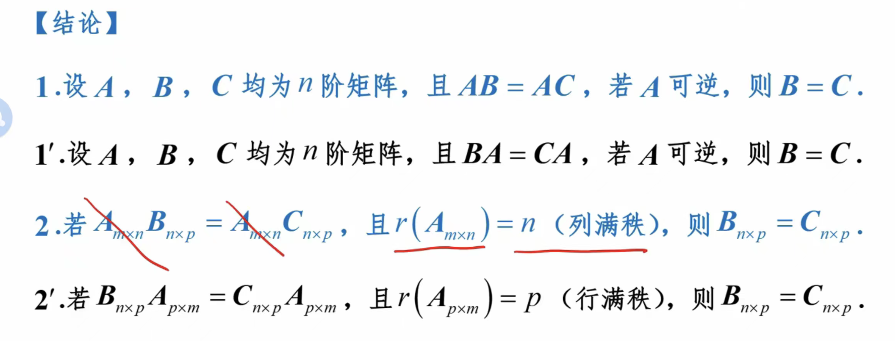

1. 可逆以及身边满秩

### 分块矩阵的逆，行列式，n次方

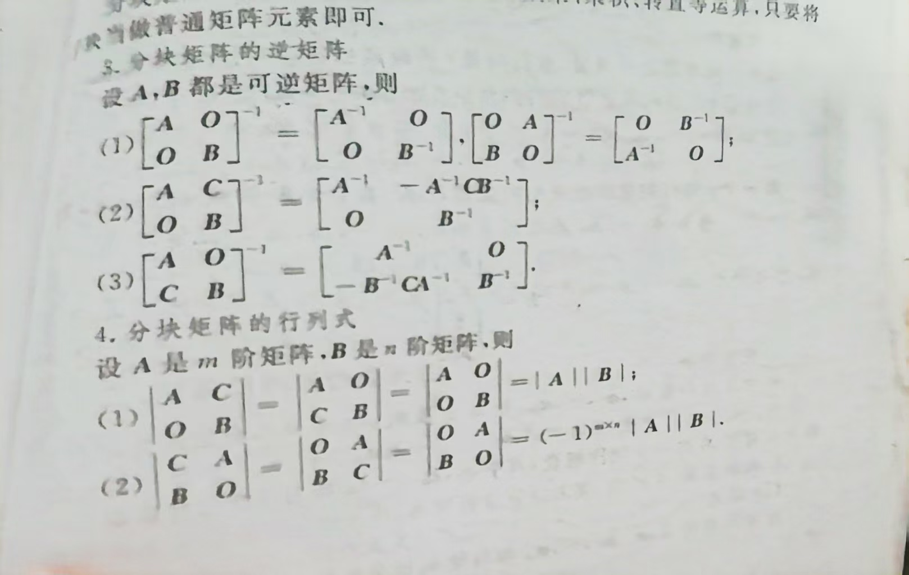

**n次方就是各自n次方	**	

### 上三角，下三角，主对角副对角行列式

上下三角是以主对角线乘积就是行列式

副对角线上下就是副对角线相乘，然后来个（-1）的n阶

### 伴随求法

A*=A^-1^ |A|,

首先求出来求各自代数余子式，然后转置！！！

### 秩为1特点

如果一个秩为1，==那么这个矩阵就可以用一个向量来线性表达其他任意向量==。

一定可以转化为a*b^T^,那么就 **很容易进行n次方了**，直接n次方，会出现b^T^a,这是一横一竖可以直接求出来值了

他的特征值 是迹，0,0

 ### Aa＝b，关于a可不可逆求解

如果a==可逆== ，那么A=a^-1^b求出来a

如果a ==不可逆==，那么把A这个矩阵元素全部设出来，然后用这个定义去一个个求出来单独项ai。

### 秩的主子式

至少有r阶不为0，且r+1阶全部为0

### 子式与秩的关系

如果一个矩阵的子式不为0，那么这个矩阵的秩至少为这个子式的阶数

###  特征值和秩的关系

**特征值的个数** 与矩阵的阶数 **（矩阵的维度）** 相关，而与矩阵的秩无直接关系。

#### 1. **特征值的个数与矩阵的阶数相关：**

- 对于一个 $n \times n$ 的矩阵 $A$，它的特征值的个数最多是 $n$ 个（包括重根）。这是因为矩阵的特征多项式是一个次数为 $n$ 的多项式，而一个多项式的根的个数（包括重根）等于其次数。所以特征值的个数的上限是矩阵的阶数。
- 特征值的个数可能少于 $n$，这取决于矩阵的特性（例如，是否存在重复的特征值，或者矩阵是否有缺失的特征值等）。

#### 2. **特征值的个数与秩的关系：**

- **秩** 与 **特征值的个数** 没有直接的关系。秩是衡量矩阵中线性独立行（或列）个数的指标，它告诉我们矩阵的线性独立性。
- 特征值的个数与矩阵是否可逆、是否是满秩矩阵相关，但并不是秩的直接函数。

#### 3. **特征值与秩的关系：**

- 如果一个矩阵的秩为 $r$，它有 $n - r$ 个零特征值。也就是说，矩阵的秩决定了有多少个零特征值，但不决定非零特征值的数量。
- 若矩阵是满秩矩阵（秩为 $n$，即 $A$ 是可逆的），则它的特征值不包含零。

#### 4. **总结：**

- **特征值的个数**：与矩阵的阶数（$n \times n$矩阵的特征值个数最多为 $n$）相关。
- **秩**：影响矩阵是否有零特征值，但不直接影响特征值的总个数。

###  特征向量和特征值的关系

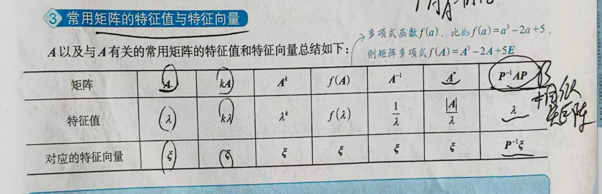

一个特征值对应一个特征向量，不同特征值的特征向量线性无关，一个多重特征值的多个特征向量可能相关也可能不相关

###  特征值小点

同一特征值的特征向量可以组合，不同特征值的特征向量不能组合

特征向量是构成解（基础解系）的自由量，多个

上三角的主对角线元素就是他的特征值！

抽象型矩阵一般带入A！特征值！两步

###  相似理论

P可以同时相似化于A，B则

必要条件：AB=BA

充分条件：AB=BA，A有n个不同特征值

**相似结论**

相似有一个重要结论就是如果P的逆*A*P=B，则A，B相似.A ,B特征值如果相同且B可以相似对角化，则A，B相似。如果A，B特征值相同，B不能相似对角化，不能推出来A,B是否相似。如果告诉你A，B相似让你找到一个P可逆矩阵使得A，B相似，只能设P为n阶矩阵根据定义式子去求出来AP=PB存在的这个P

找可逆相似矩阵两种方法

1. 如果不指定B的话，则A组成特征向量P就是可逆
2. 如果指定B的话，则用定义去求

### 同解问题

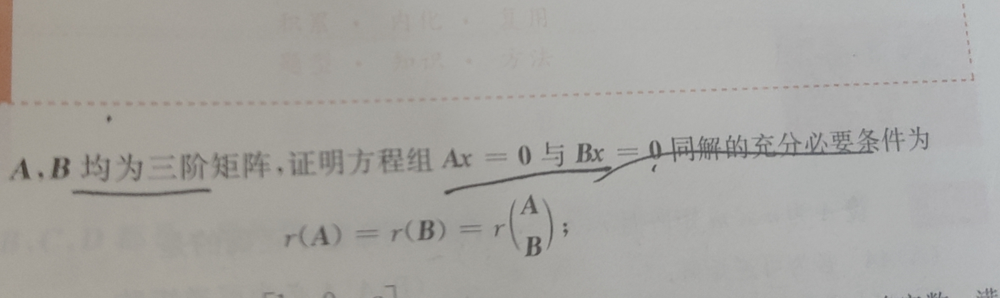

**秩的关系**：看图片

**方程的关系**：就是方程的解是同一个，也就是任何什么时候都能相等，记得与公共解区分

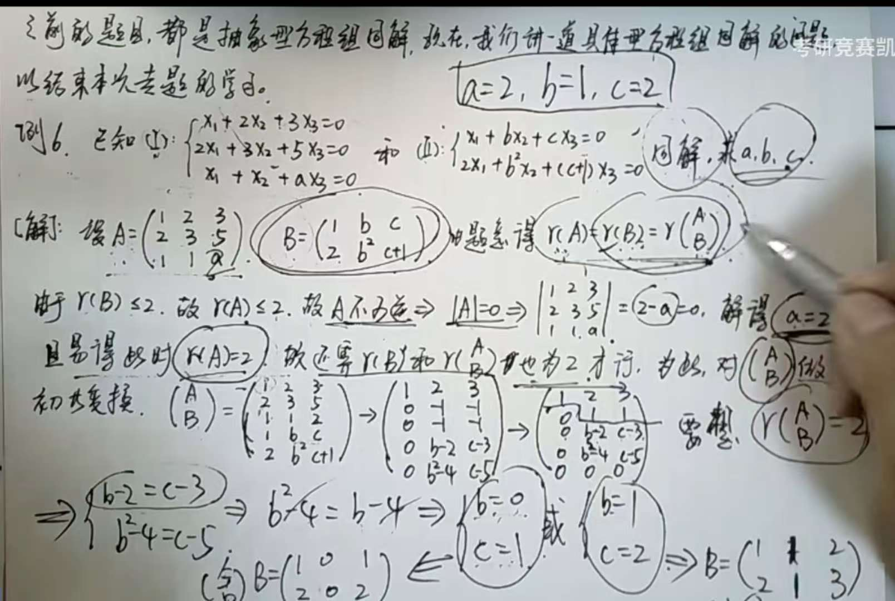

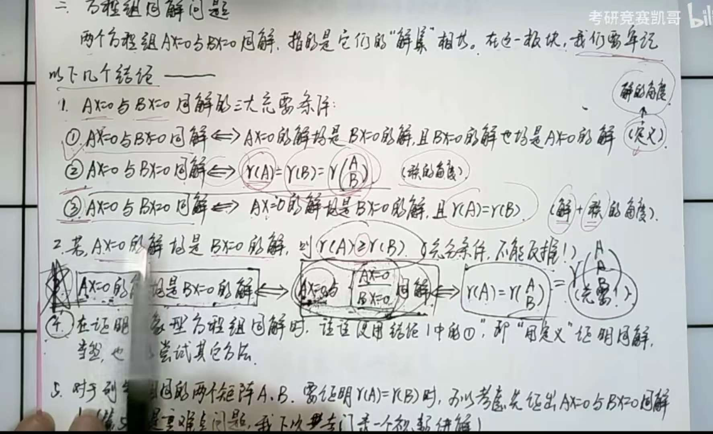

###  公共解问题

公共解问题与双线性表示是一个问题

公共解：三种表达

1. （A下方B）X=0
2. 求出来AX=0，把X带入到B的方程组里
3. k1a1+k2a2=l1b1+l2b2，移项有解

**公共解的重要理解：**公共解说明两个方程的解里头有某些解向量是相同的，那么就意味着，存在这种解，带入

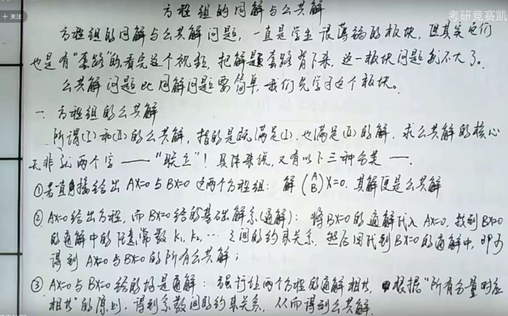

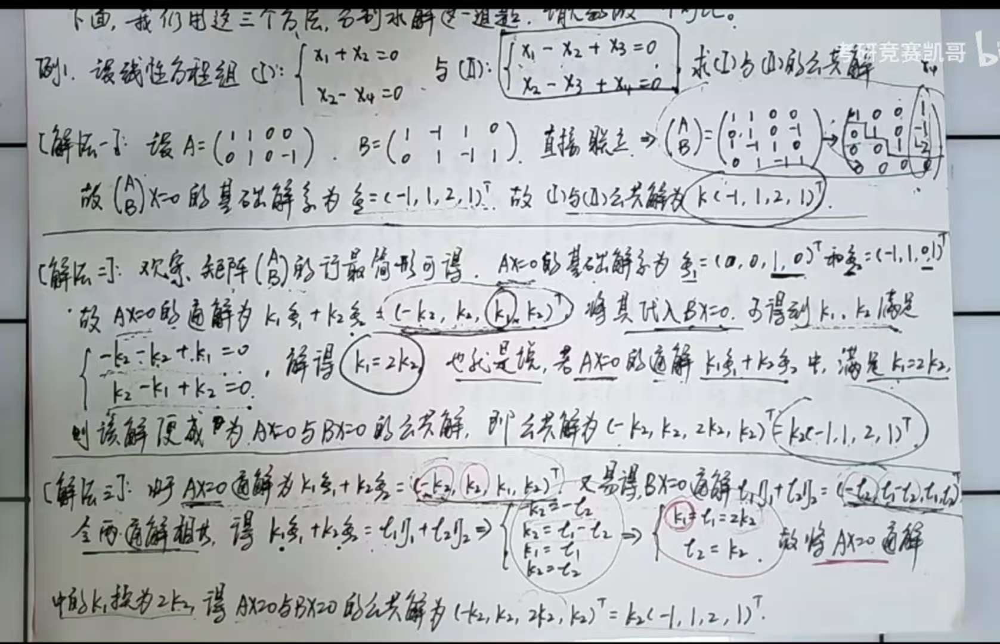

###  特征向量求A

1. A=P对角矩阵A*P逆
2. 秩的关系求A

###  可逆矩阵P的两种理解以及求法

1. 行列式不为0
2. 线性无关的列向量

**求法**：一般我们用通过伴随矩阵除以行列式来求

具体结构是分子用代数余子式 ==一定要在矩阵右上角加个T，方便记住以后转置==，然后分子除以行列式

#### 相似可逆矩阵

如果让你两个矩阵相似，同时让你求出来P^-1^ ,正常有两种方法

第一种：就是设出来这个方程，然后根据ap=pb算出来p的每一项根据等式关系

第二种：就是通过p1^-1^Ap=对角 p2^-1^BP=对角，分别求出来每一个P，用特征向量组成，然后算出来 P1P2^-1^,或者根据特征值与特征向量的关系，P^-1^PA=PB,P^-1^=PB*PA^-1^,P=PA*PB^-1^ 直接记住结论得了PA*PB^-1^

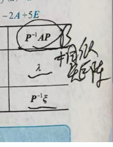

###  列向量不是特征向量的特征方程理解

$$
AC=\lambda C
$$

这个式子C不是A的特征向量但是能得到C是A属于λ的特征向量一部分，至少为R（C）个

###  两个矩阵相似充分条件

1. 两个矩阵的特征值相同（每个不同）
2. 一个可相似对角化

###  二次型

####  二次型规范标准化

两大方法

1. 可逆线性变换

   这种方法本质是配方法，配出来之后求出来C，X=CY配出来新的规范

   ==注意==：如果有平方项则正常配方，如果没有平方项则，x1=y1+y2,x2=y1-y2,x3=y3出现平方项再配方

2. 正交变换

   这种方法本质上是求出来矩阵A特征值，然后特征值Y的规范化！

   这两种特点是用矩阵就用正交，不用矩阵写出来定义型就用配方

####  二次型易错题型

==很多人以为（x1+x2）方+（x2+x3)方，直接换元变成两个都是正的系数，误以为秩就是2，或者说正指数就是2，其实是不对的，这样不一定是变换的矩阵前提是可逆线性变换==

####  x1方+x2方结论

x1方+x2方=y1方+y2方

####  线性变换后二次型矩阵发生的变化（求正交矩阵）

如果X=CY经过线性变换使得X的二次型变成Y的二次型，那么这个二次型矩阵是经历了合同变换，CtAC=B;（==这个是二次型矩阵==）！

==如果要求出来这个C==，需要根据相似理论分别求出来A，B的对角化的矩阵，然后去导

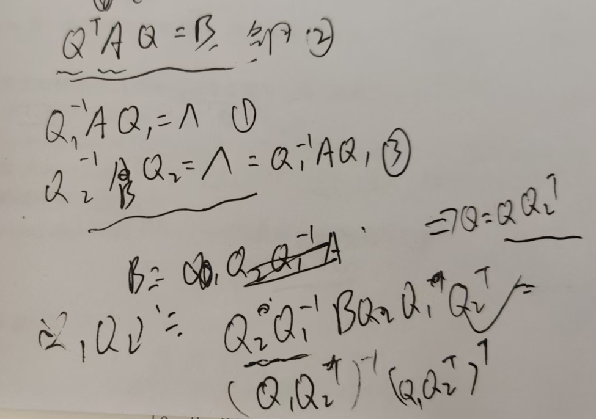

####  二次型最值问题

二次型最值问题，一般来说就是取X=QY，找出来特征值，最大值就是特征值的最大值，最小值就是特征值的最小值

####  求合同矩阵

这个问题我们一般用可逆线性变换来求出来

因为可逆线性变换后的矩阵都是合同的，那么这个可逆线性变换的矩阵就是合同矩阵

**如果是A，B合同求合同变换矩阵**

这种问题一般是用第三方的对角矩阵合同，A合同于对角，B合同于对角，则列出来等式求出来合同矩阵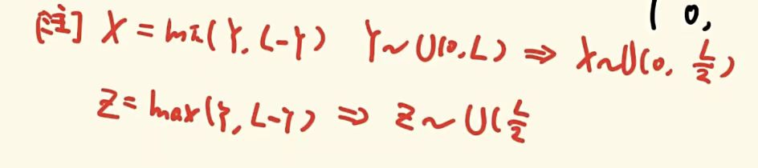

####  合同小结论

**实对称前提下**相似必合同，合同不一定相似！！！

正负惯性指数来判断两个矩阵是否合同

对称的合同矩阵一定是对称，不对称的一定和不对称的合同

####  正交变换注意事项

正交变换前后的矩阵一定是相似且合同的

正交变换也可以把矩阵转位对角矩阵（==前提是这个正交矩阵必须由特征向量构成，否则不可以转位对角矩阵==）

####  把二次型转为位规范性

要么就是可逆线性变换，要么就是正交变换

####  变换定理

在二次型的变换里，经过变换之后至少能得到矩阵的一个合同定理

## 概率论

### 边缘分布与联合分布的关系

边缘分布无法推出来联合分布，因为还少个搭配组合关系。联合分布可以推出来边缘分布

但是此时如果还让你判断是否独立，最好的方法就是代入一个合适的点

### 区间讨论

区间讨论的时候一般都是左点相等

### 无偏性与一致的含义

> 在算无偏性的时候我们一般求出来EX看看是否等于斯塔冒，等于就没事，不等于就有事！

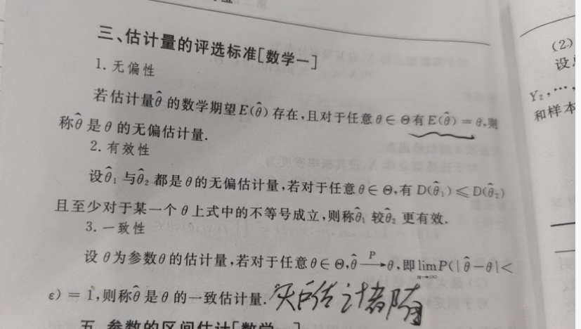

无偏性：就是估计量的期望和这个本身相等一样的

一致性是指：估计量依概率收敛于本身，简单来说就是当n很多的时候估计量一定会趋向于本身的

**估计量**：他的组成都是由数据量构成的

### 中心极限定理以及二项分布的变量设置

中心极限定理讲得是任何分布的变量的组合多了，就变成正太分布了，次数求期望和方差就能求出来这个什么是正态分布了 数字化就是**ΣXi~N(u,/σ^2^)**

**二项分布的设置：**

二项分布的特点就是

这里Xn为次品的个数分析，产品有正品和次品，2类，合格率不合格率两种结果，**设置变量的时候任取一个就好了**

这两类比如随便取一个正品，那么就是B(n，正确率)

1. n里头只有两类
2. 只有2种结果

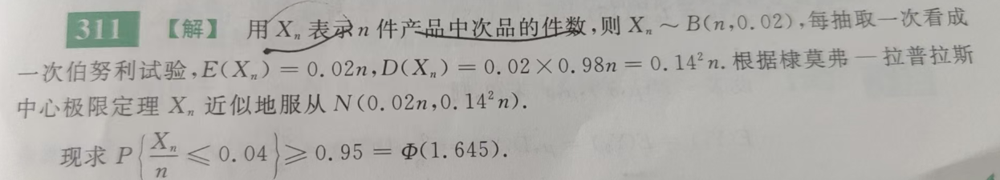

### n方差的期望以及D（标准绝对值正态分布方差）

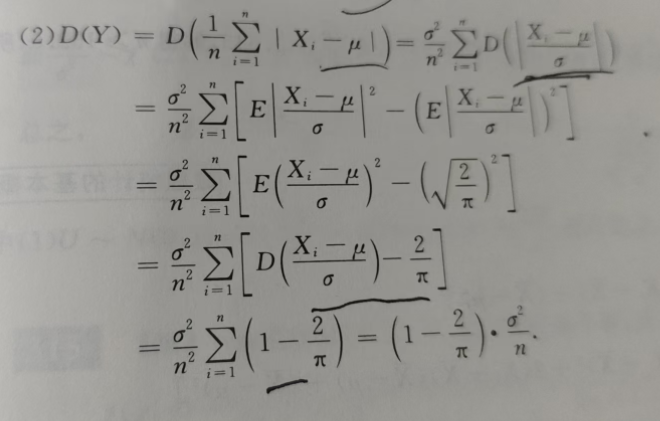

是|xi-u/σ|的方差就是（1-π分之2） 

E(**nσ 2** )=n-1*（**σ 2**） 

### 样本方差的两个定义

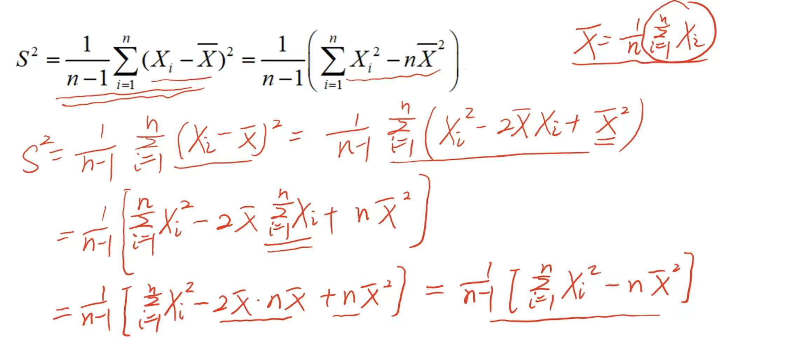

第二个定义可以引申一下，分子是相等的

### x2+y2概率密度解决以及陌生的怎么办

x方+y2这种我们只能求出来x方的概率密度，y2的概率密度，然后 用加法分布函数来求概率密度

**遇到陌生的怎么办？**：首先看一下他是什么形式+-×÷，然后把整体当做一个变量，求他的概率密度，每个求出来之后用+-分布函数这种求出来就好了

### 最大值最小值期望

> 有三种解决方案，根据合适的求

1. 独立分布公式
2. 正太均值
3. 最大最小公式

在掌握这个的时候首先要掌握标准的E（|X|）的期望是根号下2/π

处理好绝对的了，那么max和min就用公式来解决，公式里有绝对值，标准化之后就能求出来期望了！

**注意**：为什么不能用定义，因为正态分布函数的分布函数不能用正常初等函数表示，只能是积分这种表示

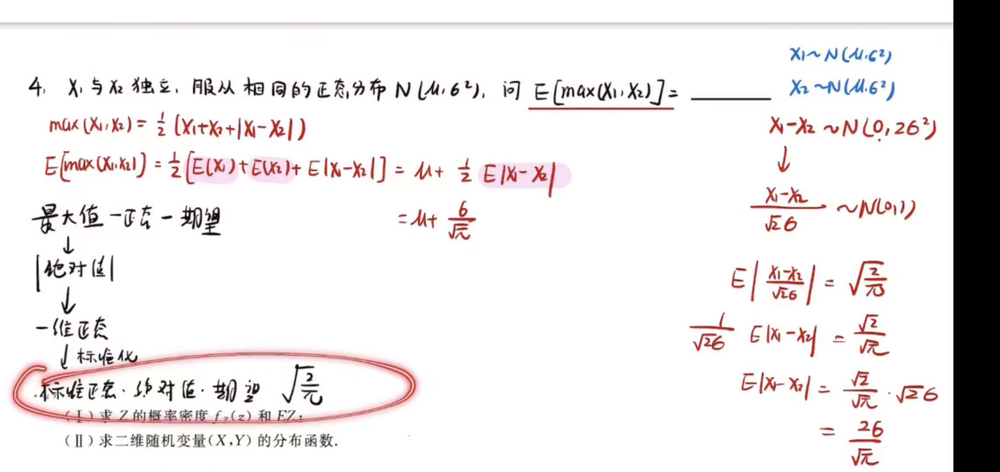

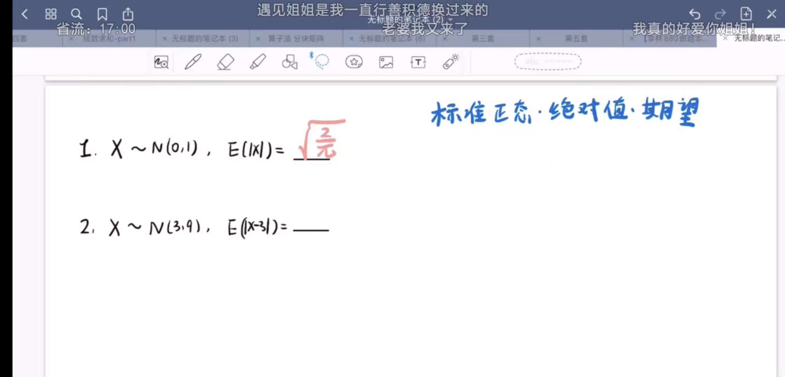

### 组合正太分布

如果X+Y是一个组合分布了，那么独立就是正常相加减，如果不独立，那么u是加减，D（X+Y）会带有2cov相关性

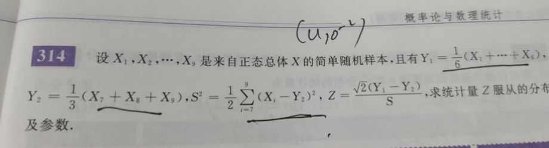

这里组合分布S方， ==千万不要直接求出来xi-y2因为这里不独立，会导致错误的结果，应该用（n-1)S^2^/σ^2^==

### P（U=xi)变量问题

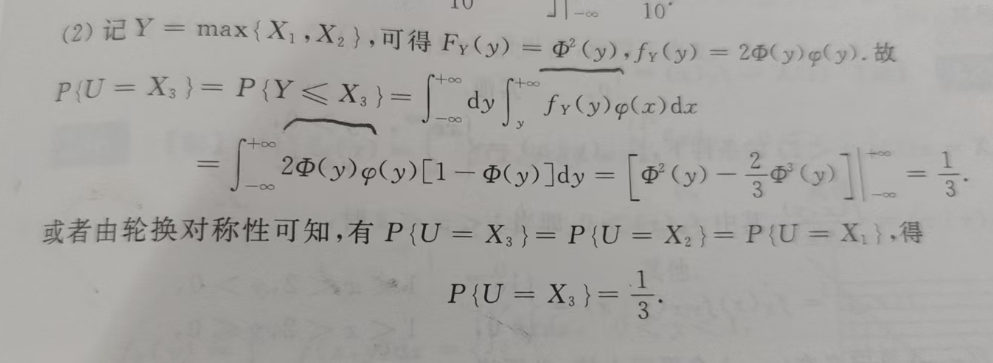

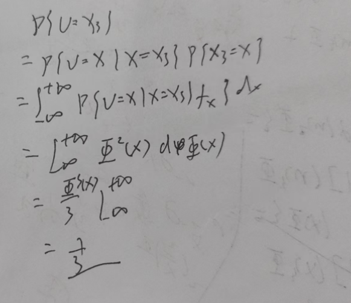

这个不同于其他问题，这个等于是个变量，这就需要对条件概率联合起来，深入理解，你想想如果U=x这是不是就是正常的求联合了？根据这个用条件概率密度转化一下！

### X方+Y方特殊的概率密度以及陌生的构造怎么办？

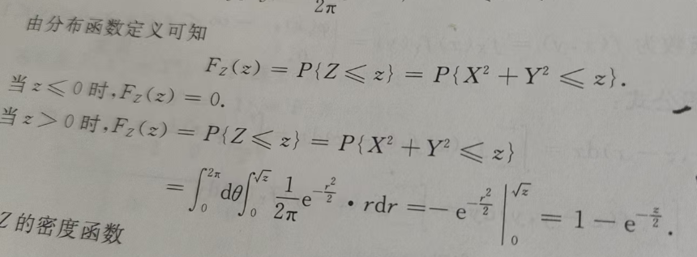

X方+Y方的概率密度首先是加法，然后根据定义P(x方＋y方<=z）他其实就是P$_D$ fxy，这个D就是x方+Y方小于等于z，所以加法求出来fxy是关键，其他都是范围

**陌生构造：往已知的靠**、

### 最大值最小值公式

max{X,y}=二分之（X+Y +|x-y|)

min{x,y}=二分之（x+y-|x-y|)

### 控制变量的全集分解

比如Y的值是由X这个控制变量组成的，那么别的不说直接带入

P{Y<=y},那么右边就是一个全集进行控制，他就变成了pxy了，接下来就简单了

### fxy的结论

1. fxy求fx或者fy要看图
2. fxy为常数的时候面积就是概率
3. fx求谁fxy求的谁就切哪个轴，fx就切x轴

### 条件概率的重要理解

题目一说在x等于x的条件下，就说明这是条件概率密度出现了 **这个条件概率密度非常有意思的一点就是他是一维的，只能是点**

P(x<0|y<0)这是条件概率，只能用fxy去求

P(x<0|y=0)这就是条件概率密度，可以用fx|y去求

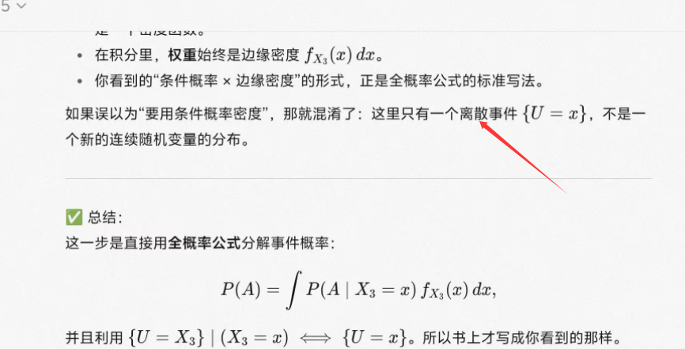

正常来说这里是fx|y但是离散的就是p

### 大数定律条件

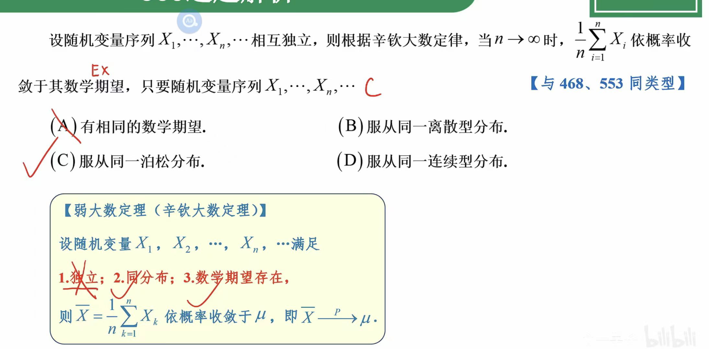

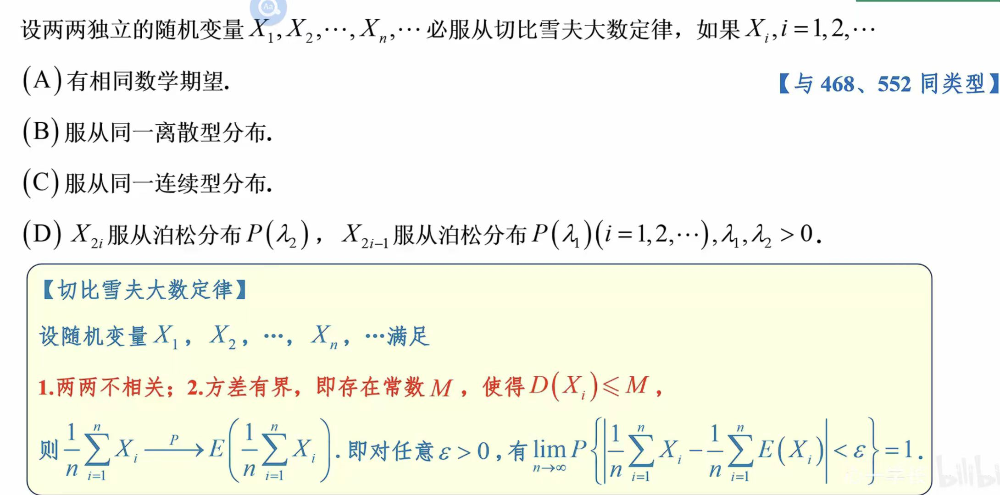

==辛勤考的多==

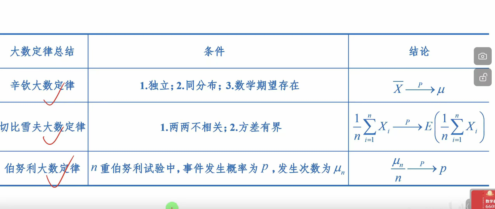

### 给了相关系数求P某一项概率

明白了，下面是直接渲染后的 Markdown 代码：

 **解法 1（用协方差）**：

$X, Y \sim B(1, \frac{1}{2}) \Rightarrow E[X] = E[Y] = \frac{1}{2}, \ \mathrm{Var}(X) = \mathrm{Var}(Y) = \frac{1}{4}$

给定相关系数 $\rho = 1$，

$\mathrm{Cov}(X,Y) = \rho \sqrt{\mathrm{Var}(X) \cdot \mathrm{Var}(Y)} = 1 \cdot \sqrt{\frac{1}{4} \cdot \frac{1}{4}} = \frac{1}{4}.$

而 $\mathrm{Cov}(X,Y) = E[XY] - E[X]E[Y]$，所以：

$E[XY] = \frac{1}{4} + \frac{1}{2} \cdot \frac{1}{2} = \frac{1}{2}.$

由于 $XY = 1$ 当且仅当 $(X,Y) = (1, 1)$，因此：

$P(X = 1, Y = 1) = \frac{1}{2}.$

用边缘概率 $P(Y = 1) = \frac{1}{2} = P(X = 1, Y = 1) + P(X = 0, Y = 1)$，得：

$P(X = 0, Y = 1) = 0.$

**解法 2（概念）（推荐）：**

$\rho = 1$ 且方差不为零 $\Rightarrow Y = aX + b$ 几乎处处成立且 $a > 0$。

$X, Y \in \{0, 1\}$ 且 $E[X] = E[Y] = \frac{1}{2}$ 推出 $a = 1, b = 0$：

$Y = X \quad \text{a.s.}$

因此，

$P(X = 0, Y = 1) = 0.$

### 正态分布函数用密度函数求均值问题

最好变成什么e的负2分之一x方，凑出来u与方差，==根据新的正态分布求期望和方差==

### D(X)与样本方差S^2^的关系

这里Dx=(n-1)S^2^/n

E(S^2^)=D(x)（无偏估计量）

### 全集分解思想要有单独两项与全概率

一般来说全集分级之后，除了带入还要根据独立结论把分解那一部分概率成了

**全概率**：是所有条件的集合，你这么想，全概率就是把各种情况*这种情况下的事件

P(B)=ΣPAi(B|Ai) 这里Ai是所有条件

### 密度函数要求导

给了一个符合分布函数比如F（3x),让你求f（3x)就是3*F^`^(X)

或者z=3x,F（z)=P (3x<=z)=P(x<=z/3)=F(z/3)

f(z)=3分之一*F`（x)

### 两两独立和相互独立关系

x,y，z

两两独立指的就是一个x无法影响到一个z，y无法影响到z，但是XY可能会影响到z哦

相互独立就是xy任何组合也无法影响到z ==证明 PABC=PAPBPC==

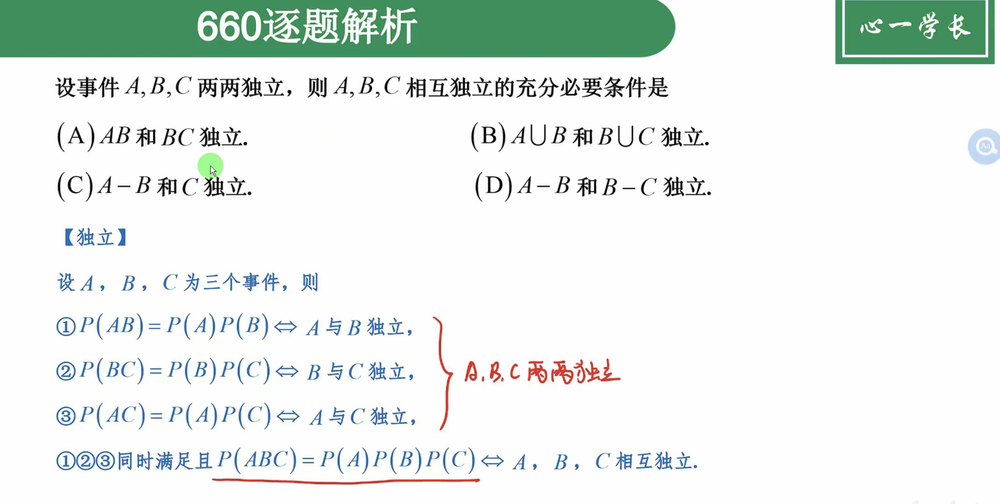

### 分布函数条件

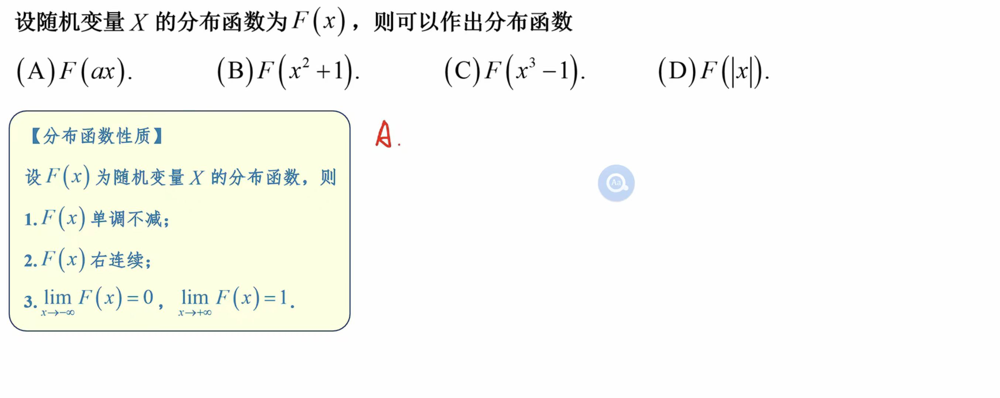

==第三个用的多==

### 判断分布趋势的规律

如果想要判断某个分布是什么分布，一般判断他的期望和方差是否符合这点的分布期望和方差（==注意这是必要条件==）

### 自己和自己的协方差特点（协方差1）

cov(x,x)=D(X)

### xi与$\bar{x}$ 的相关性（协方差2）

cov(xi,$\bar{x}$)=cov(xi,x1+x2../n)=1\nD(x)

### E(g(X))=两种整体办法

1. E（g(x))=积分上下限无穷* g(X)*fx
2. 要么求出来gx的概率密度，然后求上下限（这种方法小心分段点）

### 四大可加性

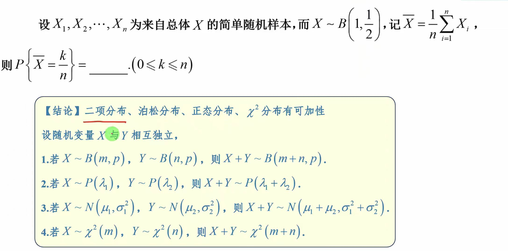

在加一个指数分布z=min(x,y)为E（x+y)

### t分布于F分布关系

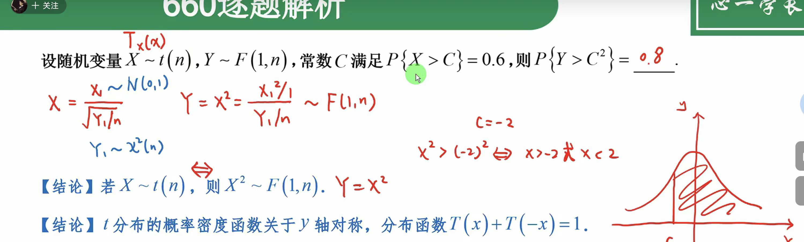

t^2^ 就是F（1，n)

### 合同三部分以及误区

> ==误区：合同不一定相似！而且合同矩阵与相似矩阵是并列，正交矩阵最细==
>
> ==对称矩阵的充要条件最多了！一定要记住正负惯性指数相同==

合同三部分：充要，充分，必要

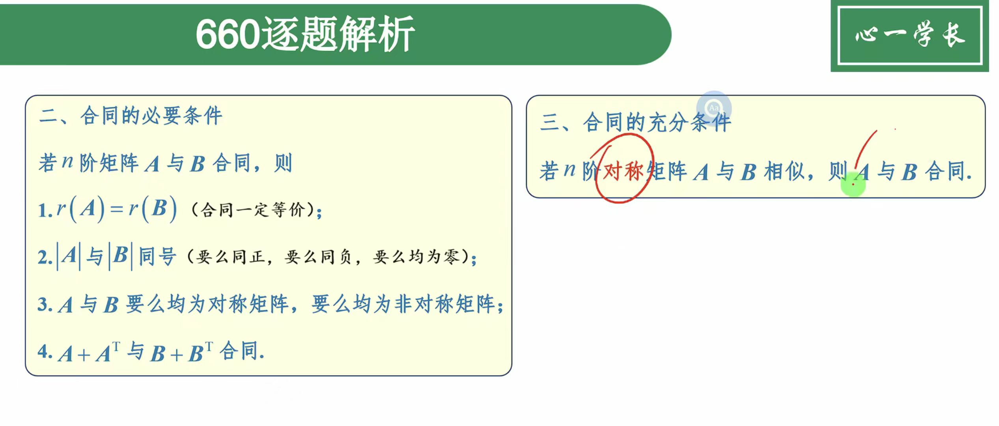

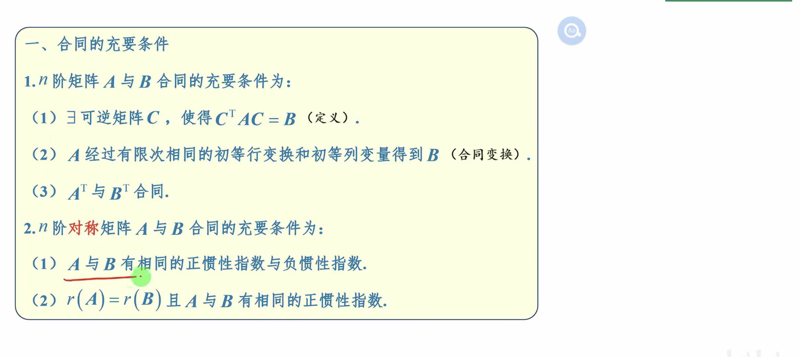

### 正交变换误区

只要是正交变换那么求出来的系数都是特征值，这个是一定的，只是可以用特征向量来组成特征向量（记得施密特以及单位化）

### 概率P里面两个含义与fz的两种办法（卷积和分布）

P（x+y<=1)第一个含义是限值了XY的范围

第二个含义是把他当一个X+Y整体随机能量

**fz的两种办法**：第一个就是分布函数用F 整体式子一个求出来区域然后用fxy二重积分

第二个就是用卷积式子 卷积 z的范围是通过代替变量y=z-x求出来z的范围（**想小本本那个整体式子**）

**卷积法重点理解**：

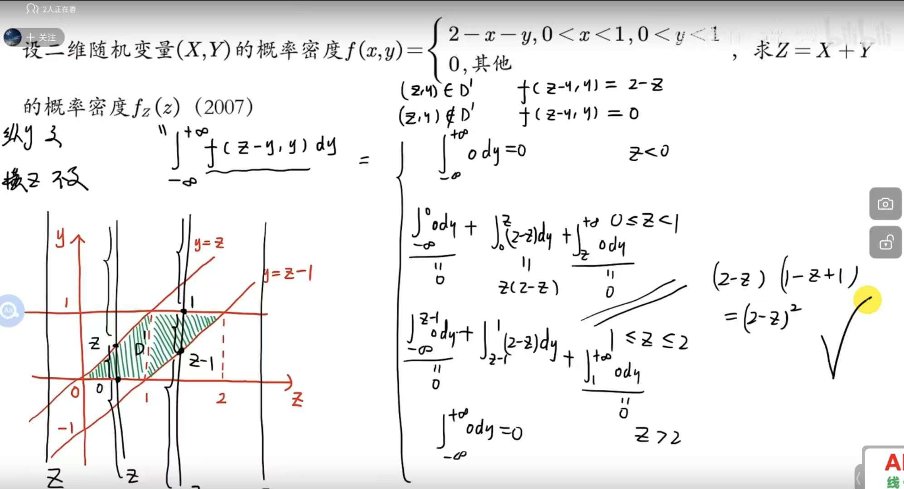

1. 首先把换元一个，然后在括号里对Z求导绝对值
2. 然后画出来==不换元与Z的轴==，你把换元的范围全部带进去，求出来Z范围，这个过程其实是从D到D’过程，这个时候已经画出来Z-不换元图了
3. 然后跟据fz，切Z轴，根据Z的值来讨论不换元的上下限，求出来就好了，大概率是个根据Z的值不同fz

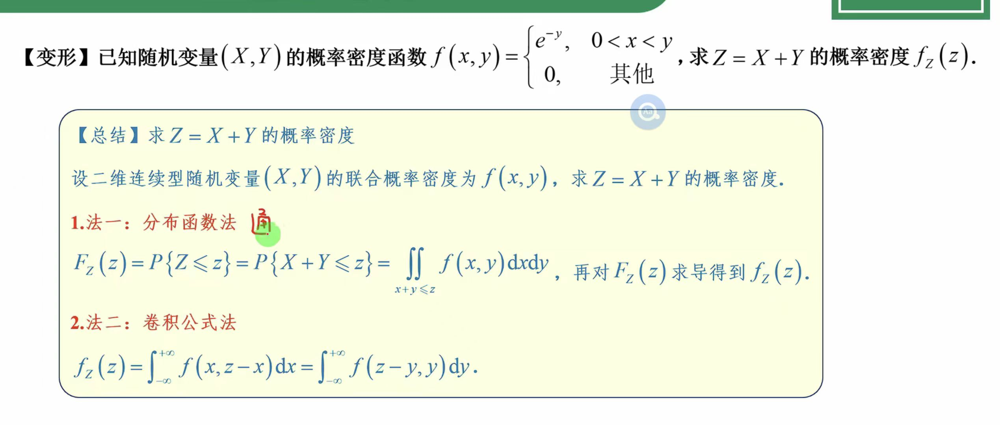

### 条件公式

P（AB非|C)=1-P(AB|C)

### 两个x减u或x平方和以及误区

> 在这里重要理解的是xi-u的平方和 与xi-x拔的平方和 这里x拔是一个随机变量，他的值随样本的变化而变化，那这就导致了一些特殊结论，而u是常数
>
> ==首先区分平方和是哪种平方和== 
>
> ==然后用重要结论 ==一般是让你求平方和的期望，那么u的平方和就是方差他的E的期望就是n*方差，如果x拔平方和，那么就是用E(（n-1)S^2^ )=方差

总体方差定义是：

$$
\mathrm{Var}(X) = E\big[(X-\mu)^2\big]
$$

所以如果你有独立样本 $X_1,\dots,X_n \sim N(\mu, \sigma^2)$，那

$$
E\big[(X_i-\mu)^2\big] = \sigma^2
$$

于是很多同学就会想：

$$
E\Big[\sum_{i=1}^n (X_i-\mu)^2\Big] = n\sigma^2
$$

$$
\sum (X_i-\mu)^2 \quad \text{和} \quad \sum (X_i-\bar{X})^2
$$

是不一样的。第二个里 $\bar{X}$ 本身就是随机变量，它依赖于样本。

所以，$\sum (X_i-\bar{X})^2$ 不是 n 个方差简单相加，而是要减去“样本均值的自由度”。

### 随机变量的设置

如果要设一个随机变量，关键理解的是==随机变量就是让一个事件转化为值==，理解了这个

那么把事件取某个值，或者是某种情况这个事件当做随机变量，那么随机变量的值是自己随便设的，一般设1为事件发生，不发生为0

**Xi随机变量的设置**：一般来说这个i说明他是有很多次数为特征，也就是==独立同分布的事件就行设置==，然后Xi每次他都有结果，每个结果又分为两个事件，1对应一个事件，0对应一个事件

###  独立的结论

1. 独立没有传递性
2. 独立没有包含关系

### 概率变化

已知结果会导致概率变化

### 概率中最大最小值的处理

我们一般都把他转成与事件！

### 遇到指数函数与指数分布

==一定要注意有a这个系数-e的x次方==

凑正态分布函数

### 二维正态分布结论以及特殊性

边缘分布也是呈现正态分布函数的

==P为0说明xy是独立的== 注意正常相关系数为0只能说没有线性相关关系，只有二维正态分布有这个性质

### 常见分布可加性

二项分布可加性

泊松分布可加性

正态分布可加性

指数分布可加性（min(X，Y)~E(f1+f2))

### 分布函数的分布

如果一个x的分布函数是单调递且连续，那么这个分布函数的分布函数是二项分布，Fx服从U（0,1)分布，F（F（X））=u在（0,1）区间

### 均匀分布的棍子截取问题

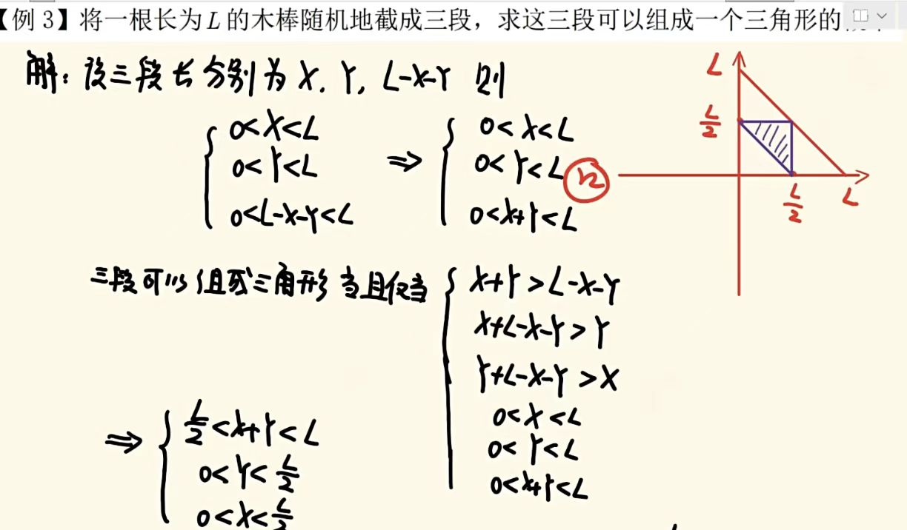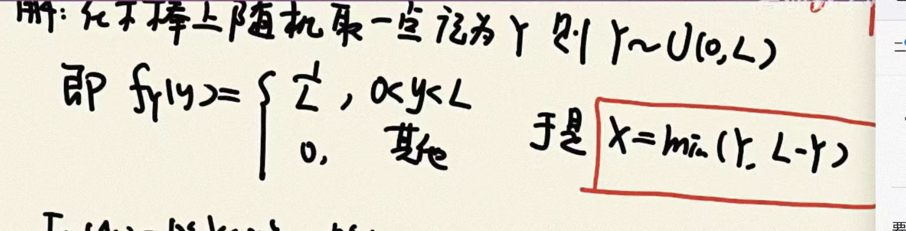

如果是截取取最短的一次就是用X=min(l，l-y)

==注意这里不能用最小公式，因为括号里头的变量不独立==	

然后如果是截取两次那么就是一个几何概率问题 ==注意截取的时候我们把坐标当做一个截取点，如果是长度反而不好理解和计算==

### 条件分布

---

#### 1. 定义直观理解

条件期望是“已知 $Y$，对 $X$ 的最佳预测值”。

* **直观比喻**：我知道今天的天气（Y），想估计去的人数（X）。
* 那么 $E[X|Y=y]$ 就是：在天气固定为 $y$ 的条件下，人数的平均值。

---

#### 2. 离散情形

如果 $(X,Y)$ 是离散型的，定义为：

$$
E[X|Y=y] = \sum_x x \, P(X=x \mid Y=y).
$$

也就是先算条件分布，再加权平均。

**例子**：
设 $(X,Y)$ 的联合分布如下：

| X\Y  | 1    | 2    |
| ---- | ---- | ---- |
| 0    | 0.1  | 0.2  |
| 1    | 0.3  | 0.4  |

比如 $E[X|Y=1]$：

* $P(Y=1)=0.1+0.3=0.4$
* $P(X=0|Y=1)=0.1/0.4=0.25,\;P(X=1|Y=1)=0.75$
* 所以 $E[X|Y=1]=0\cdot0.25+1\cdot0.75=0.75$。

---

#### 3. 连续情形

若 $(X,Y)$ 有联合密度 $f_{X,Y}(x,y)$，边缘密度 $f_Y(y)$，则：

$$
E[X|Y=y] = \int_{-\infty}^\infty x \cdot f_{X|Y}(x|y)\, dx
= \frac{\int x f_{X,Y}(x,y)\, dx}{f_Y(y)}.
$$

---

#### 4. 重要结论/性质

* **线性性质**： $E[aX+b|Y] = aE[X|Y]+b$。
* **函数化**： $E[g(Y)|Y]=g(Y)$。
* **塔式性质（迭代期望）**： $E[E[X|Y]]=E[X]$。
* **最佳预测**： 对已知 $Y$，$E[X|Y]$ 是最小化均方误差的最优估计。

---

#### 5. 特殊情况（常考/常用）

1. **独立性**：若 $X \perp Y$，则 $E[X|Y]=E[X]$。

2. **线性高斯情形**：若 $(X,Y)$ 服从二维正态，

   $$
   E[X|Y=y]=E[X]+\frac{\mathrm{Cov}(X,Y)}{\mathrm{Var}(Y)}(y-E[Y]).
   $$

   （这就是线性回归、卡尔曼滤波的核心）

---

#### 6. 举例

例：$X,Y$ 联合密度在单位正方形 $[0,1]\times[0,1]$ 上均匀分布。

* $f_{X,Y}(x,y)=1$。

* 边缘 $f_Y(y)=\int_0^1 1 dx=1$。

* 所以 $f_{X|Y}(x|y)=1, \; 0<x<1$。

* 因此

  $$
  E[X|Y=y]=\int_0^1 x \, dx = \tfrac{1}{2}.
  $$

说明：虽然知道了 $Y$，但因为独立，条件期望还是常数 $1/2$。

---

✅ 总结一句话：
条件期望的**计算套路**就是：

1. 先写出条件分布（概率或密度）；
2. 再对 $X$ 做加权平均。
   核心意义是 **“已知条件下对随机变量的最佳均方预测”**。

---

好 👍 你说的其实是条件期望

$$
E[Y \mid Y>1],
$$

也就是 **在事件 $\{Y>1\}$ 下的 $Y$ 的均值**。

---

#### 通用公式（连续型）

对连续随机变量 $Y$，条件期望定义为：

$$
E[Y \mid Y>1] = \frac{\int_{1}^{\infty} y f_Y(y)\, dy}{P(Y>1)},
$$

其中 $f_Y(y)$ 是 $Y$ 的概率密度函数。

---

#### 步骤

1. **算分母（条件概率）**：

   $$
   P(Y>1) = \int_{1}^{\infty} f_Y(y)\,dy.
   $$

2. **算分子（条件下的期望积分）**：

   $$
   \int_{1}^{\infty} y f_Y(y)\, dy.
   $$

3. **两者相除**：

   $$
   E[Y|Y>1] = \frac{\int_{1}^{\infty} y f_Y(y)\, dy}{\int_{1}^{\infty} f_Y(y)\, dy}.
   $$

---

#### 举例

* 若 $Y \sim \text{Uniform}(0,2)$，那么 $f_Y(y)=\tfrac{1}{2},\,0<y<2$。

  * $P(Y>1)=\int_{1}^2 \tfrac{1}{2} dy = \tfrac{1}{2}.$

  * 分子 $\int_{1}^2 y \tfrac{1}{2} dy = \tfrac{1}{2}\cdot \tfrac{3}{2} = \tfrac{3}{4}.$

  * 所以

    $$
    E[Y|Y>1] = \frac{3/4}{1/2}=1.5.
    $$

---

✅ 总结：
你要算的条件期望就是 **分子“带权积分”除以分母概率**。具体数值要看你 $Y$ 的分布是什么。

要不要你把 \*\*$Y$ 的分布（比如正态、指数、均匀等）\*\*告诉我，我帮你把公式算成具体结果？

好问题 👍。条件期望 $E[X|Y]$ 在概率论里是非常重要的概念（数理统计、信号估计、机器学习里到处用到）。我给你分层次解释，并告诉你不同情况下怎么算。

### 遇到最大整数

则用最大整数定理

### 换元法之后fv的范围

知道了联合概率密度之后用负无穷到正无穷fx,y积分求出来

1. 首先先对v的范围进行分解
2. 然后再对u等于什么v，确定上下限

### 分布函数讨论定理

如果一维讨论一个变量

如果二维讨论两个变量

### 球与盒子模型

一般就是安排盒子找盒子的可能

### 看到随机变量组合就一定想起联合分布

如果在P{里遇到X，Y的限定}那么一定就是确定D的范围

如果在E里头遇到（X，Y的组合）就一点是联合分布

### 长度就是均匀分布

比如在（0,1）区间任何一点的截取长度为X，那么X服从均匀分布U（0,1）因为坐标是X，概率密度是1那么1*X就是长度了

### 离散联合分布律

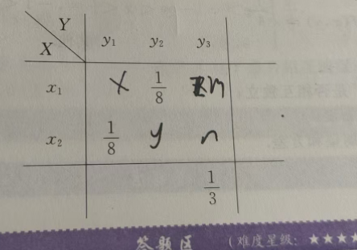

**独立**：如果变量独立的话那么各行各列他们的比值是相等的，这里把一个位置当做x，然后用x分别表示，根据比例求出来x就好了

**为什么不能用线性方程组？？**：正常来说我们把每个位置当做一个变量，列出来线性方程组不就好了？其实是可以的，但是不满足条件，比如这里是四个未知量，但是只能列三个方程组，因为他只给了三个数，所以三个方程组怎么求？解不了，行列式肯定为0，克拉默法则用不了，那么只能用上独立了3个方程加独立就能解决，单纯的线性方程组是解决不了的

### 判断独立

离散：必须要求每一项概率必须不为0而且秩为1

离散就是pxpy=pxy（也就是分布律）

连续就是fxy=fxfy或者FxFy=Fxy

### 条件绝对值E(|x-y|)

遇到条件绝对值首先需要把他转化为E(max(x,y)-min(x,y))，然后用最大值最小值分布函数求概率密度，然后接下来大概率会用到伽马函数，用阶乘性质就好了

### 依概率收敛

==平均值依概率收敛到期望==  ==频率依概率收敛于概率==

------

#### 定义

在概率论中，如果有一列随机变量 $\{X_n\}$，它 **依概率收敛** 到一个常数或随机变量 $X$，记作

$X_n \xrightarrow{p} X,$

意思是：对任意的 $\varepsilon > 0$，有

$\lim_{n \to \infty} P\left( |X_n - X| > \varepsilon \right) = 0。$

直观理解：当 $n$ 越来越大时，随机变量 $X_n$ 偏离 $X$ 的概率会越来越小。也就是说，$X_n$ 会“越来越可能”接近 $X$。

------

#### 举个例子

#### 例子 1：抛硬币取样均值

设 $X_1, X_2, \dots$ 是独立同分布的伯努利随机变量，每次抛硬币正面为 1，反面为 0，概率 $P(X_i = 1) = 0.5$。

定义样本均值：

$\bar{X}_n = \frac{1}{n}\sum_{i=1}^n X_i。$

根据 **大数定律**，当 $n \to \infty$ 时，$\bar{X}_n$ 依概率收敛到期望值 $0.5$：

$\bar{X}_n \xrightarrow{p} 0.5。$

直观上：随着抛硬币次数越来越多，正反面比例越来越接近 $1/2$。

------

#### 例子 2：带噪声的序列

令随机变量序列：

其中 $Z$ 是一个有界的随机变量（比如 $Z \sim N(0,1)$）。

那么

$P(|X_n - 1| > \varepsilon) = P\!\left(\frac{|Z|}{n} > \varepsilon \right) = P(|Z| > n\varepsilon)。$

由于当 $n \to \infty$ 时，$n\varepsilon \to \infty$，所以这个概率趋向于 0。
 因此：

$X_n \xrightarrow{p} 1。$

------

#### 小结

- **依概率收敛** = “随机变量序列越来越可能靠近某个值”。
- 常见情形：大数定律中的样本均值收敛到总体期望。

------

要不要我帮你画一个直观的概率图（比如抛硬币均值的分布随 $n$ 增大越来越集中在 0.5）？

### 期望

遇到里边的平方我们喜欢用D+E外平方解决

### 偏导问题

如果fx=f（x,y)dy这种时候，是x轴切，x表示y

如果fy=f(x，y)dx是y轴切，y表示x

### 概率技巧

在分布函数里面积就是概率

P(a-b)>pa-pb

### 假设检验与区间估计的理解

好 👍，我来帮你系统梳理一下 **假设检验与区间估计**，它们其实是统计推断的两大核心方法。

------

#### 一、区间估计（Interval Estimation）

##### 1. 定义

区间估计是用样本信息来估计总体参数，并给出一个“区间范围”，在一定置信水平下，这个区间覆盖总体参数的概率较高。

##### 2. 基本形式

如果总体参数是 $\theta$，我们构造一个随机区间

$(L(X_1,\dots,X_n), \, U(X_1,\dots,X_n))$

满足

$P\{ L \leq \theta \leq U \} = 1 - \alpha,$

其中 $1-\alpha$ 就是置信水平（confidence level），常见取 $95\%$ 或 $99\%$。

- **区间长度**：反映精确程度，样本量大 → 区间更窄。
- **置信水平**：反映可靠性，置信度高 → 区间更宽。

##### 3. 举例

样本来自 $N(\mu, \sigma^2)$，$\sigma^2$ 已知。
 则 $\bar{X}\sim N(\mu,\sigma^2/n)$。
 构造置信区间：

$\mu \in \left( \bar{X} - z_{\alpha/2}\frac{\sigma}{\sqrt{n}}, \, \bar{X} + z_{\alpha/2}\frac{\sigma}{\sqrt{n}} \right).$

------

#### 二、假设检验（Hypothesis Testing）

##### 1. 定义

假设检验是对总体参数 $\theta$ 的假设（通常有两种对立假设）进行检验，利用样本来决定是否接受或拒绝原假设。

##### 2. 两类假设

- **原假设 $H_0$**：默认成立的假设，例如“$\mu=\mu_0$”
- **备择假设 $H_1$**：与原假设对立的假设，例如“$\mu\neq\mu_0$”

##### 3. 两类错误

- 第一类错误（Type I error）：拒绝了正确的 $H_0$，概率记作 $\alpha$（显著性水平）。
- 第二类错误（Type II error）：接受了错误的 $H_0$，概率记作 $\beta$。

通常我们固定 $\alpha$（如 0.05），并尽量减小 $\beta$。

##### 4. 基本步骤

1. 提出假设：$H_0$ 与 $H_1$。
2. 选择显著性水平 $\alpha$。
3. 构造检验统计量（通常利用已知分布）。
4. 确定拒绝域。
5. 根据样本观测值落在拒绝域与否，决定是否拒绝 $H_0$。

##### 5. 举例

已知总体 $N(\mu, \sigma^2)$，$\sigma^2$ 已知。
 检验 $H_0: \mu=\mu_0$ vs $H_1: \mu\neq \mu_0$。

- 检验统计量：

  Z=Xˉ−μ0σ/n∼N(0,1).Z = \frac{\bar{X}-\mu_0}{\sigma/\sqrt{n}} \sim N(0,1).

- 拒绝域：
   $|Z| > z_{\alpha/2}$。

如果算出来的 $Z$ 超过临界值，就拒绝 $H_0$。

------

### 三、两者的联系与区别

| 对比点   | 区间估计                       | 假设检验           |
| -------- | ------------------------------ | ------------------ |
| 目标     | 给出参数的可能范围             | 判断假设是否成立   |
| 结果     | 一个区间（带置信度）           | 接受/拒绝原假设    |
| 核心思想 | 构造置信区间覆盖参数           | 构造拒绝域排除假设 |
| 关系     | 区间估计与双侧假设检验常常等价 | 检验能反推出区间   |

**联系举例**：
 如果 95% 置信区间是 $(1.2, 2.5)$，
 要检验 $H_0:\mu=3$，显著性水平 0.05，
 因为 3 不在区间内 → 拒绝 $H_0$。

------

✅ 总结：

- **区间估计**：告诉你“参数可能落在什么范围内”。
- **假设检验**：告诉你“数据是否支持某个假设”。
- 两者都是基于样本分布构造的统计推断方法，常常互相转化。

------

### 常用结论（重点掌握）

==我们做题一般是用检验法和区间法==

==这里的区间一般指的是u0的范围！！！==

**在拒绝域就是否定原假设，在接受域就是接受原假设**

- 设 $\alpha=0.05$，$z_{0.05}=1.645$，样本 $\bar X = 10.3$，$\sigma/\sqrt{n}=0.1$，$\mu_0=10$。

- **检验法**：
  $$
  Z = \frac{10.3-10}{0.1}=3 > 1.645 \quad \Rightarrow \quad 拒绝 H_0。
  $$

- **区间法**：
  $$
  \mu \in (10.3-1.645\times0.1, \infty)=(10.135, \infty)。
  $$
  因为 $\mu_0=10$ 不在区间内，所以拒绝 $H_0$。

结果完全一致 ✅。

#### 双侧检验

**来道题深入理解一下**

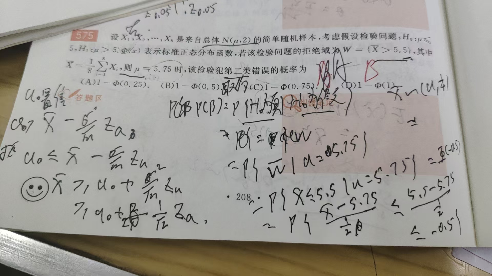

这里根据第二类错误概率H0为假，H0为真 **取伪**（其实就是H1是真的，你给选择H0了，本质上是一种犯错）

H1为真，即u>=u0,u是5.75，也就是u=5.75H1就是真，那么带入，然后H0为真就是H0要在接受域，那么根据下面走

然后根据标准正态分布进行化简就好了

**第一类错误a概率**，弃真，那么就是P（H0假|H0为真）也就是接受H1在H0为真的情况下，也就是a，详细请看这块原理部分的讲解，也可以看看补充部分

------

**小补充：5.5 是怎么定的？**

实际考试中它可能是用显著性水平 $\alpha$ 反推出来的阈值；但这题已给定拒绝域，所以不需要再管 $\alpha$ 的来历，直接按它来计算 $\beta$。

------

 **这道题在做什么决策？**

- 总体：$X_i \sim N(\mu, \sigma^2)$，已知 $\sigma^2 = 2$，样本量 $n = 8$。
- 规则（已经给好）：只要样本均值超过 5.5 就拒绝原假设。
- 用集合写就是拒绝域 $W = \{\bar{X} > 5.5\}$。

所以这就是一个阈值检验：“看 $\bar{X}$ 有没有大到超过 5.5”。

------

 **原假设与备择是什么？**

给了上尾拒绝域，通常对应：

- $H_0: \mu \le 5.5 \quad \text{vs} \quad H_1: \mu > 5.5$。若观察到 $\bar{X} > 5.5$，就把 $H_0$ 否掉（拒绝）；
- 若 $\bar{X} \le 5.5$，就不拒绝 $H_0$。

注意：“不拒绝 $H_0$” ≠ “$H_0$ 为真”，只是证据不够。

------

 **二类错误到底是什么？**

- 一类错 $\alpha$：$H_0$ 真，却被我们拒绝了（冤枉）。
- 二类错 $\beta(\mu_1)$：$H_1$ 真（均值其实变大了），我们却没有拒绝 $H_0$（漏报）。

本题要求的是：当真实均值 $\mu = 5.75$ 时的二类错概率：
$$
\beta(5.75) = P_{\mu = 5.75}(\text{不拒绝 } H_0) = P_{\mu = 5.75}(\bar{X} \le 5.5).
$$
关键点：二类错不是一个固定常数，而是随“真实的备择值 $\mu_1$”变化的函数（叫“功效函数”的补：功效 = $1 - \beta$）。

------

**为什么用正态去算这个概率**？

因为平均数的抽样分布已知：
$$
\bar{X} \sim N\!\Big(\mu, \frac{\sigma^2}{n}\Big) = N\!\Big(\mu, \frac{2}{8}\Big) = N(\mu, 0.25).
$$
也就是：当真实均值是 5.75 时，
$$
\bar{X} \sim N(5.75, 0.25), \quad \sigma_{\bar{X}} = 0.5.
$$
于是
$$
\beta(5.75) = P(\bar{X} \le 5.5 \mid \mu = 5.75) = P\!\Big(Z \le \frac{5.5 - 5.75}{0.5}\Big) = P(Z \le -0.5) = \Phi(-0.5) = 1 - \Phi(0.5).
$$
数值约 $0.3085$。
 解释：若均值真的涨到 5.75，这个检验还有约 31% 的机会看不出来（没拒绝 $H_0$），功效 $1 - \beta \approx 69\%$。

##### 方差已知

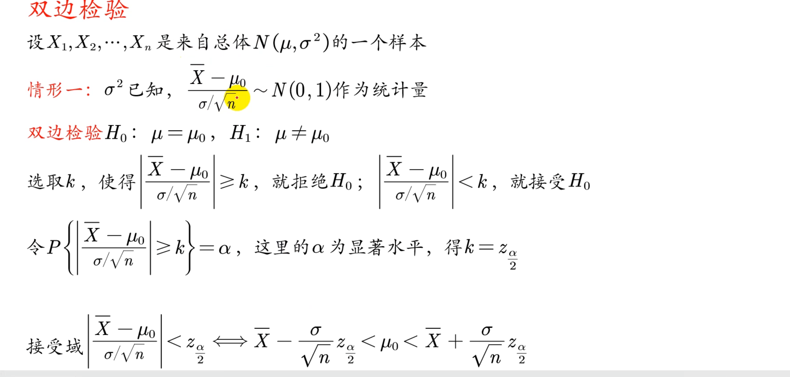

##### 方差未知

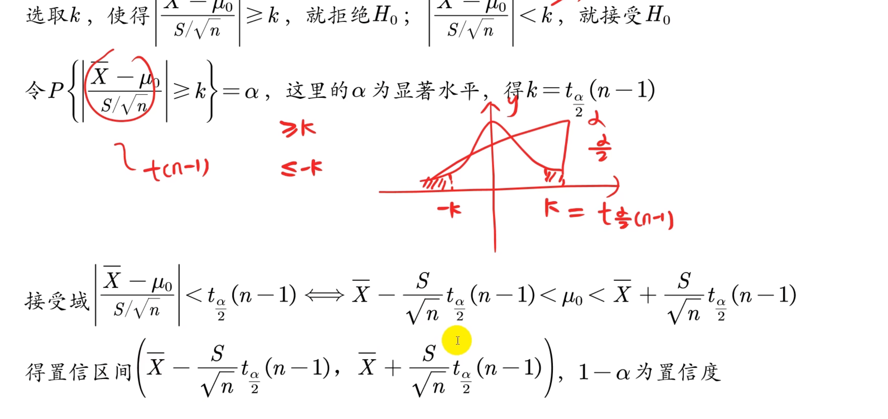

#### 单边检验

##### 方差已知

###### 右侧检验

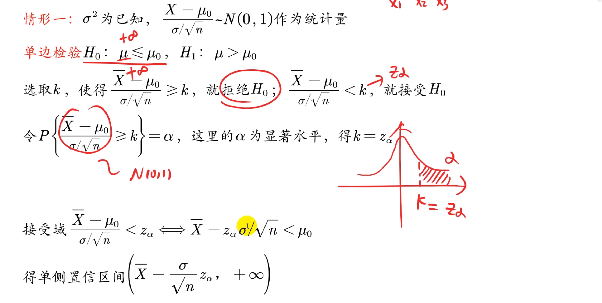

###### 左侧检验

改成+，左区间

##### 方差未知

###### 右侧检验

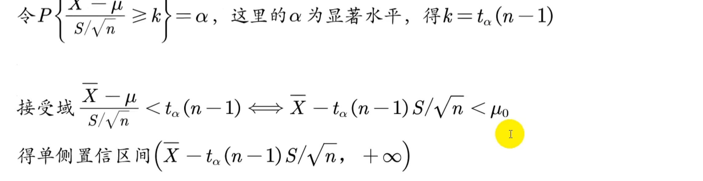

###### 左侧检验

改成+，左区间

#### 两类错误的定义

这个的理解一般要掌握两方面

**弃真**（a概率）：

1. H0为真但是拒绝了H0
2. 在拒绝率的概率

**取伪（**b概率）

1. H0为假，接受H0
2. 在接受域的概率

### 置信区间和拒绝域的关系

他俩其实就是一回事，无非置信区间是在参数量的纬度，拒绝域是在统计量的纬度

比如你落在置信区间那么就在接受域等价

在不置信区间就在拒绝域

拒绝域是从 **统计量出发** 得到的判别规则。

单侧置信区间是从 **参数出发** 得到的范围。

它们没有矛盾，而是**等价的**：
$$
H_0 \text{被拒绝} \quad \Longleftrightarrow \quad \mu_0 \notin \text{置信区间}.
$$

### 假设的选择

我们一般把**要检验的变成备选假设**，这个是因为如果错了那么就只会犯弃真概率，弃真概率又叫做a概率，他是又不可信水平a控制的（显著性水平）这样对统计者来说更容易控制，将错误影响降到最小。

#### 关于知乎上的理解

https://zhuanlan.zhihu.com/p/86178674?share_code=1e9XIRfujLGaA&utm_psn=1944867300957201437

### 不变性原理

不变形原理就是求出来的参数，直接带入

==矩估计不具有不变形==

==最大似然估计具有不变形==

参数不变性：有时候就是让你的求参数的估计量，你就用E（X)=X平均值，表示参数就好了

#### 符不符合某种分布的标准

跟这个分布的期望和方差规律一样就行了

1. 期望
2. 方差

### 期望和方差的无偏估计量就是样本均值和方差

### 一致性的判断

一般一致性我们用两种方法 

==一致性一般和依概率收敛非常像==，把依概率收敛的数变成参数量本身就变成了一致性

1. 辛勤大数定律
2. 切比雪夫（**常用**）

## 高数

### 截面法画图

通过确定每一个z的值来确定一个平面，多画几个，未知的方程式也能变成已知图

### 导数

- 不可导点仍然可以是极值点，极值点如果可以求导就直接判断异号找出来

### 中值定理

**重要结论：**

1. 积分为0则某点f($\xi$)=0
2. 介值定理二分之一

先展示大纲

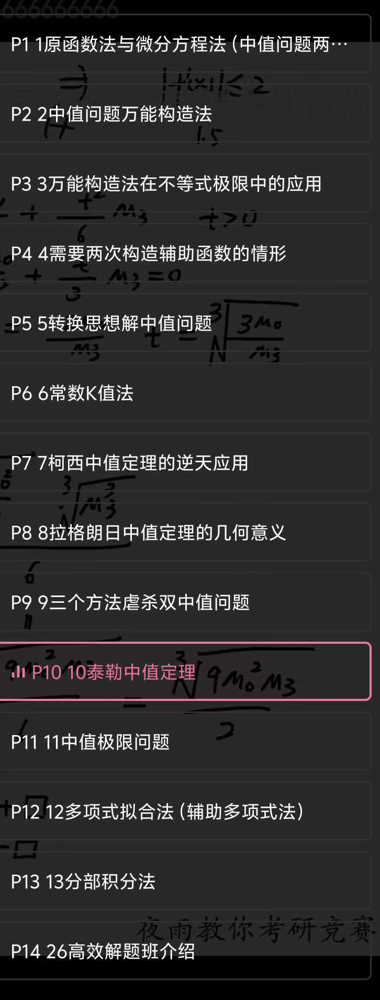

#### 原函数法


主要是找到F（X)=c，找到了F（x)那么这就是要构造的原函数，一般来说找到这个F（x)而且是理想，那么思路就已经出来了，直接设F（x)然后那么放到题上就是直接设了之后开始正向罗尔定理，然后求导


**注意**:有时候F(x)并不是想要的，为什么不是理想的，因为F（a)=F(b)这个要用上已知条件否则就废掉了

遇到二阶f与0阶我们经常用观察法（即是否能凑出来g’‘f+f’‘g）然后用原函数法，或者来一个中间的一阶来辅助构造，其实都可以


**题目：**


这题包含罗尔定理推广

#### 微分方程法


#### 万能构造法（重点）

==万能构造当中用不到条件就反解已知条件==

> 万能构造法在解决微分方程的极限有用，还能还原回去，用这个还原公式。其实微分方程和万能构造是一回事，一般用万能构造来构造微分方程，G（x)构造其实就是在找微分方程的原函数

f’‘+f用微分方程，f’’-f用万能构造（微分方程找出来C）直接秒了


这里有万能构造法求导换元回去这个微分方程


这里头有一个重要思想就是

新旧函数转化

##### 新旧函数转化

一般来说设积分上限的时候都喜欢把被积函数设的干净点，如果不够干净那么重新设一个干净的就好了


#### 常数K值法


#### 柯西中值的逆天应用

柯西中值定理遇到一个值是从两方面入手，如果是遇到中值那么最后从中值入手，这两种一般解决的不是真正的双中值问题，第一步肯定是分离，不同的中值即双中值就是分成不同的区间


记住是从两个角度入手，一般从中值角度入手


这点非常重要昂==常数K值法解决是不是真正的双中值，当然柯西和拉格朗日要求的就是处理不是真正的双中值==


==遇到两边都有中值就不能两个角度都能入手了，只能从中值入手==和含一个中值有区别，一个中值两个角度，两个中值就只能从中值入手


#### 拉格朗日的几何意义


#### 三大方法解决真正的双中值问题

> 双中值问题本质上是换掉导数


**拉格朗日方法即几何法**：


**插分点方法**：


**消一个中值**：


有时候可以把一个中值当做一个K==常数来解决==

#### 隐藏导数问题


#### 多项式拟合法

> 多项式拟合法可以让式子变成0，化简


这个方法能消掉f$\xi$=k常数问题，把问题简单化


#### 分布积分法

这个方法主要是把中值与fx的积分与xfx的积分联系起来


#### 泰勒中值定理


两个原则，没有出现的消掉，展开点用题目出现的，分为取点和展开点。不知道的就设展开点

> 介值定理除以前面的系数，题目给的点就是取点，导数就是展开点
>
> 一般来说存在往往转化为任意c的问题，设c点任意
>
> 泰勒这块常常把有界转化为绝对值问题
>
> 泰勒对称不要找对称点，要找对称中心

**泰勒通常与介值定理和对称中心联系起来**


#### 中值极限问题


这个用的少，第二种

### 圆盘结构


在求最左边这个的时候，我们一般用截限法，不用投影穿线，因为这个穿线它分为两部分，没有截限一部这么好使

### 有理分式化简

一般就是比如分母是三阶的，一个二次方一个一次方，找出来几个相乘的，然后二次方分子就是ax+b,一次方就是a，然后用留数求出来系数就好了（注意留数条件：假分式以及最高次方为1）

#### 伯努利与欧拉方程的解法


### 两个偏导为0的结论

当题目出现z对x，z对y的偏导那么会出现

**Z（x)=F(x)+G(y)**，对y求积分出现f(y),然后在对x求积分就是这个了

构建两个等式，F（0)+GY=siny,F(x)+G(0)=sinx

把 $F,G$ 表达式合并：
$$
z(x,y) = F(x)+G(y) = [\sin x - G(0)] + [\sin y - F(0)].
$$
= $\sin x + \sin y - [F(0)+G(0)]$。

设常数 $C = F(0)+G(0)$，于是：
$$
z(x,y) = \sin x + \sin y - C.
$$
利用交点条件 $x=0,y=0$：
 此时 $z(0,0)$ 从两边条件都要一致。

- 从 $x=0$：$z(0,0)=\sin 0=0$。
- 从 $y=0$：$z(0,0)=\sin 0=0$。

带入通解：
$$
z(0,0)=\sin 0+\sin 0 - C = -C = 0.
$$
所以 $C=0$。

### 常见的不定积分


### 级数与f的0处的n阶导关系


级数里最后一项的通项就是f的n阶导除以n的阶乘

### 线性方程组的误区


这个解的结构而言我之前陷入一个误区，就是误以为两个特解减去就能求得齐次，其实是不行的，必须是同一个输入量才能齐次，不同输入就不行

### 换元注意

**换元换三部分**：被积函数，微分，上下限（上下限是换元后的）

换元两部分：被积函数，微分 （正常的上下限）

### 雅可比注意的地方


正常来说我们换元法是换的雅可比的绝对值，出现的是新变量du ，dv，下面是消掉的，上面是新出现的

但是在概率论里，雅可比是倒数的绝对值，为什么呢？因为在换元之后变量是dxdy，他没有变成新变量，单纯的换元

那么就是倒数，第二个变量是父母

### 间断点的区分

间断点有可去，跳跃，无穷

怎么解呢？核心就是极限！

1. 首先找到这个式子的可疑点
2. 然后根据极限判断左右的关系判断间断点

### 多元微分整理

#### 质心等换公式

确定∫∫∫ydv=最好就是质心乘以S，这个是最快的

**平面方程**：有四个


1. 一般式
2. 点法式
3. 截距式
4. 平面束方程

**直线方程**:

1. 一般式
2. 参数式
3. 点向式

**空间曲线方程：**

1. 一般式
2. 参数方程

**投影**：注意在后面点到

常用的曲面方程图像


#### 几何学应用：

**空间曲线的切线与法平面**：


**空间曲面的法线以及切平面**


#### 场论有四大点

1. 方向导数：记住是f（x，y，z）的导数，导数就是一个数
2. 梯度就是方向导数的最大值，他是个向量
3. 散度（与高斯密切相关）
4. 旋度（与斯托克斯密切相关


### 多重积分曲线曲面积分整理

先看大纲，这里比较多

先来多重积分再到->曲线曲面积分


**三重积分的计算方法**：投影曲线以及定限截面法

投影曲线首先是竖着弄一刀求出来z的范围（用xy表示）然后z轴投影面积表示出来就好了（二重积分）

截面：最左边是z的定值范围，然后切成一个平面D，用xy表示


**多元积分的应用：**


**第一型曲线积分**： 这个是求质量

一般把ds用三个弧微分公式，变成x的上下限（y一阶导，x一阶导，ρ的一阶导）

**第一型曲面积分**：这个是求面质量

一般把dS变成根号下（1+Z^`^x方+Z^`^y方）dxdy，然后曲面投影到dxy上

**第二型曲线积分**:这个是力沿着曲线做功


1. 一般是y变成x，变成一个定限积分
2. 用格林公式
3. 格林公式判断对出来与路径无关

#### 格林格式挖洞法补充


遇到这种题首先判断这个点是不是奇点，如果是奇点那么挖一个顺时针的洞，这俩部分想加，即一个逆时针和一个顺时针相加为0，整体为0，那么让你求原来的就是L+D -D，一般来说这个L+D就是大概率为0（此时可以用格林公式了），-D当中D是顺时针，那么就变成了D了，所以求得I变成D（逆时针，但是补的时候是顺时针）

**第二型曲面积分**：这个是求场的通量


1. 一般是把dyz，dydz，dxdy把这个曲面分别投影到对应的面上，求三个二重积分比较麻烦
2. 投影定理
3. 闭曲面用高斯公式

#### 高斯公式挖洞法

跟格林公式挖洞法类似，有时候挖半圆，挖整体看清楚，高斯公式会出现dxdy，dydz，这种最好不要用三部分，因为每次都用移动到对应面，最好的就是法向量，直接变成Pcosa*dS，Qcosb * dS ,这样cosa，cosb就是这个法向量哦

### 空间曲线积分这个是求空间曲线的质量！

直接用斯托克斯公式


### 旋转曲面的求法、

#### 旋转曲面的不定积分==误区==

旋转曲面遇到弧一定要考虑形状问题


**求体积**：两个相减或者==πr方ds==

**求弧长**：也要出现ds


1. 磊哥指点：一般来说就是找两个点，一个曲面点P，一个母线点P0，然后根据这个曲线（根据QP0==Qp用这个向量的模构建曲线）
2. 消掉xyz0的分量，只剩xyz

### 级数分母出现根号以及谬论

级数分母出现根号一般用有理化来解决，分母简单点，分子复杂点

**谬论**：sin(π$\sqrt{n^2-1}$ 这里n趋于无穷的时候一般人可能以为是sin（πn）这里是不对的，因为抓大头是分子分母，单独对分子是不行的，应该是猜测他是nπ然后+nπ-nπ sin公式展开就好了！

### 投影误区

如果在xoy面上投影那么就是消掉z 就能够得到=》f(x,y)=0,以及z=0

==记住是消掉==

### 点到直线距离解法

一般来说找到直线的方向向量然后找到一个点

点与点组成向量与方向向量点成除以方向向量的模（面积）

### 斯托克斯两种方式

一个是旋度定理求出来的

另外一个是高斯定理求出来的！

### 直线与三轴夹角常见形式

### 空间直线与三轴夹角（方向角/方向余弦）

**方向向量：** 设直线的方向向量为 $\mathbf{v}=(a,b,c)\neq \mathbf{0}$。

**方向角：** 与 $x,y,z$ 轴正向分别成角 $\alpha,\beta,\gamma$。

**方向余弦：**
$$
\cos\alpha=\frac{a}{\sqrt{a^2+b^2+c^2}},\quad
\cos\beta =\frac{b}{\sqrt{a^2+b^2+c^2}},\quad
\cos\gamma=\frac{c}{\sqrt{a^2+b^2+c^2}}.
$$
**夹角：**
$$
\alpha=\arccos\!\Big(\tfrac{a}{\sqrt{a^2+b^2+c^2}}\Big),\quad
\beta =\arccos\!\Big(\tfrac{b}{\sqrt{a^2+b^2+c^2}}\Big),\quad
\gamma=\arccos\!\Big(\tfrac{c}{\sqrt{a^2+b^2+c^2}}\Big).
$$
**恒等式（检验式）：**
$$
\cos^2\alpha+\cos^2\beta+\cos^2\gamma=1.
$$
**小例子：** $\mathbf{v}=(1,2,2)$。
$$
\cos\alpha=\frac{1}{3},\ \cos\beta=\frac{2}{3},\ \cos\gamma=\frac{2}{3}
\quad\Rightarrow\quad
\alpha=\arccos\!\tfrac{1}{3},\ \beta=\gamma=\arccos\!\tfrac{2}{3}.
$$

### 级数收敛总结

必要条件lim Un=0；级数加括号后收敛（==加括号只会加强收敛性，不一定一定是收敛  有限项不改变收敛性==

**遇到括号最好用Sn**

**正项级数的五个收敛性**

1. 比较收敛(==可以用等价无穷小来处理==)

2. 无穷极限收敛

   ==一般遇到极限收敛一定要分母只有Xn，分子有的话就消掉Un，把上面最大的跟下面消掉==

3. 瑕点极限收敛

   

4. 比值

5. 根值

6. 积分收敛

**任意级数收敛	**	

绝对收敛：如果绝对值收敛，那么原级数收敛 `如果绝对不收敛，不能判断原级数不收敛！`

条件收敛：如果绝对值收敛，原级数不收敛

**交错级数**

单调递减  Un为0，如果不满足不能判断此技术不收敛 

**遇到lnx的级数时候怎么办？**：


记住只需要lnx在1,0，正负无穷与x，x分之一这种形式去变，实在不行用公式

**常用结论：！！很重要**：


最后一个用公式，我这个是不对的，是0，lnx的指数是1，那么就是发散了，

#### 括号级数

级数收敛的定义是lim n->无穷 Sn=常数，级数是n，如果加个括号变成2n，那么就是偶数，算个级数，分类讨论


#### 收敛域与收敛区间问题

**求收敛域步骤**：

1. 求x 这里求出来的是变量
2. 然后求出来整体X是复杂的式子变成简单的那个式子
3. 第三步新的带入

收敛域要判断端点！

收敛区间不用判断！

#### 两个P级

第一个P是几何P级数，>1为收敛，《=1发散

第二个P级数是极限p级数，上下趋于无穷，消掉n

#### 级数逆过去的时候

一般对f’进行还原，一定是从0到x积分，左边就变成了f(x)-f(0)不要丢掉f0啊

### 过直线先想平面束


### 级数展开规律

**一定要注意收敛范围**

**记住两点**

1. ln区间是从1开头

2. 只有arc tanx和ln是有【-1,1] (-1,1] 有闭区间成分

   

   

### 多重积分以及曲面曲线的对称问题

对称分有图和无图：无图简单的用两点法，有图的话直接画了就好了

**普通对称性**

这里核心用两点法解决！如果是多重积分带着dv就好了，如果是曲面曲线带着dxdy这种。


**轮换对称性**：轮换对称性，就是把积分区域xy互换，如果区域可以，那么就可以相等了


### 奇点

不可定义点和无定义点

件期望计算的速查表”**（离散、连续、高斯、独立情形），方便你考试/作业直接套用？

### 数列极限三大方法

1. 单调有界:如果一个函数有界了，且单调，用单调定义，那么可以用，a=f（a),求出来极限

1. 函数递推：这个方法是把xn+1变成fxn，求导算出来单调，然后判断有界，直接用a=fa
2. 压缩映射：这个方法是0<=|xn+1-a|<=r|xn-a|,找到小于1的r，然后就求出来数列极限了

### 黎曼和的统一法

这个一般把n分之i的等价无穷小找到就行了，在n趋于无穷的时候，然后用0-1的定积分


### 拉格朗日的具体＆抽象

**具体	**：如果是具体那么就把$\varepsilon$ 用x求出来，然后求极限

**抽象	**：抽象的话就用泰勒了

### 极限两大求法

**示例	**	

x→0limxln(1+x+xf(x))=3

分析步骤是：

1. **当 $x \to 0$ 时**，分母 $\to 0$。为了极限存在，分子必须也 $\to 0$。
    所以
   $$
   \lim_{x \to 0} \left(x+\frac{f(x)}{x}\right) = 0.
   $$
   这一步得到的不是恒等式，而是一个**极限条件**，即：当 $x$ 很小时，$x+\frac{f(x)}{x}$ 趋向 0。

------

1. 你写成 $\frac{f(x)}{x}=-x$，再推 $f(x)=-x^2$，这是把“极限趋于 0”理解成了“恒等于 0”。⚠️ 这是逻辑错误。

   正确理解：
   $$
   \lim_{x \to 0}\Big(x+\frac{f(x)}{x}\Big)=0
   \quad \Longleftrightarrow \quad
   \frac{f(x)}{x} \sim -x \ \ (x\to 0),
   $$
   这里的“$\sim$”表示“同阶无穷小”，而不是严格等号。

#### 脱帽法

极限条件化为等式条件	

#### 泰勒法

泰勒展开等同等x

### 含参变量的积分


$$
公式法（Leibniz 公式）

若 g(x)=∫a(x)b(x)F(x,t) dtg(x)=\displaystyle\int_{a(x)}^{b(x)} F(x,t)\,dt，
g′(x)=∫a(x)b(x)∂F∂x(x,t) dt + F(x,b(x))b′(x) − F(x,a(x))a′(x)\boxed{g'(x)=\int_{a(x)}^{b(x)}\frac{\partial F}{\partial x}(x,t)\,dt \;+\;F\big(x,b(x)\big)b'(x)\;-\;F\big(x,a(x)\big)a'(x)}（需要 ∂F/∂x\partial F/\partial x 存在且可积。）
$$

### 拉格朗日中值定理

在这里用行列式解决，先把fx，fy这个行列式解决了，然后带入辣么大的方程


### 导数定义

如果一点的导数有定义，那么其附近是单增或者单减，也就是说增区间和减区间不能包括这个本身这个点

### 正负无穷积分收敛问题

这种问题不能用常见的对称区间奇函数偶函数解决了，因为正负无穷的收敛速度不同，并不是简单的理解为正负一个值了，有了变化的概念。

==要先判断两个单独区间是否收敛，然后在判断相加的情况单独去算==就比如正无穷之间是发散那么不用想了整体就是发散了

### 反常积分瑕点等价无穷小同敛散问题

遇到这种问题，可以把被积函数变成等价无穷小，然后判断同敛散一致情况

### 全微分方程理解

如果一个pdx+qdy=0是全微分方程，那么可以用==不定积分法和曲线积分路径无关来解决==

**更重要的是这个原函数是一个u（x,y）=c!**

### d（x*y^2^)以及d（e^y^)怎么算  (d的两种问题)

1. d(x*y^2^)=把他当做同等地位就是，左导右不导，这种。就是x*dy^2^+y^2^dx
2. d（e^y^)=e^y^dy

### 偏导是最高境界（二元微分）

二阶偏导连续=》可微=》连续|偏导存在

### 孤立点用定义求

### 某点偏导以及偏导连续算法

==一个点偏导就用定义去求==


==证明偏导连续就用== ((**证明左边一定要先求偏导**))然后判断

（x,y)->0 f$_x$ (x,y)=f$_x$(0,0)

(x,y)->(x0,y0) f$_x$(x,y)=f$_x$(x0,y0)

### 连续高阶有界

如果一个类似x3/x2+y2这种二元极限问题，一般把他变成x*(x2/x2+y2)一边是一个小于1的有界，然后0成有界就是无穷小就是0

### 微分方程解的结构问题

一般来说右边是afx+bgx，y1，y2是f的解，y3,y4是g的解，那么根据y1-y2的系数是a，y3-y4的系数是b就是解，相加就是完整解了

### 迭代式和面积式奇偶

题目
$$
I=\int_{-\pi/4}^{\pi/4}\!dx\ \int_{0}^{\sin x}\!f(x,y)\,dy,
\quad f(x,y)=\big(x^2+y\cos x\big)\sqrt{1-y^2}
$$
**面积式奇偶	**	：这里有一个误区以为(-x,-y)会把这个y给消掉，这里是把图给画错了，因为他不是sinx在-二分之π到2分之派，因为第二项的上下限是从“0”，这就限制sin，如果是sinx图像可以这么做

**迭代式奇偶**：从第二项积分来看，sinx与x方那一项是奇函数，正好x是对称区间，那么就能消掉，这里y不能确定是不是对称区间，所以不要用y判断

### 伽马公式与递推


