# 笔记

> 没有为什么一切都是那么自然
>
> 做题习惯要改，步骤必须清晰！
>
> 代数求必要性答案
>
> 答案带进去
>
> 相信自己的计算量！
>
> 有思路直接写，不要浪费时间与重复
>
> 题号进行分解画区域
>
> 写过程拿最多的分
>
> 系数放到最左边最后成
>
> 能写在答题卡上就写在答题卡上（重要过程，题目也要抄！）
>
> 大题养成不要草稿的习惯，一步步来。比如单独求，宁可规划也不要乱写
>
> 基础题一定要写过程！（尤其是考研刚开始）
>
> 考试之前为什么提前进入状态就要在脑海里不断进行公式的记忆
>
> 证明题第二问用到第一问
>
> 分析题时心态平稳沉着冷静，找到那种淡淡的紧张感觉！
>
> 秉持着稍微慢点的原则考试不要着急

##  线性代数

**线性代数是同一个向量映射到不同基的向量**

杂项：

1. aat的问题：aat的秩一定为1，且迹就为内积

2. 正态分布线性组合的时候必须是独立（**记住xi-x拔不能线性组合，不是独立，这是陷阱）**

3. 有一点的就是成比例，不是0，两行的是比例不是一行为0

### A与E合同求变换矩阵

这里B=CTC求C，本质上是E与B合同求出来E变换到B的矩阵，那么我们说白了E与B合同，那么经过一系列变换，经过的Z=Q^-1^M^-1^X,这个左边那俩就是变换矩阵！C

   

### 行秩与行向量等价问题

> 行秩相同不一定行向量组等价，是必要条件，还要求行向量组相互表示。秩永远推不出来向量组等价，这里就是行秩相同表示行空间相同，但是不代表行空间可以表示另外一个行空间！

### 复杂矩阵的可逆线性变换怎么求

通常用QQ-1=E来转化

### 线性表示与解的关系，两种方法

这道题最快的解法就是行空间与解空间是垂直的，AX=0的本质就是行向量与解空间垂直的关系。那么根据题目给的线性表示，说明R（BT）的行空间大于R（AT），然后B的解空间就小，那么他的解就是AT的解了，AC选项无法判断，因为行空间不知道。！

第二个就是A可以被B线性表示，那么一定能有A=BM，BTX=0,等价MTBTX=0,==ATX等于0。同理AC不能推出来

### 抽象矩阵的乘法和代数区别以及分式化

如果是代数的话那么都是常数，什么的，但是这个你看图片是E，没错只要是抽象型那么一定是代数式

如果A^2^-A=3E

分式化：对于这种你要求特征值是求不出来的，一般分式化，看看他跟哪些矩阵可逆

分式化我们用有理分式化就是整式除以你想要组合的式子进行系数变化

> 给了抽象矩阵就说明给了个相似！！！

### 求A矩阵的两个方法（重点是谱分解）

>  根据A的普通矩阵和实对称矩阵分为两个方法
>
> 先重点解释一下实对称的谱分解法，记住是特征值乘以单位向量乘以单位向量的转置（**一定是单位向量**）
>
> 这样能快速求出来A,记住
>
> 普通矩阵的话一般特征值与特征向量的组合乘以P的逆
>
> ==极致的高效方法==：我们一般通过A-某个E，来消掉第三个特征向量或者化简特征值。A-2E，求出来这个矩阵的特征值，然后求出来A-2E的对称矩阵，别忘了还是原来的e，因为这种组合不改变特征向量，最后+2E，达到快速求解的问题

### 正定的类型以及判定方法

 **总结：从顺序主子式和特征值分析它们的区别**

* **正定矩阵**：

  * 所有顺序主子式都大于零。
  * 所有特征值都大于零。

* **半正定矩阵**：
  * 所有顺序主子式都大于或等于零，且至少有一个主子式为零。
  * 所有特征值都大于或等于零，且至少有一个特征值为零。
  
* **负定矩阵**：

  * 奇数阶顺序主子式为负，偶数阶顺序主子式为正
  * 所有特征值都小于零。

* **半负定矩阵**：

  * 所有顺序主子式都小于或等于零，且至少有一个主子式为零。
  * 所有特征值都小于或等于零，且至少有一个特征值为零。

* **不定矩阵**：

  * 顺序主子式既有正值也有负值。
  * 特征值既有正值也有负值。

**直观对比：**

* **正定和半正定**：正定矩阵有“正”的性质，半正定矩阵虽然也有很多“正”的特性，但它可以有“零”特征值或顺序主子式。
* **负定和半负定**：负定矩阵全是“负”的，而半负定矩阵则是“负或零”。
* **不定矩阵**：既有“正”的，也有“负”的，因此没有统一的“定”性。

通过顺序主子式和特征值，我们可以直观地判断一个矩阵的定性，从而理解它的稳定性、可逆性等性质。

### 解不唯一的情况

这些都是解不唯一的情况，有一个网站可以判断是否正确

### R^T^的转置加法

这道题就是看图，记住这个转置加法，还得竖起来

### 双线性表示的问题

如果一个r可以被a1，a2线性表示，可以被b1，b2线性表示

那么我们根据r=x1a1+x2a2=x3b1+x4b2

x1a1+x2a2-x3b1-x4b2=0有解，算出来齐次方程组的非零解就好了

### Q变换矩阵的两个算法

这道题是一个Q是由P变换而来的矩阵，那么有两种方法或者两个角度理解

**特征向量理解**：比如Q的第二列对应的是a2对应的特征值，那么a1+a2应该是对应一个特征值，那么我们根据Aa1=λ1a1

Aa2=λ1a2,然后A(a1+a2)=λ1(a1+a2),所以特征值是1，有一个重要的结论就是，同一个特征值的特征向量组合还是这个特征值

**换算矩阵的理解**：这里呢我们可以用Q=PM,这个M带入过去，Q^-1^AQ=M^-1^P^-1^APM=M^-1^ΛM

**注意**：这里呢如果改成P^T^AP的话，就不可以这么用了，因为上面用的是相似理论，形式上就是相似的定义，那么各种相似的性质是可以用的，但是如果是Pt的话就得重新推导！

### 线性方程组和平面点和法向量的关系

> 两个平面的点关系就决定了解的类型，比如三平面有一个交点就是一个解，无穷交点，没有交点，这里的交点是公共交点
>
> 判断好相交类型之后，平面法向量就是系数，法向量的空间关系，立体就是秩3，平面就是2，确定出来A，根据点关系求出来A增广

### 线性方程组解与空间的关系

一般来说解唯一个，那么就是一个交点，解是一维就是直线，解是二维就是平面，看这个图片

### 可逆线性变换，合同变换，以及正交变换的特点x=cy

> 初等行列变换对特征值的影响。如果是对称矩阵那么初等行列变换本质上是一种合同变换，惯性定理相同，特征值会改变
>
> 如果是普通矩阵，特征值改变而且没有惯性定理

首先可逆线性变换前后就是的矩阵就是合同矩阵，经历的变换就是合同变换，这就意味着可逆线性变换前后唯一不变的就是惯性定理！正交变换前后不改变特征值，合同变换以及可逆线性变换不能保证特征值相同，这是很重要的一点，合同相似正交满足三角变换，合同与相似并列，公共部分是正交

3. 

### 极大线性无关的个数以及误区

==误区==：在行阶梯的时候很多时候就开始盲目的从每行选一个，就误认为是极大线性方程组了，其实这是错误的！只能保证每行第一个是极大线性方程组

**个数寻求：** 首先确定他的秩，那么确定他的秩就意味着极大线性方程组里有多少个，然后在从第一行逐个选n个，拿出来看看是否行列式为0，为不为0就是线性无关，为0就是线性相关，只能这么求!!

### 两个二次型怎么用X=PY变换矩阵P

> 必须都转化到规范性，否则就是出错的！

这里就是给你两个二次型，我想要你找到一个P，使得他俩能从X变换到Y

==这里跟对角化的思路类似==，对角化是让你找到共同的对角矩阵，这里就是让你找到共同的规范性 **注意，前提是能有共同的规范性，如果规范性也就是正负惯性指数不同那么就无法转到另外一个二次型**

如果是正交变换矩阵，那么标准型都是一样的，思路也是一样的，注意 **先决条件是特征值相同，才能找到Q正交矩阵**

x=q1z  y=q2z

**都是同一个结论PAPB^-1^**，如果是正交那么P改成Q

### 同一个向量的坐标与基关系

==一个向量=基乘坐标== `根据这一点就可以求出来一个向量在不同基下的坐标了`

### Ax=b与XA=b的关系

这种情况，最后就是转置一下，求出来At的解，然后X转置

### 行列式

#### 范德蒙行列式

两种常见的

**行阶梯遇到参数问题**

为了保证不漏解，最后化简到最后一列，否则很容易出现少解问题，求出来的多解最后又要排除一个

#### Ax=0与特征值的关系

行列式为0则特征值为0

Ax=0则特征值为0

#### 快速寻找特征值的方法与公式

套路是这样的，你得相信特征值大概率是整数，那么首先求出来迹，行列式，然后看看能不能猜出来，如果猜出来感觉不信，那么带一个试试，符合了那么大概率猜出来的特征值是对的，如果还是猜不出来，**尤其是带参数的特征值**，就最好套用公式，基本上不带参数秒了，带参数就猜 ==有个小提示，也许公式出来他会某个值就直接把a消掉，简而言之与a无关==

#### 行列以及n与m关系含义

这个一列有多少个，代表一个向量的维数

一共多少列代表这个空间的向量个数

n<m是没有解的,n=m是唯一解，n>m是无穷解

### 向量组的线性表示

有必要表示和充要表示

向量组等价就是R（a)=R(b)=R(a|b)

###

P可以是特征向量组成的，也可以是P可以是特征向量 **组合**组成的。满足一下特点

1. 本身必须可逆
2. 本身必须跟特征值对应上，比如对角矩阵是2，2,1那么组合的特征向量必须是同一个特征值下的组合，不能混合组合，而且要对应。

### 行列式求参数要讨论

==求出来一个或者两个参数一定要带入进行讨论！！==

### 线性相关定理

**证明线性相关还是无关本质上行就是找抽象相似矩阵，判断行列式是否为0**

1. 一堆向量线性相关=>行列式为0=>秩<n=>ax=0有无穷多解 抽象矩阵用定义，k不全为0

2. 一堆向量线性无关=>行列式不为0=>秩=n=>ax=0只有零解  抽象矩阵用定义，k只能全为

   > 线性自带等式，比如A被B列线性表示，则A=BM
   >
   > 有两种方法，抽象线性相关和具体线性相关，抽象的意思是给你一个组合判断线性相关性（有有个线性无关条件a1,a2,a3线性无关），具体线性相关就是用定义式子去求，注意抽象线性相关跟抽象矩阵联系在一起！

**几何意义！**

### 矩阵结论

#### 分块矩阵的结论

 **广义初等变换矩阵**

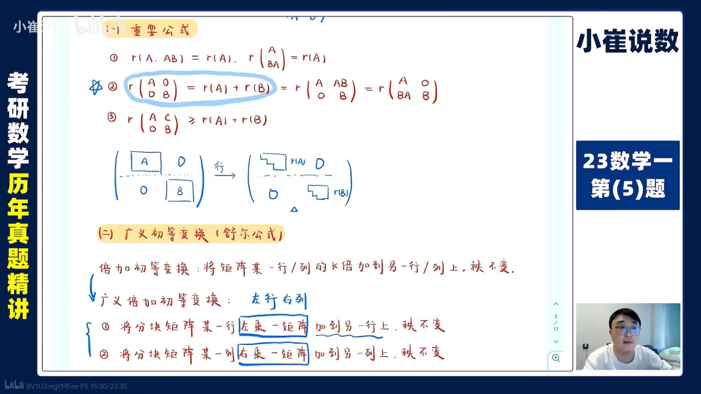

这个方法的作用就是左成的是一个矩阵，是初等行变换的拓展，只能有这种r1-abr2，c1-c2ab这种，左行右列

还有作用结论，主对角线的秩为相加

还有分块矩阵的逆，以及行列式的算法

> 注意这里副分块的行列式必须是分块里副对角线，否则不能用，但是主分块可以这么用

秩1的高次幂矩阵以及0E的高次幂矩阵

#### 矩阵拆分问题

一般来说让你求**C^k^=A**，求出来A的对角矩阵，那么K是多少，那么对角矩阵就是多少，再根据特征值和特征向量的关系，特征向量不变，所以看图片就是那个了，一般直接用就行了，或者让你求**A^k^次方**也都是这么做，**这两个区别就在于**:A^k^是正向，那么对角就是k，C^k^就是负向，C^2^就是A开二分之一

#### 初等矩阵的逆

#### 反对称矩阵的特点

对角线都为0，且特征值只能是虚数和0！

#### AB=O

设B为n阶矩阵，每一个用Ax=b，求出来的是解y1=k1a+k2b，B是由y1，yn的向量组成

把B看成每一个yi跟A相求，然后进行组合，也就是n阶里有n个变量呗

#### AB=C的结论以及两种解法

**秩的结论**：如果A列满秩，那么R（B）=R（C)

**线性相关理论：**如果A线性无关，那么B的相关性决定了C。如果a线性相关，那么B和C线性相关。

**第一种解法**：首先就是AB1=C1，求出来一个X,然后有几个列向量就再同时构造几个列向量，然后求出来！**每一个解都是他的列向量！我们一般用矩阵方程求多个解**

**第二种解法**：或者直接把他当做AX=C，然后求解X

**线性相关性**相同：就是A线性相关则B线性相关，A线性无关，B线性无关

#### 幂指矩阵的重要性质

四个结论记住，特征值只有0,1   一定可以相似对角化，E-A相似对角化，迹为r

#### 四秩相等与At与A同解

#### 两大消去！

1. 可逆以及身边满秩

#### 分块矩阵的逆，行列式，n次方

**n次方就是各自n次方	**

#### 上三角，下三角，主对角副对角行列式

上下三角是以主对角线乘积就是行列式

副对角线上下就是副对角线相乘，然后来个（-1）的n阶

#### 伴随求法

A*=A^-1^ |A|,

首先求出来求各自代数余子式，然后转置！！！

#### Jordan矩阵的求法

就是若尔丹判断是否相似，标准若尔丹和瑞尔丹相似，和对角矩阵一定不相似

一个特征值重数是3，假如Jordan值是2（就是在若尔旦块里有几个1）就有一个特征向量！

### 秩的结论

#### 秩的线性无关与主子式的关系

如果一个r(A)=2,可以这么理解，从主子式上理解就是存在2阶行列式不为0，然后任意3阶及其以上的行列式为0（至少有r阶不为0，且r+1阶全部为0）

r(a)=2的线性无关性的理解上来看。如果**这个矩阵有三个** 就是A这个矩阵的任意两个向量皆为线性无关性，存在三个向量为线性相关！ **如果这个是超过三维**，那么就不一定了，反正就是如果这个矩阵的列向量有n个，这个矩阵的秩为n-1，那么就是任意n-1个就是线性无关，n阶就是相关了

#### 秩为0的重要理论

秩为0就是O矩阵

#### 秩的主子式

至少有r阶不为0，且r+1阶全部为0

#### 秩为1特点

如果一个秩为1，==那么这个矩阵就可以用一个向量来线性表达其他任意向量==。

一定可以转化为a*b^T^,那么就 **很容易进行n次方了**，直接n次方，会出现b^T^a,这是一横一竖可以直接求出来值了

他的特征值 是迹，0,0

#### 子式与秩的关系

如果一个矩阵的子式不为0，那么这个矩阵的秩至少为这个子式的阶数

#### 秩与行满秩列满秩的关系

一个矩阵的秩就是等于行秩等于列秩，无论是方阵还是扁平矩阵（扁平里n>m往往是有意义的）

**行满秩不一定列满秩，行秩一定等于列秩**

 ### Aa＝b，关于a可不可逆求解

如果a==可逆== ，那么A=a^-1^b求出来a

如果a ==不可逆==，那么把A这个矩阵元素全部设出来，然后用这个定义去一个个求出来单独项ai。

**舒尔公式**：

### 特征值

####  特征值和秩的关系

**特征值的个数** 与矩阵的阶数 **（矩阵的维度）** 相关，而与矩阵的秩无直接关系。

#### 1. **特征值的个数与矩阵的阶数相关：**

- 对于一个 $n \times n$ 的矩阵 $A$，它的特征值的个数最多是 $n$ 个（包括重根）。这是因为矩阵的特征多项式是一个次数为 $n$ 的多项式，而一个多项式的根的个数（包括重根）等于其次数。所以特征值的个数的上限是矩阵的阶数。
- 特征值的个数可能少于 $n$，这取决于矩阵的特性（例如，是否存在重复的特征值，或者矩阵是否有缺失的特征值等）。

#### 2. **特征值的个数与秩的关系：**

- **秩** 与 **特征值的个数** 没有直接的关系。秩是衡量矩阵中线性独立行（或列）个数的指标，它告诉我们矩阵的线性独立性。
- 特征值的个数与矩阵是否可逆、是否是满秩矩阵相关，但并不是秩的直接函数。

#### 3. **特征值与秩的关系：**

- 如果一个矩阵的秩为 $r$，它有 $n - r$ 个零特征值。也就是说，矩阵的秩决定了有多少个零特征值，但不决定非零特征值的数量。
- 若矩阵是满秩矩阵（秩为 $n$，即 $A$ 是可逆的），则它的特征值不包含零。

**总结：**

- **特征值的个数**：与矩阵的阶数（$n \times n$矩阵的特征值个数最多为 $n$）相关。
- **秩**：影响矩阵是否有零特征值，但不直接影响特征值的总个数。

####  特征向量和特征值的关系

转置矩阵：属于相同特征值的特征向量不是正交的，不同特征值的特征向量是正交的

一个特征值对应一个特征向量，不同特征值的特征向量线性无关，一个多重特征值的多个特征向量可能相关也可能不相关

#### 特征值与矩阵的关系

如果你知道所有特征值，以及知道变换矩阵，那么可以求出来A

####  特征值小点

同一特征值的特征向量可以组合，不同特征值的特征向量不能组合

特征向量是构成解（基础解系）的自由量，多个

上三角的主对角线元素就是他的特征值！

抽象型矩阵一般带入A！特征值！两步

### 高次幂对角化问题AP=PB的所有问题

**A能够相似对角化**：如果A能相似对角化，那么那么根据相似传递性B∽对角矩阵，A∽B，那么P的组成就能找到了，那就是特征向量组成的

**A不能够相似对角化：**那么就只能根据定义AP=PB，首先B是已知的，PB就能是什么特征向量，然后每一列进行组合，先说找一个的。（A ξ1，A ξ2，A ξ3）=（ 2ξ1， ξ1+ ξ2， ξ3）变成这样，那么首先求A ξ1=2 ξ1，求出来2特征值对应的特征向量 ξ1，这个就是特征向量的第一列， ξ3求出来是1的特征值的特征向量 ，（A-E） ξ2= ξ1，那么 ξ2就是（A-E）X= ξ1的解了， ξ1带入求出来一个 ξ2，这里组合求出来的是一个P，如果是要求出来所有的P，那么就需要分别带k带入求出来就行了!，当然最后组成的P必须是可逆的，那么行列式不为0就限制了k的范围！（k本身就是各自不全为0，然后行列式又是一个条件）

###  相似理论

#### 都不能对角化的矩阵是否相似

#### 一个对角化一个不能对角化是否相似

#### 都能对角化相似

P可以同时相似化于A，B则

必要条件：AB=BA

充分条件：AB=BA，A有n个不同特征值

**相似结论**

相似有一个重要结论就是如果P的逆*A*P=B，则A，B相似.A ,B特征值如果相同且B可以相似对角化，则A，B相似。如果A，B特征值相同，B不能相似对角化，不能推出来A,B是否相似。如果告诉你A，B相似让你找到一个P可逆矩阵使得A，B相似，只能设P为n阶矩阵根据定义式子去求出来AP=PB存在的这个P

找可逆相似矩阵两种方法

1. 如果不指定B的话，则A组成特征向量P就是可逆
2. 如果指定B的话，则用定义去求

**判断两个矩阵是否相似**：除了常见的特征值行列式等等必要条件还有一些重要理论，**相似一定是对应特征向量，不是特征值（意思是如果特征值相同不能判断是相似，这是一个误区，必须判断n个线性无关的特征向量，如果是n个不同特征值则一定相似**

> 相似变换理论，如果一个矩阵右边是第三列加到第一列，逆操作就是第一列减去第三列
>
> 对于一个P^-1^AP=B
>
> **右边的 $P$** 是列操作：将 **第三列加到第一列**。
>
> **左边的 $P^{-1}$** 是相应的 **行操作**：将 **第三行减去第一行**，即逆操作
>
> 如果是AP=PB，则这里的PB的P是第三行减去第一行（当然这个简化后的结论，看似于P-1一样

1. t-A相似与t-B
2. 同一个特征值对应的特征向量的个数是相同的（常用）
3. 如果两个矩阵相似AP=PB，我们只要找到了一个可逆矩阵就算两个矩阵相似
4. 

#### 几何意义

这里的注意的就是P本质是是变换基到基本基的变换关系，几何意义就是在变换基里对同一个向量进行操作本质上就是对另外一个基本基里进行相同的操作，一一对应的关系。

### 解的问题

#### 基础解系就能求出来A

一个特征值算出来全部特征向量只有一个用不为0的k特征向量表示，这里人家说“是他的特征向量”没有说这个特征值对应的全部特征向量（简单来说是是但不全是），全部要包含k。AX＝0，解出来的X是解向量，解向量是由基础解系构成的，基础解系是A矩阵的所有特征值对应的包含k特征向量线性组合而成的，且k实数。

 **基础解系与等价的特点**

基础解系要求：线性无关，且维数相同！

等价的特点：==本质上是形成的向量空间是一致的==

**求A：**

一般给出来特征值，特征向量之后，通过A=P对角P-1求出来A

**基础解系与特征向量的关系**

1. 基础解系他的解k为任何数
2. 特征向量的解是k不全为0
3. 他们的解都是一堆组合，也就是y=什么，必要的时候把ki带进去，求出来y是真正这个组合解，局部向量是为y服务且是一部分

#### 齐次解和非齐次求解

在化简成行阶梯的时候，我们一般先求齐次解，让等式=0，找到未知量和自由量，自由量很重要，分别为0,1带入计算，求出来未知量，那么解就出来了，如果求特解的时候，一般让自由量为0，然后根据等式关系求出来未知量，求出来特解。

#### 基础解系解的结构

矩阵的秩决定了未知量，n-r就是这个自由量

在求基础解系的时候要求自由量，选择自由量，让自由量1,0  0,1求出来未知量

==选择自由量求未知量==，一共n-r个（或者n-r+1）

**怎么求齐次与特解**：

齐次解我们要求一个自由变量一个为1，但是特解是等式！！比如下面这个图，齐次解设x3=1，特解就是等式x3=0

#### 只有零解的两个含义

一个是AX=0只有零解一个是任意X不等于0，都有AX≠0

#### 同解问题

重要理解就是方程组的化简！**同解的本质！**

**秩的关系**：看图片

**方程的关系**：就是方程的解是同一个，也就是任何什么时候都能相等，记得与公共解区分

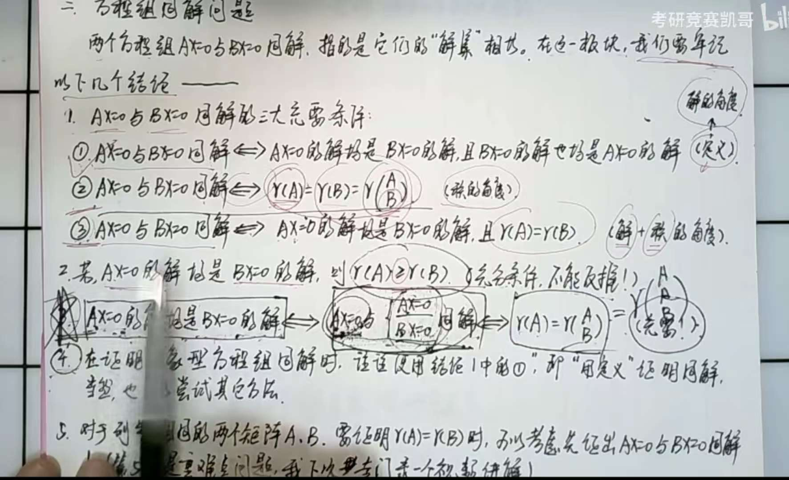

####  公共解问题

有公共解说明BX=b存在解，一定能保证R（B）=R（B|b）

若没有公共解则BX=b可能有解也可能没有解，则没有关系，有解不一定有交集！

公共解问题与双线性表示是一个问题

> 公共解误区：就是这里了有公共解，可以存在零向量，你到时候判断秩的时候看看是否是有非零公共解还是有0公共解！正常来说一定是零公共解，所以我们说有公共解准确来说是有非零公共解。

公共解：三种表达

1. （A下方B）X=0
2. 求出来AX=0，把X带入到B的方程组里
3. k1a1+k2a2=l1b1+l2b2，移项有解

**公共解的重要理解：**公共解说明两个方程的解里头有某些解向量是相同的，那么就意味着，存在这种解，带入

==都是解的重要问题==：

###  特征向量求A

1. A=P对角矩阵A*P逆
2. 秩的关系求A

###  可逆矩阵P的两种理解以及求法

1. 行列式不为0
2. 线性无关的列向量

**求法**：一般我们用通过伴随矩阵除以行列式来求

具体结构是分子用代数余子式 ==一定要在矩阵右上角加个T，方便记住以后转置==，然后分子除以行列式

#### 相似可逆矩阵

如果让你两个矩阵相似，同时让你求出来P^-1^ ,正常有两种方法

第一种：就是设出来这个方程，然后根据ap=pb算出来p的每一项根据等式关系

第二种：就是通过p1^-1^Ap=对角 p2^-1^BP=对角，分别求出来每一个P，用特征向量组成，然后算出来 P1P2^-1^,或者根据特征值与特征向量的关系，P^-1^PA=PB,P^-1^=PB*PA^-1^,P=PA*PB^-1^ 直接记住结论得了PA*PB^-1^

###  列向量不是特征向量的特征方程理解

$$
AC=\lambda C
$$

这个式子C不是A的特征向量但是能得到C是A属于λ的特征向量一部分，至少为R（C）个

###  二次型

> 这里的二次型一定是对称矩阵，否则没有意义
>
> 若X^T^A^T^AX,A可逆则A^T^A正定
>
> Q^T^AQ=B等于B存在的条件（同一个对角以及两个矩阵相似且合同）注意看我的合同变换那快图像，以及Q的求法

#### 关系寻找！

专注于找关系，忽略xy，找到之后y与x展开就行了！

#### 瑞丽商不等式和正定不等式求最值问题

瑞丽商表明了一个二次型值的最值问题！

#### 合同相似与对称的关系

实对称的传递性- 实对称矩阵相似的矩阵必为对称矩阵（实对称矩阵可对角化，相似于对角矩阵，且相似具有传递性，对角矩阵对称），复对称矩阵相似的矩阵不一定对称；

实对称矩阵合同的矩阵必为对称矩阵（合同定义为  B = P^TAP ，由  A^T = A  可推出  B^T = B ）。

一个经典的问题就是相似一定合同吗？显然这是不对的，只有实对称才可以。特征值相同不代表合同，特征值相同意味着惯性指数相同，但这是必要条件，要从根本上定义的话是需要合同定义式子推导

#### 正定大观

>  正定矩阵一定是实对称矩阵

很多时候实对称才能推出来很多结论

**正定的前提是是实对称矩阵才有意义**

AB排除，正定与E合同，A与正定合同，那么A与E合同，A就是正定

####  二次型规范标准化

两大方法

1. 可逆线性变换

   这种方法本质是配方法，配出来之后求出来C，X=CY配出来新的规范

   ==注意==：如果有平方项则正常配方，如果没有平方项则，x1=y1+y2,x2=y1-y2,x3=y3出现平方项再配方

2. 正交变换

   这种方法本质上是求出来矩阵A特征值，然后特征值Y的规范化！

   这两种特点是用矩阵就用正交，不用矩阵写出来定义型就用配方

####  二次型易错题型

==很多人以为（x1+x2）方+（x2+x3)方，直接换元变成两个都是正的系数，误以为秩就是2，或者说正指数就是2，其实是不对的，这样不一定是变换的矩阵前提是可逆线性变换==

####  线性变换后二次型矩阵发生的变化（求正交矩阵）

如果X=CY经过线性变换使得X的二次型变成Y的二次型，那么这个二次型矩阵是经历了合同变换，CtAC=B;（==这个是二次型矩阵==）！

==如果要求出来这个C==，需要根据相似理论分别求出来A，B的对角化的矩阵，然后去导

####  二次型最值问题

二次型最值问题，一般来说就是取X=QY，找出来特征值，最大值就是特征值的最大值，最小值就是特征值的最小值

####  求合同矩阵（合同本质）

>  **如果**A=PTP，那么求P，这个本质上是A与E合同，那么求出来A经过X=QMZ变成E了，标准型，那么Z=（QM）^-1^X变成A了P就是（QM）^-1^了

这个问题我们一般用可逆线性变换来求出来

因为可逆线性变换后的矩阵都是合同的，那么这个可逆线性变换的矩阵就是合同矩阵

**如果是A，B合同求合同变换矩阵**

这种问题一般是用第三方的对角矩阵合同，A合同于对角，B合同于对角，则列出来等式求出来合同矩阵！

**实对称前提下**相似必合同，合同不一定相似！！！

正负惯性指数来判断两个矩阵是否合同

对称的合同矩阵一定是对称，不对称的一定和不对称的合同

> 合同本质上是列变换！列变换就是合同

#### 一个矩阵P同时让两个矩阵线性对角化

> 这个矩阵本质上是合同矩阵（有一个特点就是换元相同）经历的是列变换！

####  正交变换注意事项

正交变换前后的矩阵一定是相似且合同的

正交变换也可以把矩阵转位对角矩阵（==前提是这个正交矩阵必须由特征向量构成，否则不可以转位对角矩阵==）

**正交变换的列与特征值的关系**：就是正交变换的列向量为特征向量对应的一个特征值，是有**对应顺序的，**注意就是是特征值，如果特征向量的k倍的话，那么还是这个特征值，除非是跟其他特征向量组合

**正交变换误区**

只要是正交变换那么求出来的系数都是特征值，这个是一定的，只是可以用特征向量来组成特征向量（记得施密特以及单位化）

####  把二次型转为位规范性

要么就是可逆线性变换，要么就是正交变换

####  平方和和二次型的关系

这个是独创的方法，遇到平方和，首先就是找到一个方框，这个方框yn等于什么xn，然后求y=Ax，这个就是所有方框，然后你想对所有方框干什么呢？比如平方和，那么就是y^T^y=x^T^A^T^AX然后进行求解！完美，yn到y的变换关系本质上是线性变换！

在二次型的变换里，经过变换之后至少能得到矩阵的一个合同定理

#### X^T^AX=0的问题

最好用Q^T^AQ变成特征值y那一种，然后看看那些y变成0，然后用X=QY求出来全部解，y=（y1,y2,0)

X^T^AX=0的解本质上就是AX=0的解，也就是特征值0的解向量（还有一个B，这个B所形成的BX的模平方等于二次型的值也有结论）

模一般都转化为矩阵形式！

## 概率论

> 概率分布分为连续和离散，一定要首先看这个，否则全错，因为这是两个不同体系

杂项：

1. 自己和自己的协方差特点（协方差1）：cov(x,x)=D(X)
2. xi与$\bar{x}$ 的相关性（协方差2）：cov(xi,$\bar{x}$)=cov(xi,x1+x2../n)=1\nD(x)
3. 区间讨论：区间讨论的时候一般都是左点相等
4. 球与盒子模型一般就是安排盒子找盒子的可能
5. 分布函数展开求，就是画大括号分类讨论
6. 韦恩图比较概率大小

### P（X>Y)的分析

这里如果让求出来P（X>Y)我们应该怎么去解呢，定义i和j，也就是ΣP（x=i,y=j)，i大于j去求解

求解的过程中要保证先i后j，来两次等比q^n^数列求和，注意判断首项和q的倍数，求出来这个概率

### 古典概率求解

核心思想就是分类讨论

### 负二项分布

本质是这个几何分布的拓展，记住r是成功次数，x是一共发生次数

### 矩估计和最大似然估计的区别

我们求一个估计量的时候如果要求矩估计，那么常常用E(x)=X拔，来间接求出来估计量，这也是与最大似然估计的区别

最大似然估计是根据最大似然函数求出来的估计量，这个估计量一般都带有数据统计的变量，如果求他的期望或者方差，我们直接带入就好了，但是如果要让你求最大似然估计量的等式，那么一般根据不变形直接带入

### 边缘分布与联合分布的关系

边缘分布无法推出来联合分布，因为还少个搭配组合关系。联合分布可以推出来边缘分布

但是此时如果还让你判断是否独立，最好的方法就是代入一个合适的点

### 无偏性与一致的含义

> 在算无偏性的时候我们一般求出来EX看看是否等于斯塔冒，等于就没事，不等于就有事！
>
> 一般来说这是一个证明性的问题，**简单来说就是让你证明某个变量是否无偏于另外一个变量，那么这个新的变量肯定是有统计量组成的，然后还有概率密度，求出来就好了**E(aT)=sita，那么T的概率密度求出来就好了，然后带入，一般都是得求出来这个变量的概率密度

无偏性：就是估计量的期望和这个本身相等一样的

一致性是指：估计量依概率收敛于本身，简单来说就是当n很多的时候估计量一定会趋向于本身的

**估计量**：他的组成都是由数据量构成的

### 中心极限定理以及二项分布的变量设置

中心极限定理讲得是任何分布的变量的组合多了，就变成正太分布了，次数求期望和方差就能求出来这个什么是正态分布了 数字化就是**ΣXi~N(u,/σ^2^)**

**二项分布的设置：**

二项分布的特点就是

这里Xn为次品的个数分析，产品有正品和次品，2类，合格率不合格率两种结果，**设置变量的时候任取一个就好了**

这两类比如随便取一个正品，那么就是B(n，正确率)

1. n里头只有两类
2. 只有2种结果

### n方差的期望以及D（标准绝对值正态分布方差）

是|xi-u/σ|的方差就是（1-π分之2） 

E(**nσ 2** )=n-1*（**σ 2**） 

### 样本方差的两个定义

第二个定义可以引申一下，分子是相等的

### x2+y2概率密度解决以及陌生的怎么办

x方+y2这种我们只能求出来x方的概率密度，y2的概率密度，然后 用加法分布函数来求概率密度

**遇到陌生的怎么办？**：首先看一下他是什么形式+-×÷，然后把整体当做一个变量，求他的概率密度，每个求出来之后用+-分布函数这种求出来就好了

### 最大值最小值结论

#### 最大值最小值期望

> 有三种解决方案，根据合适的求

1. 独立分布公式
2. 正太均值
3. 最大最小公式

在掌握这个的时候首先要掌握标准的E（|X|）的期望是根号下2/π

处理好绝对的了，那么max和min就用公式来解决，公式里有绝对值，标准化之后就能求出来期望了！

**注意**：为什么不能用定义，因为正态分布函数的分布函数不能用正常初等函数表示，只能是积分这种表示

#### 最大值最小值公式

max{X,y}=二分之（X+Y +|x-y|)

min{x,y}=二分之（x+y-|x-y|)

这个最大值公式就是P(max(x,y)<1)就是x小于1，y小于1

最小值公式就是P（min(x,y)<1)就是1-p(min（x,y）>1)，就是x大于1，y小于1，第二层意思就是x，y至少有一个小于1，他们是并列关系，用并列公式

#### 最大值最小值的概率密度

一般来说是根据独立的结论，然后求出来F$_x{max}$的，在进行求导

### 正太分布问题

> 二维概率正态分布的边缘分布就是正态分布，比如这道题，给了联合概率密度，那么求x+y就是求边缘分布他一定是符合正态分布的！
>
> 

如果X+Y是一个组合分布了，那么独立就是正常相加减，如果不独立，那么u是加减，D（X+Y）会带有2cov相关性

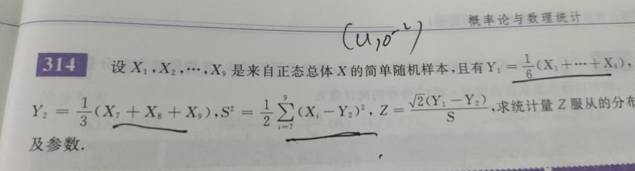

这里组合分布S方， ==千万不要直接求出来xi-y2因为这里不独立，会导致错误的结果，应该用（n-1)S^2^/σ^2^==

 **遇到e二次型的概率密度函数一定是服从正态分布的！**

#### 二维正态分布结论以及特殊性

边缘分布也是呈现正态分布函数的

==P为0说明xy是独立的== 注意正常相关系数为0只能说没有线性相关关系，只有二维正态分布有这个性质

#### 正太分布求期望方差，分布函数

这里不是标准的正态分布只能去凑啊！具体的就带入

比如求期望的时候，∫tφdt就是0，∫t^2^φdt就是1，如果让你求分布函数，只能把他转化为标准型，然后带入！！

这里没办法了，只能具体带入了，大题一般是具体带入！！

### P（U=xi)变量问题

这个不同于其他问题，这个等于是个变量，这就需要对条件概率联合起来，深入理解，你想想如果U=x这是不是就是正常的求联合了？根据这个用条件概率密度转化一下！

### X方+Y方特殊的概率密度以及陌生的构造怎么办？

X方+Y方的概率密度首先是加法，然后根据定义P(x方＋y方<=z）他其实就是P$_D$ fxy，这个D就是x方+Y方小于等于z，所以加法求出来fxy是关键，其他都是范围

**陌生构造：往已知的靠**、

### 控制变量的全集分解(半连续离散型)

**两个理解**：幂指函数U其实就是gxy，你把他看成gxy那么就好求均值了，还有就是这个可以画出来图，当然只能画出来U与x与U与Y，但是相当重要了！

比如Y的值是由X这个控制变量组成的，那么别的不说直接带入

P{Y<=y},那么右边就是一个全集进行控制，他就变成了pxy了，接下来就简单了，这种问题都是用连续分布函数定义

### 条件概率的重要理解

题目一说在x等于x的条件下，就说明这是条件概率密度出现了 **这个条件概率密度非常有意思的一点就是他是一维的，只能是点**

P(x<0|y<0)这是条件概率，只能用fxy去求

P(x<0|y=0)这就是条件概率密度，可以用fx|y去求

正常来说这里是fx|y但是离散的就是p

### 大数定律条件

==辛勤考的多==

### 给了相关系数求P某一项概率

明白了，下面是直接渲染后的 Markdown 代码：

 **解法 1（用协方差）**：

$X, Y \sim B(1, \frac{1}{2}) \Rightarrow E[X] = E[Y] = \frac{1}{2}, \ \mathrm{Var}(X) = \mathrm{Var}(Y) = \frac{1}{4}$

给定相关系数 $\rho = 1$，

$\mathrm{Cov}(X,Y) = \rho \sqrt{\mathrm{Var}(X) \cdot \mathrm{Var}(Y)} = 1 \cdot \sqrt{\frac{1}{4} \cdot \frac{1}{4}} = \frac{1}{4}.$

而 $\mathrm{Cov}(X,Y) = E[XY] - E[X]E[Y]$，所以：

$E[XY] = \frac{1}{4} + \frac{1}{2} \cdot \frac{1}{2} = \frac{1}{2}.$

由于 $XY = 1$ 当且仅当 $(X,Y) = (1, 1)$，因此：

$P(X = 1, Y = 1) = \frac{1}{2}.$

用边缘概率 $P(Y = 1) = \frac{1}{2} = P(X = 1, Y = 1) + P(X = 0, Y = 1)$，得：

$P(X = 0, Y = 1) = 0.$

**解法 2（概念）（推荐）：**

$\rho = 1$ 且方差不为零 $\Rightarrow Y = aX + b$ 几乎处处成立且 $a > 0$。

$X, Y \in \{0, 1\}$ 且 $E[X] = E[Y] = \frac{1}{2}$ 推出 $a = 1, b = 0$：

$Y = X \quad \text{a.s.}$

因此，

$P(X = 0, Y = 1) = 0.$

### 正态分布函数用密度函数求均值问题

最好变成什么e的负2分之一x方，凑出来u与方差，==根据新的正态分布求期望和方差==

### D(X)与样本方差S^2^的关系

这里Dx=(n-1)S^2^/n

E(S^2^)=D(x)（无偏估计量）

D（S^2^）=2σ^4^/n-1

### 全集分解思想要有单独两项与全概率

一般来说全集分级之后，除了带入还要根据独立结论把分解那一部分概率成了

**全概率**：是所有条件的集合，你这么想，全概率就是把各种情况*这种情况下的事件

P(B)=ΣPAi(B|Ai) 这里Ai是所有条件

### 密度函数要求导

给了一个符合分布函数比如F（3x),让你求f（3x)就是3*F^`^(X)

或者z=3x,F（z)=P (3x<=z)=P(x<=z/3)=F(z/3)

f(z)=3分之一*F`（x)

### 卷积的深度理解

> 这里需要记住的是卷积之后，是替换后对z的偏导的绝对值！
>
> 任何形式都可以求卷积，关于这个卷积的注意事项
>
> 1. 刚好遇见你：这里就是对x的左右的两个式子对z相等，把z进行划分！！！刚好遇见你是看z的范围
> 2. 真正的上下限是看x的交集范围：这里就是把z分好了就取两个式子的交集，那个就是x的范围！那么卷积的上下限不就确定x的范围了吗！第二步确定x的范围
>
> ==复杂卷积有三个范围，比如u的，y的，x的，卷积必须画图，因为要讨论z，z与x的，z与y的，别忘了双重卷积的特殊性！==

### 分布函数

> ==一定要看清混合分布，看值==
>
> 求半连续离散要用定义了 [跳转到期望](###期望)  
>
> 分布函数一维二维方法，一维用图像，二维用面积
>
> 分布函数有三种解决办法：
>
> 1. 定义法
> 2. 图像法
> 3. 联合概率密度法（一般是面积）分布函数里的面积
>
> **fxy的结论**
>
> 1. fxy求fx或者fy要看图（fx就是x轴且，dy就是x轴且，fy就是y轴且，dx就是y轴切
> 2. fxy为常数的时候面积就是概率
> 3. fx求谁fxy求的谁就切哪个轴，fx就切x轴**（注意你切轴的时候注意画出来切谁与d变量的图）**

#### 随机变量的设置

如果要设一个随机变量，关键理解的是==随机变量就是让一个事件转化为值==，理解了这个

那么把事件取某个值，或者是某种情况这个事件当做随机变量，那么随机变量的值是自己随便设的，一般设1为事件发生，不发生为0

**Xi随机变量的设置**：一般来说这个i说明他是有很多次数为特征，也就是==独立同分布的事件就行设置==，然后Xi每次他都有结果，每个结果又分为两个事件，1对应一个事件，0对应一个事件

#### 分布函数的定义

#### 分布函数条件

==第三个用的多==

#### 分布函数的分布（二维）

如果一个x的分布函数是单调递且连续，那么这个分布函数的分布函数是二项分布，Fx服从U（0,1)分布，F（F（X））=u在（0,1）区间

二维的分布一定要画点，然后求左下方的面积，进行讨论！

#### 概率密度条件

大于0是正常的，主要就是积分为1

#### 分布函数的条件概率与交集概率

这有两道题，很容易犯错误，在用定义求的时候，会遇到全概率展开的问题，类似图片这种，如果是条件概率的话，那么左边和右边是两个，如果是交集概率的话那么就是一个，这就是变成P（Y<=y,x<=1)变成一个了

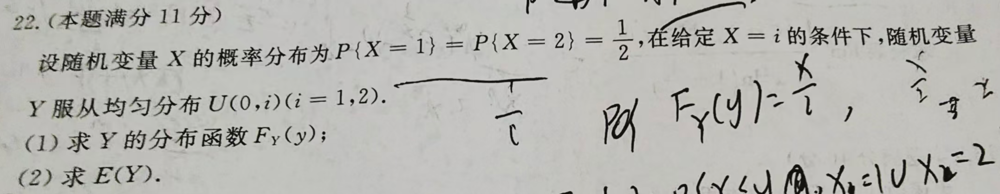

#### 分布函数的画图法

> 缺陷：这个只能解决一维的，如果是二维的那么就只能用二维联合概率密度法了

画图法的要求先画出来Y与X关系，记住是Y，分布函数图像法，以及第一步找X的真实值，第二步画图看y取真，第三步反解x，用密度函数求解就好了

、

#### 判断分布趋势的规律

如果想要判断某个分布是什么分布，一般判断他的期望和方差是否符合这点的分布期望和方差（==注意这是必要条件==）

#### 分布函数的面积只能用fxy的联合分布去求

在求分布函数的时候，F（Z）= P（|x-y|<=z)的时候，探讨z的时候，在z大于0，会求出来x-z<Y<x+z，这个时候是一个Y与x的面积，就是分布函数，面积就要用联合概率密度

#### 边缘离散分布函数

一般来说给你P（M，N）联合分布，让你求边缘P（M）的分布，可以用定义，就是N为n从0到正无穷开始相加那个联合分布（想象那个**表格的横线**），

#### 条件分布函数

>  条件分布函数本质上是概率

==条件概率是无条件的，但是带入不能消掉！==

正常分析就是条件全概率！然后是独立看看能不能消掉，别忘了条件概率可以无条件带入，但是不能消掉！然后化简

2. 

### 四大可加性

在加一个指数分布z=min(x,y)为E（x+y)

### t分布于F分布关系

t^2^ 就是F（1，n)

### 合同三部分以及误区

> ==误区：合同不一定相似！而且合同矩阵与相似矩阵是并列，正交矩阵最细==
>
> ==对称矩阵的充要条件最多了！一定要记住正负惯性指数相同==

合同三部分：充要，充分，必要

### 概率P里面两个含义与fz的两种办法（卷积和分布）

P（x+y<=1)第一个含义是限值了XY的范围

第二个含义是把他当一个X+Y整体随机能量

**fz的两种办法**：第一个就是分布函数用F 整体式子一个求出来区域然后用fxy二重积分

第二个就是用卷积式子 卷积 z的范围是通过代替变量y=z-x求出来z的范围（**想小本本那个整体式子**）

**卷积法重点理解**：

1. 首先把换元一个，然后在括号里对Z求导绝对值
2. 然后画出来==不换元与Z的轴==，你把换元的范围全部带进去，求出来Z范围，这个过程其实是从D到D’过程，这个时候已经画出来Z-不换元图了
3. 然后跟据fz，切Z轴，根据Z的值来讨论不换元的上下限，求出来就好了，大概率是个根据Z的值不同fz

### 条件公式

P（AB非|C)=1-P(AB|C)

### 两个x减u或x平方和以及误区

> 在这里重要理解的是xi-u的平方和 与xi-x拔的平方和 这里x拔是一个随机变量，他的值随样本的变化而变化，那这就导致了一些特殊结论，而u是常数
>
> ==首先区分平方和是哪种平方和== 
>
> ==然后用重要结论 ==一般是让你求平方和的期望，那么u的平方和就是方差他的E的期望就是n*方差，如果x拔平方和，那么就是用E(（n-1)S^2^ )=方差

总体方差定义是：

$$
\mathrm{Var}(X) = E\big[(X-\mu)^2\big]
$$

所以如果你有独立样本 $X_1,\dots,X_n \sim N(\mu, \sigma^2)$，那

$$
E\big[(X_i-\mu)^2\big] = \sigma^2
$$

于是很多同学就会想：

$$
E\Big[\sum_{i=1}^n (X_i-\mu)^2\Big] = n\sigma^2
$$

$$
\sum (X_i-\mu)^2 \quad \text{和} \quad \sum (X_i-\bar{X})^2
$$

是不一样的。第二个里 $\bar{X}$ 本身就是随机变量，它依赖于样本。

所以，$\sum (X_i-\bar{X})^2$ 不是 n 个方差简单相加，而是要减去“样本均值的自由度”。

### 联合概率密度

> 这里有离散*离散，变成立体点
>
> 连续*连续变成曲面
>
> 离散乘以连续变成几条曲线

注意图片中右边联合概率的式子，是条件概率乘以概率密度

边缘的话就是求y这条面积就是fxy的定积分

fx概率密度就是求一个x下y所有的值就好了

###  独立的结论

#### 独立求联合概率密度

一般来说知道fxfy，然后是独立就能求出来概率密度

==如果两个变量不独立那么联合概率密度只能变成fxy=fx|y fy了==变成条件概率密度乘以一个概率密度了

#### 判断独立

离散：必须要求每一项概率必须不为0而且秩为1

离散就是pxpy=pxy（也就是分布律）

连续就是fxy=fxfy或者FxFy=Fxy

**如果是半连续离散**：一般只能用最根本的定义，P（x=a,Y<=b),这种一般用二纬概率密度来解决这种来解决=?p(x=a)p(y<=b)

1. 独立没有传递性

2. 独立没有包含关系

#### 两两独立和相互独立关系

   x,y，z

   两两独立指的就是一个x无法影响到一个z，y无法影响到z，但是XY可能会影响到z哦

   相互独立就是xy任何组合也无法影响到z ==证明 PABC=PAPBPC==

   

### 常见的分布问题

#### 常见分布可加性

二项分布可加性

泊松分布可加性

正态分布可加性

指数分布可加性（min(X，Y)~E(f1+f2))

#### 均匀分布的棍子截取问题

如果是截取取最短的一次就是用X=min(l，l-y)

==注意这里不能用最小公式，因为括号里头的变量不独立==	

然后如果是截取两次那么就是一个几何概率问题 ==注意截取的时候我们把坐标当做一个截取点，如果是长度反而不好理解和计算==

 **长度就是均匀分布**

比如在（0,1）区间任何一点的截取长度为X，那么X服从均匀分布U（0,1）因为坐标是X，概率密度是1那么1*X就是长度了

#### 条件分布

 **1. 定义直观理解**

条件期望是“已知 $Y$，对 $X$ 的最佳预测值”。

* **直观比喻**：我知道今天的天气（Y），想估计去的人数（X）。
* 那么 $E[X|Y=y]$ 就是：在天气固定为 $y$ 的条件下，人数的平均值。

---

2. **离散情形**

如果 $(X,Y)$ 是离散型的，定义为：

$$
E[X|Y=y] = \sum_x x \, P(X=x \mid Y=y).
$$

也就是先算条件分布，再加权平均。

**例子**：
设 $(X,Y)$ 的联合分布如下：

| X\Y  | 1    | 2    |
| ---- | ---- | ---- |
| 0    | 0.1  | 0.2  |
| 1    | 0.3  | 0.4  |

比如 $E[X|Y=1]$：

* $P(Y=1)=0.1+0.3=0.4$
* $P(X=0|Y=1)=0.1/0.4=0.25,\;P(X=1|Y=1)=0.75$
* 所以 $E[X|Y=1]=0\cdot0.25+1\cdot0.75=0.75$。

---

3. **连续情形**

若 $(X,Y)$ 有联合密度 $f_{X,Y}(x,y)$，边缘密度 $f_Y(y)$，则：

$$
E[X|Y=y] = \int_{-\infty}^\infty x \cdot f_{X|Y}(x|y)\, dx
= \frac{\int x f_{X,Y}(x,y)\, dx}{f_Y(y)}.
$$

---

4. **重要结论/性质**

* **线性性质**： $E[aX+b|Y] = aE[X|Y]+b$。
* **函数化**： $E[g(Y)|Y]=g(Y)$。
* **塔式性质（迭代期望）**： $E[E[X|Y]]=E[X]$。
* **最佳预测**： 对已知 $Y$，$E[X|Y]$ 是最小化均方误差的最优估计。

---

5. **特殊情况（常考/常用）**

1. **独立性**：若 $X \perp Y$，则 $E[X|Y]=E[X]$。

2. **线性高斯情形**：若 $(X,Y)$ 服从二维正态，

   $$
   E[X|Y=y]=E[X]+\frac{\mathrm{Cov}(X,Y)}{\mathrm{Var}(Y)}(y-E[Y]).
   $$

   （这就是线性回归、卡尔曼滤波的核心）

---

6. **举例**

例：$X,Y$ 联合密度在单位正方形 $[0,1]\times[0,1]$ 上均匀分布。

* $f_{X,Y}(x,y)=1$。

* 边缘 $f_Y(y)=\int_0^1 1 dx=1$。

* 所以 $f_{X|Y}(x|y)=1, \; 0<x<1$。

* 因此

  $$
  E[X|Y=y]=\int_0^1 x \, dx = \tfrac{1}{2}.
  $$

说明：虽然知道了 $Y$，但因为独立，条件期望还是常数 $1/2$。

---

✅ 总结一句话：
条件期望的**计算套路**就是：

1. 先写出条件分布（概率或密度）；
2. 再对 $X$ 做加权平均。
   核心意义是 **“已知条件下对随机变量的最佳均方预测”**。

---

好 👍 你说的其实是条件期望

$$
E[Y \mid Y>1],
$$

也就是 **在事件 $\{Y>1\}$ 下的 $Y$ 的均值**。

---

 **通用公式（连续型）**

对连续随机变量 $Y$，条件期望定义为：

$$
E[Y \mid Y>1] = \frac{\int_{1}^{\infty} y f_Y(y)\, dy}{P(Y>1)},
$$

其中 $f_Y(y)$ 是 $Y$ 的概率密度函数。

---

 **步骤**

1. **算分母（条件概率）**：

   $$
   P(Y>1) = \int_{1}^{\infty} f_Y(y)\,dy.
   $$

2. **算分子（条件下的期望积分）**：

   $$
   \int_{1}^{\infty} y f_Y(y)\, dy.
   $$

3. **两者相除**：

   $$
   E[Y|Y>1] = \frac{\int_{1}^{\infty} y f_Y(y)\, dy}{\int_{1}^{\infty} f_Y(y)\, dy}.
   $$

---

 **举例**

* 若 $Y \sim \text{Uniform}(0,2)$，那么 $f_Y(y)=\tfrac{1}{2},\,0<y<2$。

  * $P(Y>1)=\int_{1}^2 \tfrac{1}{2} dy = \tfrac{1}{2}.$

  * 分子 $\int_{1}^2 y \tfrac{1}{2} dy = \tfrac{1}{2}\cdot \tfrac{3}{2} = \tfrac{3}{4}.$

  * 所以

    $$
    E[Y|Y>1] = \frac{3/4}{1/2}=1.5.
    $$

---

✅ 总结：
你要算的条件期望就是 **分子“带权积分”除以分母概率**。具体数值要看你 $Y$ 的分布是什么。

要不要你把 \*\*$Y$ 的分布（比如正态、指数、均匀等）\*\*告诉我，我帮你把公式算成具体结果？

好问题 👍。条件期望 $E[X|Y]$ 在概率论里是非常重要的概念（数理统计、信号估计、机器学习里到处用到）。我给你分层次解释，并告诉你不同情况下怎么算。

### 看到随机变量组合就一定想起联合分布

如果在P{里遇到X，Y的限定}那么一定就是确定D的范围

如果在E里头遇到（X，Y的组合）就一点是联合分布

### 离散联合分布律

**独立**：如果变量独立的话那么各行各列他们的比值是相等的，这里把一个位置当做x，然后用x分别表示，根据比例求出来x就好了

**为什么不能用线性方程组？？**：正常来说我们把每个位置当做一个变量，列出来线性方程组不就好了？其实是可以的，但是不满足条件，比如这里是四个未知量，但是只能列三个方程组，因为他只给了三个数，所以三个方程组怎么求？解不了，行列式肯定为0，克拉默法则用不了，那么只能用上独立了3个方程加独立就能解决，单纯的线性方程组是解决不了的

### 依概率收敛

==平均值依概率收敛到期望==  ==频率依概率收敛于概率==

------

 定义

在概率论中，如果有一列随机变量 $\{X_n\}$，它 **依概率收敛** 到一个常数或随机变量 $X$，记作

$X_n \xrightarrow{p} X,$

意思是：对任意的 $\varepsilon > 0$，有

$\lim_{n \to \infty} P\left( |X_n - X| > \varepsilon \right) = 0。$

直观理解：当 $n$ 越来越大时，随机变量 $X_n$ 偏离 $X$ 的概率会越来越小。也就是说，$X_n$ 会“越来越可能”接近 $X$。

------

 举个例子

 **例子 1：抛硬币取样均值**

设 $X_1, X_2, \dots$ 是独立同分布的伯努利随机变量，每次抛硬币正面为 1，反面为 0，概率 $P(X_i = 1) = 0.5$。

定义样本均值：

$\bar{X}_n = \frac{1}{n}\sum_{i=1}^n X_i。$

根据 **大数定律**，当 $n \to \infty$ 时，$\bar{X}_n$ 依概率收敛到期望值 $0.5$：

$\bar{X}_n \xrightarrow{p} 0.5。$

直观上：随着抛硬币次数越来越多，正反面比例越来越接近 $1/2$。

------

**例子 2：带噪声的序列**

令随机变量序列：

其中 $Z$ 是一个有界的随机变量（比如 $Z \sim N(0,1)$）。

那么

$P(|X_n - 1| > \varepsilon) = P\!\left(\frac{|Z|}{n} > \varepsilon \right) = P(|Z| > n\varepsilon)。$

由于当 $n \to \infty$ 时，$n\varepsilon \to \infty$，所以这个概率趋向于 0。
 因此：

$X_n \xrightarrow{p} 1。$

------

**小结**

- **依概率收敛** = “随机变量序列越来越可能靠近某个值”。
- 常见情形：大数定律中的样本均值收敛到总体期望。

### 联合样本

这里取了一个点，那么就是联合样本了，他的一个就是独立同分布，这个点的联合概率密度就是相乘

还有联合均值，联合方差！

记得是第二问的形式是联合概率密度的分布函数形式！判断独立不光有fxfy还有FxFy

### 期望

遇到里边的平方我们喜欢用D+E外平方解决

期望与方差都是独立的

**条件期望**：1.条件期望一般来说我们用直接二重概率密度，在不同区域里不同的区域乘以联合概率密度的二重积分

2.或者用重期望

重期望要求这个E（E（X|Y))这个E（X|Y）=g（y）的函数，它本质上是一个一维函数

`注意一下他的定义式子，x*P(x|y)，然后乘以的是一个p(y)`

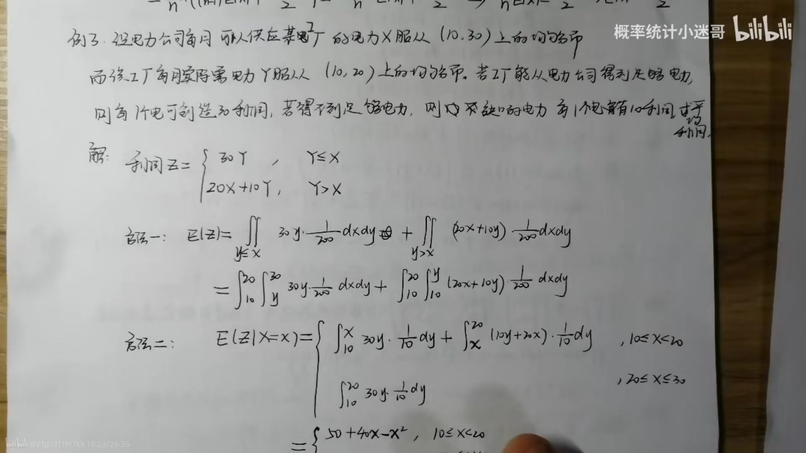

#### 联合概率求期望

如果要求E（X）或者E（Y），如果知道了fxy这个概率密度，那么根据∫∫xfxydσ二重积分求，当然也可以求出来fx概率密度，然后求出来E（X）

一般来说期望有两种解法，第一种就是正常就x的概率密度，然后定义，还可以是E（X）=∫xfxy，求一样的，还可以是E（X^2^）=∫x^2^fxy

#### 条件绝对值E(|x-y|)

遇到条件绝对值首先需要把他转化为E(max(x,y)-min(x,y))，然后用最大值最小值分布函数求概率密度，然后接下来大概率会用到伽马函数，用阶乘性质就好了

#### 期望快速解法

> 记住等式也能给我求期望，比如z=xy，那么E（z）不要z求概率密度，直接变成E（Xy）

比如求某个期望的是=我们呢一般把他看成常见的分布，然后左边的变量就变成求E(变量)然后用期望的性质去解决，然后根据这个分布的期望来快速求解期望

#### 一维求期望以及分布函数问题

如果是一维求分布函数，那么用分布函数的画图法

如果是求期望，那么根据右边x的范围判断积分上下限，在根据复杂的E（g（X)）求出来E（Y)的期望

#### 重期望的公式

重期望特别重要，帮助简化计算，让你求协方差，**相关系数简直是神中神**

#### 概率与期望的误区

面对一个一维分布的时候如果这么想问题，比如这个就是∫1到正无穷，（x-1)fx求出来的是期望

如果要求概率的话，那么就是P（Y >0)=P(X-1>0,X >1)=P(X>1)=∫1到正无穷 fxdx了！这是一个误导

### 概率技巧

概率为0的事件与任意事件都独立

**贝叶斯概率**：

本质上就是全概率，别忘了右边是条件！

#### 在分布函数里面积就是概率

P(a-b)>pa-pb

#### 概率变化

已知结果会导致概率变化

### 假设检验与区间估计的理解

> 检验水平可以理解为撒豆子，比如给定一定的置信度，那么他会倾向于在哪个区间撒豆子

------

#### 一、区间估计（Interval Estimation）

##### 1. 定义

区间估计是用样本信息来估计总体参数，并给出一个“区间范围”，在一定置信水平下，这个区间覆盖总体参数的概率较高。

##### 2. 基本形式

如果总体参数是 $\theta$，我们构造一个随机区间

$(L(X_1,\dots,X_n), \, U(X_1,\dots,X_n))$

满足

$P\{ L \leq \theta \leq U \} = 1 - \alpha,$

其中 $1-\alpha$ 就是置信水平（confidence level），常见取 $95\%$ 或 $99\%$。

- **区间长度**：反映精确程度，样本量大 → 区间更窄。
- **置信水平**：反映可靠性，置信度高 → 区间更宽。

##### 3. 举例

样本来自 $N(\mu, \sigma^2)$，$\sigma^2$ 已知。
 则 $\bar{X}\sim N(\mu,\sigma^2/n)$。
 构造置信区间：

$\mu \in \left( \bar{X} - z_{\alpha/2}\frac{\sigma}{\sqrt{n}}, \, \bar{X} + z_{\alpha/2}\frac{\sigma}{\sqrt{n}} \right).$

------

#### 二、假设检验（Hypothesis Testing）

 1. 定义

假设检验是对总体参数 $\theta$ 的假设（通常有两种对立假设）进行检验，利用样本来决定是否接受或拒绝原假设。

 2. 两类假设

- **原假设 $H_0$**：默认成立的假设，例如“$\mu=\mu_0$”
- **备择假设 $H_1$**：与原假设对立的假设，例如“$\mu\neq\mu_0$”

3. 两类错误

- 第一类错误（Type I error）：拒绝了正确的 $H_0$，概率记作 $\alpha$（显著性水平）。
- 第二类错误（Type II error）：接受了错误的 $H_0$，概率记作 $\beta$。

通常我们固定 $\alpha$（如 0.05），并尽量减小 $\beta$。

4. 基本步骤

1. 提出假设：$H_0$ 与 $H_1$。
2. 选择显著性水平 $\alpha$。
3. 构造检验统计量（通常利用已知分布）。
4. 确定拒绝域。
5. 根据样本观测值落在拒绝域与否，决定是否拒绝 $H_0$。

5. 举例

已知总体 $N(\mu, \sigma^2)$，$\sigma^2$ 已知。
 检验 $H_0: \mu=\mu_0$ vs $H_1: \mu\neq \mu_0$。

- 检验统计量：

  Z=Xˉ−μ0σ/n∼N(0,1).Z = \frac{\bar{X}-\mu_0}{\sigma/\sqrt{n}} \sim N(0,1).

- 拒绝域：
   $|Z| > z_{\alpha/2}$。

如果算出来的 $Z$ 超过临界值，就拒绝 $H_0$。

------

 **三、两者的联系与区别**

| 对比点   | 区间估计                       | 假设检验           |
| -------- | ------------------------------ | ------------------ |
| 目标     | 给出参数的可能范围             | 判断假设是否成立   |
| 结果     | 一个区间（带置信度）           | 接受/拒绝原假设    |
| 核心思想 | 构造置信区间覆盖参数           | 构造拒绝域排除假设 |
| 关系     | 区间估计与双侧假设检验常常等价 | 检验能反推出区间   |

**联系举例**：
 如果 95% 置信区间是 $(1.2, 2.5)$，
 要检验 $H_0:\mu=3$，显著性水平 0.05，
 因为 3 不在区间内 → 拒绝 $H_0$。

------

✅ 总结：

- **区间估计**：告诉你“参数可能落在什么范围内”。
- **假设检验**：告诉你“数据是否支持某个假设”。
- 两者都是基于样本分布构造的统计推断方法，常常互相转化。

------

#### 常用结论（重点掌握）

==我们做题一般是用检验法和区间法==

==这里的区间一般指的是u0的范围！！！==

**在拒绝域就是否定原假设，在接受域就是接受原假设**

- 设 $\alpha=0.05$，$z_{0.05}=1.645$，样本 $\bar X = 10.3$，$\sigma/\sqrt{n}=0.1$，$\mu_0=10$。

- **检验法**：
  $$
  Z = \frac{10.3-10}{0.1}=3 > 1.645 \quad \Rightarrow \quad 拒绝 H_0。
  $$

- **区间法**：
  $$
  \mu \in (10.3-1.645\times0.1, \infty)=(10.135, \infty)。
  $$
  因为 $\mu_0=10$ 不在区间内，所以拒绝 $H_0$。

结果完全一致 ✅。

#### 双侧检验

> 双侧检验是双边是二分之a，中间夹着1-a，单侧就是一侧是a中间是1-a

**来道题深入理解一下**

这里根据第二类错误概率H0为假，H0为真 **取伪**（其实就是H1是真的，你给选择H0了，本质上是一种犯错）

H1为真，即u>=u0,u是5.75，也就是u=5.75H1就是真，那么带入，然后H0为真就是H0要在接受域，那么根据下面走

然后根据标准正态分布进行化简就好了

**第一类错误a概率**，弃真，那么就是P（H0假|H0为真）也就是接受H1在H0为真的情况下，也就是a，详细请看这块原理部分的讲解，也可以看看补充部分

------

**小补充：5.5 是怎么定的？**

实际考试中它可能是用显著性水平 $\alpha$ 反推出来的阈值；但这题已给定拒绝域，所以不需要再管 $\alpha$ 的来历，直接按它来计算 $\beta$。

------

 **这道题在做什么决策？**

- 总体：$X_i \sim N(\mu, \sigma^2)$，已知 $\sigma^2 = 2$，样本量 $n = 8$。
- 规则（已经给好）：只要样本均值超过 5.5 就拒绝原假设。
- 用集合写就是拒绝域 $W = \{\bar{X} > 5.5\}$。

所以这就是一个阈值检验：“看 $\bar{X}$ 有没有大到超过 5.5”。

------

 **原假设与备择是什么？**

给了上尾拒绝域，通常对应：

- $H_0: \mu \le 5.5 \quad \text{vs} \quad H_1: \mu > 5.5$。若观察到 $\bar{X} > 5.5$，就把 $H_0$ 否掉（拒绝）；
- 若 $\bar{X} \le 5.5$，就不拒绝 $H_0$。

注意：“不拒绝 $H_0$” ≠ “$H_0$ 为真”，只是证据不够。

------

 **二类错误到底是什么？**

- 一类错 $\alpha$：$H_0$ 真，却被我们拒绝了（冤枉）。
- 二类错 $\beta(\mu_1)$：$H_1$ 真（均值其实变大了），我们却没有拒绝 $H_0$（漏报）。

本题要求的是：当真实均值 $\mu = 5.75$ 时的二类错概率：
$$
\beta(5.75) = P_{\mu = 5.75}(\text{不拒绝 } H_0) = P_{\mu = 5.75}(\bar{X} \le 5.5).
$$
关键点：二类错不是一个固定常数，而是随“真实的备择值 $\mu_1$”变化的函数（叫“功效函数”的补：功效 = $1 - \beta$）。

------

**为什么用正态去算这个概率**？

因为平均数的抽样分布已知：
$$
\bar{X} \sim N\!\Big(\mu, \frac{\sigma^2}{n}\Big) = N\!\Big(\mu, \frac{2}{8}\Big) = N(\mu, 0.25).
$$
也就是：当真实均值是 5.75 时，
$$
\bar{X} \sim N(5.75, 0.25), \quad \sigma_{\bar{X}} = 0.5.
$$
于是
$$
\beta(5.75) = P(\bar{X} \le 5.5 \mid \mu = 5.75) = P\!\Big(Z \le \frac{5.5 - 5.75}{0.5}\Big) = P(Z \le -0.5) = \Phi(-0.5) = 1 - \Phi(0.5).
$$
数值约 $0.3085$。
 解释：若均值真的涨到 5.75，这个检验还有约 31% 的机会看不出来（没拒绝 $H_0$），功效 $1 - \beta \approx 69\%$。

##### 方差已知

> 我们一般记住这个置信区间，这个置信区间的值是u的值，区间是看备选假设说等于那么就是闭区间，一般是开区间，这个置信区间是接受域，比如方差未知的右侧检验，u0>x-t(n-1)s/n..这个是接受域,拒绝域就是u<！别忘了转化形式标准型

##### 方差未知

#### 单边检验

##### 方差已知

###### 右侧检验

###### 左侧检验

改成+，左区间

##### 方差未知

###### 右侧检验

###### 左侧检验

改成+，左区间

#### 两类错误的定义

这个的理解一般要掌握两方面

**弃真**（a概率）：

1. H0为真但是拒绝了H0
2. 在拒绝率的概率

**取伪（**b概率）

1. H0为假，接受H0
2. 在接受域的概率

这道题这么做！

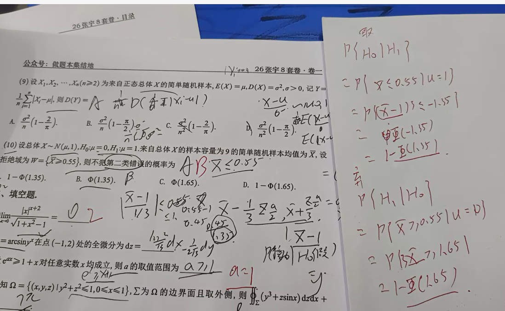

### 置信区间和拒绝域的关系

他俩其实就是一回事，无非置信区间是在参数量的纬度，拒绝域是在统计量的纬度

比如你落在置信区间那么就在接受域等价

在不置信区间就在拒绝域

拒绝域是从 **统计量出发** 得到的判别规则。

单侧置信区间是从 **参数出发** 得到的范围。

它们没有矛盾，而是**等价的**：
$$
H_0 \text{被拒绝} \quad \Longleftrightarrow \quad \mu_0 \notin \text{置信区间}.
$$

#### 假设的选择

我们一般把**要检验的变成备选假设**，这个是因为如果错了那么就只会犯弃真概率，弃真概率又叫做a概率，他是又不可信水平a控制的（显著性水平）这样对统计者来说更容易控制，将错误影响降到最小。

#### 关于知乎上的理解

https://zhuanlan.zhihu.com/p/86178674?share_code=1e9XIRfujLGaA&utm_psn=1944867300957201437

### 不变性原理（最大似然函数）

> 最大似然函数分连续和离散
>
> 让你求某个量的最大似然函数，一定要根据连续或者离散去构建这个函数，剩下的自然就求出来了，==离散找概率，连续找概率密度，本质上就是似然函数的建立==

最大似然函数一般是出大题，**一定要看样本！！！**，如果给一个样本说x1,x2..xn,y1,y2..ym简单随机样本，那么这就需要构造fxi*fyj，如果是说（x1,y1),(x2,y2)（xn,yn)简单随机样本，那么就是fxy这都是不一样的

不变形原理就是求出来的参数，直接带入

==矩估计不具有不变形==

==最大似然估计具有不变形==

> 这种题本质上问你概率最大的值是多少，那么求的是最后P（）一定带着δ，本质上就是求g(δ问题)，你只需要正常去求里头的方程最后带着，然后不变形带入就行，这里的正态分布有公式，别忘了左边是函数的方差！

参数不变性：有时候就是让你的求参数的估计量，你就用E（X)=X平均值，表示参数就好了，==其实就是传递性：让你求M =a分之一，然后求出来a就能求出来P的最大似然==

#### 符不符合某种分布的标准

跟这个分布的期望和方差规律一样就行了

1. 期望
2. 方差

### 期望和方差的无偏估计量就是样本均值和方差

### 估计量问题

总结：
1.估计量：用于样本推断总体，估计量是一个随机变量，服从一个分布
2.无偏：随机变量（估计量）的期望（均值）等于总体的均值
3.有效性：随机变量（估计量）围绕总体均值的波动（方差）小
4.一致性：随着样本容量增加（即估计量具体的估计值增加），估计量的方差逐渐减小，依概率收敛到总体均值（PS：在我看来是随着样本的增多，信息量增多，不确定性下降，导致能从样本得到对总体更多的认识）
5.一致性对于估计量最重要：随着样本量增加，估计量会收敛致总体的数字特征，这样可以用样本推断总体（扰动项与同期解释变量不相关（无内生性）是OLS为一致估计量的最重要条件）
参考：https://www.zhihu.com/question/22983179/answer/404391738

#### 一致性的判断

一般一致性我们用两种方法 

==一致性一般和依概率收敛非常像==，把依概率收敛的数变成参数量本身就变成了一致性

1. 辛勤大数定律
2. 切比雪夫（**常用**）
3. 

## 高数

**杂项结论**

这个是结论

- 极值与最值的关系：极值有唯一，二维没有唯一（如果有唯一极值点）
- 绝对值要从外到里去绝对值
- 渐近线误区:正无穷和负无穷都要判断没有水平线才能判断没有斜渐近线，如果有一个还要判断另外一个
- 求导是邻域，定义是改点，说邻域的时候就是求导，说改点的时候就是定义
- 相乘不变号必须是同号否则有误，（比如x<2x，那么左右乘以x方，那么一定好让x3<2x3次方吗？不一定)
- 判断端点收敛发散后一项除以前一项必须是单减！
- 积分上下限遇到这个直接给我变限积分
- 二重积分的三角函数要利用对称性尽量让他单区间，否则有绝对值（开根号里就是绝对值）
- 绝对值模π定理：遇到绝对值里面是周期函数比如∫|cox|dx这个定积分，他是π为周期的绝对值，那么就是模π把他转化为x=nπ＋r，其中r小于π大于0，又或者模2，反正绝对值里面如果是周期函数总是可以用模定理简化问题

### 数列与函数图（海涅定理）

**数列**：遇到两个相减可以看差分，遇到两个相加可以用交错法算出来通项（交错法求出来是个级数）

**海涅定理两大应用：**

第一个就是将函数极限与任意数列极限联系在一起了！想那个图，就是一个数列存在极限，那么一个数列函数的xn任意方式趋近于这个函数的极限都相等。我们一般求数列的极限用函数的极限推出来这个数列极限，但是数列的极限不能推出来这个函数的极限（因为只有一个，我们要求的是所有数列）

第二个就是用海涅定理证明函数的极限不存在，因为只有用数列求出来两个极限不存在，那么这个函数的极限就不存在了

这个是函数的极限与数列图的关系。记住n是第几个点，xn的点的横坐标，fxn就是函数值

**注意**：这里xn以任一方式趋近于x0，可以是发散也可以是收敛！比如交错级数

an的n就是第几个点，an就是第几个点的函数值，这里没有横坐标！

### 幂指放缩

幂指放缩非常重要解决这个极限问题，必须记住

###  f(x+2)-fx=gx的两个理解

一个是转化为变限积分，他的定积分求导是gx求出来对应的关系

第二个就是利用拉格朗日求出来新的函数！

### 数学归纳法！

  核心是初始条件，以及假设，最后验证，别忘了可以简化语言表达问题！

  

  

  

  

  

  

### 反三角函数的主值和区间以及锯齿函数arcsin（sinx）

这个是大纲！可以方便找，然后有公式

> 注意这里的k是右移动是正在左移是负！是主值的移动！

**arcsinx：**

**arccosx：**注意的是奇数有（k+1)π，其他跟arcsinx的相同，奇数减，偶数加

**arctanx：**

**arccotx**：跟arctanx一样

**锯齿函数**

> 锯齿函数主要的精髓就是arcsin（sinx）就是一个锯齿波，那么根据这个主值区间进行平移，求出来这个直线就行（点斜式）

**arcsinx（sinx）**

**arccos（cosx):**主值区间是0到π，然后锯齿波，求解直线

**arctan（tanx）**：主值区间，然后这个不太像锯齿波了，反正差不多的意思，求直线，平移

**arcsin（cosx)**:记住公式就行

### 旋转体积和表面积的万能公式

> 旋转小心x的范围，找到有效范围，而不是完整都要！

万能公式主要将定积分转化为二重积分，有的时候复杂有的时候难

绕x轴一般用圆盘法，y轴一般是周长法，二者有的时候可以转化

### 广义奇偶问题，即xdS的三大方法

### 高阶导数的三大方法以及两个理解

> 高阶导数的第一个理解就是就是给的函数求n次导，第二个理解就是泰勒展开x^n^前面的系数乘以n！f^(n)^=an*n!

第一个办法是归纳法，记住公式，然后展开就好了（这里已经带n！）了泰勒联系起来

第二个办法是莱布尼茨一定要记住这个是解决幂级数展开系数为0

第三个办法是泰勒法，他的方法就是想办法找到x^n^的是系数，然后再乘以n！（可以用已知泰勒去求系数）找到Xn的系数

这里有一个泰勒高阶导数相乘的例子！泰勒也可以高阶相乘！

### 多元微分的极小值点与二阶导数的关系

内部最小值都是极小值点，内部最大值都是极大值点

极小值点则二阶导fxx>=0,fyy>=0.

### 变限积分可不可导问题，连续问题

如果变限积分可导则fx连续或可去，如果fx不连续或不是可去则变限积分不可导。变限积分二阶导则说明fx的一阶导存在

### 泰勒公式的应用

> 泰勒展开应该是因式子最小项

**一定要记住高阶导数和x^n^不是简单的系数对应关系！**

#### 泰勒形式不变形

泰勒形式的不变形是指就是sinx/1+x方，比如就是x^3^次方那个系数无论用什么方法，只要是X^3^次方的完整系数就行，比如这个sinx展开，乘以1+x展开，到最后只要系数完整就能代表最终用定义去求泰勒

#### 微分等式

我们正常来说中值那快是把展开x0，取点就是x，但是在不等式这里我们需要把x0当做x这样会出现f‘x这种导数关系，从而构造不等式，取点变成一个常数

### 极限

> 可疑点有不存在点与不可定义点

正负号判断有四个，分段函数，e的x，ln，arctan，绝对值

#### 保号性

这里带帽就是带等于且是带了个极限号，也就说只要fx大于还是大于等于那么加了极限一定是大于等于0（**特指是去心领域不能忘这点！）**

这里摘帽子就是不带极限，当极限大于0求出来原函数的去心领域里存在大于0，不能是大于等于0，等于了就推不出来了，还有就是

**能否摘帽子极限大于0，得到去心领域大于等于0，是可以的因为大于0推出来大于0，结果大于0包含大于等于0**

#### 二元积分的极限快速判断以及判断极值点

> 分母取到0必不存在
>
> 上下齐次必不存在
>
> 高次比低次，或者说分母次数低那么一定存在，大概率为0

这个二元只能用是分子为0，分母为了的话要保号性了！，记住**这里有个误区，就是认为o(（x^2^+y^2^）^2^)是xy的高阶无穷小，其实不是的**，答案记住就是高阶无穷小的二维这块，高阶只能说同形式高阶，其他形式不是相似！

本质上是用保号性来解决问题，别忘了这个高阶无穷小的收缩

**具体函数才能用AC-B方，抽象不能用！这里不能用**

#### 间断点的区分

间断点有可去，跳跃，无穷

怎么解呢？核心就是极限！

1. 首先找到这个式子的可疑点
2. 然后根据极限判断左右的关系判断间断点

#### 极限与不定积分的求法（n与不定积分交换次序）

遇到这种我们一般都是放缩！看到n与定积分的组合一般用放缩。

这里重点解释一下什么时候可以n与积分号交换位置（也叫做勒贝格定理，俗称控制收敛定理）

做这个题首先把极限放到里面，然后得到fxn，重点看x，首先看x的范围收否可控（小于最大值）第二是否收敛看看收否收敛于一个函数（注意判断的时候n一直都是大于无穷，一直都要观察x的变换求出来可控以及收敛，x变换里注意x的端点）这个只是充分条件，就是满足这个一定可以交换，不满足不一定不可以嗯。。

#### n阶乘的极限公式（斯特林公式）

#### 极限七个未定式！

重点就是0*无穷是未定式，无穷是无穷不是，0*0不是

#### 极限绝对值问题

#### 二元极限判断可微的问题

处理偏导是一个难点，比如B选项，一定要理解可谓的两个含义

1. 可微几何意义就是空间几何体非常平缓，跟可导平缓一个意思，不那么尖
2. 可微判断方法，偏导存在且连续，可微公式

这里判断可微用公式，首先找到fx偏导，用定义，由图可见，那么极限能求偏导，当y趋于0的极限再成x分之一，分母为0，分子偏导，那么偏导为0，同理fy偏导为0，fxy比上x方加y方存在，那么凑一下，也出来了。也就是说极限求偏导！

#### 极限判断连续问题

如果判断一个区间在ab上是否连续，我们呢一般是通过三要素解决是否连续，核心就是左连续等于右连续

 三要素

1. 任意一点
2. 存在δ，【x0-δ，x0+δ】区间有x
3. limx->x0- f（X）=fx0  limx->x0+  f(X)=fx0如果这两个左边等于右边，那么没有问题啊

**连续第二种定义**：连续的第二个定义就是lim德塔x趋于0，detaY等于0

#### 判断间断点类型问题

> 可疑点：分段点和无定义点！

#### 无穷大公式

### 不等式

这个平方平均数，算术平均数，几何平均数，记住这个口诀

|a+b|<=|a|+|b| .

柯西不等式：(a² + b^2^ )(c² + d^2^)≥(ac + bd)^2^(当且仅当ad = bc时取等号)

### 参数方程的间断法判断方法

**根本方法是看y的值，以及y值对应t所对应的x**

首先看y的可疑点，**注意这里的可疑点必须是看y所对应的t而不是x对应的t** 找到所有t的时候，在要看看最后y无穷的时候，然后分类讨论不同t对应y的值以及t对应x的值，这就是一个

**为什么没有t等于2**：因为此时x趋于无穷，我们并不研究x趋于无穷的间断点

**为什么要t有无穷呢**？因为t趋于无穷，x趋于0，既然x趋于0，但是又不等于0，那么就是x从定义上来看他就是间断点，也就是参数方程要考虑t为无穷的时候

### 转换投影和dxdydz转换关系

这里不能用转换投影，因为转换投影他就是Dxy了，但是这个不是，所以根据dxdydz转换关系就行，注意n向量的方向，逆时针的右手原则，要从dydz转化到dxdy的关系，别忘了cosa/cosr这个比值就是对应n向量位置的比值（也就是不需要单位化）

### 奇偶函数求导的结论

变限积分符合正常结论

奇偶函数求导是反过来，偶函数的原函数不一定，奇函数的原函数就是偶函数！

### 反函数求解理论

反函数求斜渐近线我们一般就是用定义y/x当做一个数带进去，求出来，通过隐函数方程求出来这个值

如果让求零点那么y=0求出来x的数量

一般用-Fx/Fy

反函数求解公式是φ（==y==）别忘了一阶导是导数，二阶导是类似于参数

### 区域和曲面补不补的问题

区域一般就是空间体积了，这个一般自带，不用补，一定要注重区域的表现，他有大于小于这种符号

曲面一般就要补，他一般是等于，得补

**题目描述：**空间区域外侧，曲面外围

### 边界含义

如果是二维，那么要探讨两个边界，一个是三个点，三个边（**三个边探讨最值就是让一个为0,f(0,y)求导算极值算一个，剩下的同理)**

如果是三维，那么就要探讨三个边界，一个是三个点，一个是三个边，一个是三个面

**二维**：如果是个等式那么就只有黑色的点，如果是区间，那么三条边，有三个黑点（这里少一个）

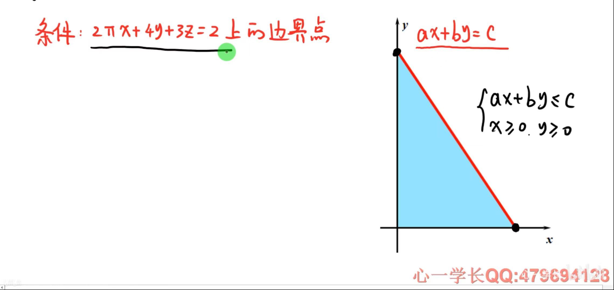

**三维：**如果是等式那么就是三个黑点（是两个变量为0）三条边（一个变量为0）一共六个，如果是区间那么就只有三个咯~

### 轮换对称性与普通对称的关系

这里轮换对称性一定要F（X,Y,Z)=F(Y,X,Z)=F(X,Z,Y)他们是相等的，满足轮换对称性

而且有一个常见的误区 **∫∫xydxdy=是不等于∫∫x^2^dxdy，而是等于∫∫xzdxdy**错就错在了轮换对称性要换俩个

**区别**：普通对称如果区域是f(x)=f(-x)某种关系，轮换对称是看f(x,y)=f(y,x)的关系

### 命题的理解

> 很多时候往往拿一个特例来排除选项，这种方法只能去掉错误选项，但是如果对了，我们不能立马选择这个答案，只能大概率是这个答案，如果排除了三个那么这个就是绝对对的

**反证法**：首先反证法就是先把结论反一下，然后当做条件去证明已知的矛盾

**逆否命题**：可以简化命题

**充分必要**：若p->q，则p是充分的，能推出来q，q是必要的，这里的必要如果是p那么一定会有q，这幅图理解

逆命题和否命题不是等价的记住，这俩出来就是为了研究逆否命题 

### 偏导理论

二阶偏导连续=》可微=》连续|偏导存在

> 偏导链式法则，

#### 分段偏导！

分段函数的时候一定要分四段，不要偷懒

分段函数求偏导点  求点就用定义  求段就用求导（==如果分段时x等于某个数了还让你对x偏导，那么你只能用定义，原因就在于原式都没有x了，你求导就是0，实则不是==

#### 偏导链式法则

找到独立变量，然后找到最底层的那个变量，分别求导相加就行了！

#### 复合函数

这里有函数名与变量的关系，z是变量，函数名如果有两个位置那就是二维，如果函数名有两个位置但都是x则就是一维，对应的就是z(x)，变量求导就是函数名各个位置求导！（复合函数）

第二张图是换元偏导问题。以及换元误区，就是说r（x,y)不能有θ！

#### 偏导算法

全微分两种算法

#### 某点偏导以及偏导连续算法

==一个点偏导就用定义去求==

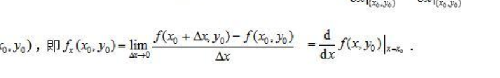

==证明偏导连续就用== ((**证明左边一定要先求偏导**))然后判断

（x,y)->0 f$_x$ (x,y)=f$_x$(0,0)

(x,y)->(x0,y0) f$_x$(x,y)=f$_x$(x0,y0)

**偏导的几何求法**：偏导就是与xoy的交线，通常是f(x,y)=0,z=0，构造出来f(x,y)-z=0 `注意方向问题`简单来说就是给了你fxy你怎么求偏导问题！

#### 两个偏导为0的结论

当题目出现z对x，z对y的偏导那么会出现

**Z（x)=F(x)+G(y)**，对y求积分出现f(y),然后在对x求积分就是这个了

构建两个等式，F（0)+GY=siny,F(x)+G(0)=sinx

把 $F,G$ 表达式合并：
$$
z(x,y) = F(x)+G(y) = [\sin x - G(0)] + [\sin y - F(0)].
$$
= $\sin x + \sin y - [F(0)+G(0)]$。

设常数 $C = F(0)+G(0)$，于是：
$$
z(x,y) = \sin x + \sin y - C.
$$
利用交点条件 $x=0,y=0$：
 此时 $z(0,0)$ 从两边条件都要一致。

- 从 $x=0$：$z(0,0)=\sin 0=0$。
- 从 $y=0$：$z(0,0)=\sin 0=0$。

带入通解：
$$
z(0,0)=\sin 0+\sin 0 - C = -C = 0.
$$
所以 $C=0$。

### 导数

- 不可导点仍然可以是极值点，极值点如果可以求导就直接判断异号找出来
- 导数定义的时候是用极限来说的，那么可以用变量代换。极限降维，一般函数是小于，那么极限就是小于等于。
- f(X+2)-fx=一个函数本质上是一个变现积分的导数！
- 偏导对函数值的影响：这里是形容二元函数的，这是充分条件，就是说如果fx大于0，那么x增函数值增，如果fy增x增函数值增，如果fx，fy大于0，那么x，y增则函数值增。但是如果函数值增则不一定偏导关系了，这就是充分条件

#### 导数定义问题（难点）

> 导数我们要注意的是导数定义式子的导数fx的x是一个整体，是这个整体趋近于这个点。
>
> 我们一般给的式子存在里拆成导数定义式子和一个判断式子，这个判断式子决定了是否导数定义式能否存在
>
> **注意**：两端，F’0，

> 这里一看人家为什么就能拆成两个呢？（这与上面f（2h)-f(h)错误解法不可拆形成矛盾，因为上面那个方法求出来两个极限，然后去判断这个导数是否存在。关键的误区就是上面是一个存在你变成两个极限，这两个极限可以是都存在，也可以是都不存在，那么你这么解肯定是不对的，不能通过极限存在来判断导数情况，关键在于这个极限不一定存在。但是这个题呢，为什么可拆呢，因为题目告诉你了二阶导存在，那么就意味着一阶导连续可导，不就意味着导数存在，极限存在，本身就可以拆了）

#### 可导与连续，二维偏导问题问题

可导是这点导数存不存在，一般用fxy-f00这种判断某点导函数连续意味着就是连续定理要用整体上求导然后去判断是否等于该点

**核心就是可导就是定义，连续就要求导判断是否等于该点！连续一定要求导**，可导就是问你左右导数，连续就是问你左右极限是否等于函数值

二维偏导连续：核心也是求这个fx的偏导！然后判断这个值是否等于该点，别忘了**是两个趋近**

#### 极值点和极值的判断(隐函数求导)

> ==极值点存在的可能性==：驻点，不可导点，不存在点（不存在属于不可导）
>
> 拐点是真正的点，其他八大点都是横坐标（一共九个点）
>
> 间断点一定是不可导点

极值点与拐点的关系，在**可导的情况下是**不能存在于同一个点

隐函数求导，我们一般要求直接对式子进行求解，让y’=0，求出来y与x的关系，带入原式子，求出来y与x的值，然后再对式子求导，算出来二阶导，然后算一下y’‘（x)的正负判断极值

斜率变化的点

1. 可导那么就求导判断
2. 不可导就只能用定义

**第三充分条件**:

极值点附近领域处处有值！必要条件是可导函数的导数为0，如果不可导那么就只能定义！这就是算法

#### 乘积求导

一个求导，另外其他不求导

注意穿针引线的理解（奇穿偶不穿）处理相乘式子

#### 导数存在

如果导数存在的话那么就是左导等于右导，如果这个导数的xy是一个关于t的导数，那么就分类讨论。

导数存在本质上是**这个点的附近存在**，导函数连续判断两个区间连续在添加一个端点连续

#### 一点可导与一点极限的重要区别

某点导数大于0，不能推出来附近存在一个领域恒大0

某点极限大于0，根据保号性，能推出来存在附近领域使其函数值都大于0

#### 凹凸性的两个方法（拐点）

1. 一个是原函数凹凸性改变的点

2. 一阶导函数单调区间变化的那个点

**拐点就是凹凸性变化的点**：二阶导为0，正负变化（或者三阶导不为0）失效的话就用极值点第三中值定理）

#### 洛必达必要性问题

如果洛必达有极限，那么一定能推出来原来的极限是A,如果原来极限是A，不一定能保证洛完之后就是A

==洛必达后面如果不存在极限，不能代表洛之前的极限就是A==

#### 函数的无界问题

当导数不为0的时候，那么x趋于无穷fx是无界的

**注意**：导数为0，不能说明x趋于无穷fx是有界的的

有界无界用fx/x的洛必达解决，导数的值来判断函数的关系

**有界的两个理解**：一个就是有界分为闭区间，闭区间一定连续，开区间要看两个端点的极限是否存在以及区间内连续那么就开区间有界，其实大部分讨论开区间是否极限存在

#### 导数与原函数的问题

如果原函数，与二阶导存在的话，那么无穷的时候，速度为0，二阶导为0，记住得存在，也算是能到无穷远！

无穷这块，速度有界，那么位移也有界，时间到极点的情况时候就导数为0了

速度有界那么，时间有限的情况下，位移也有界

### 多元极值失效的方法

首先是回归定义，而且大概率是没有极值的

一般来说就用特殊路径法，看看两边的大小来判断极值

也可以用正定来判断

### 中值定理

**重要结论：**

1. 积分为0则某点f($\xi$)=0
2. 介值定理二分之一
3. 带权中值定理

1. 积分第一中值定理
2. 

先展示大纲

#### 原函数法

主要是找到F（X)=c，找到了F（x)那么这就是要构造的原函数，一般来说找到这个F（x)而且是理想，那么思路就已经出来了，直接设F（x)然后那么放到题上就是直接设了之后开始正向罗尔定理，然后求导

**注意**:有时候F(x)并不是想要的，为什么不是理想的，因为F（a)=F(b)这个要用上已知条件否则就废掉了

遇到二阶f与0阶我们经常用观察法（即是否能凑出来g’‘f+f’‘g）然后用原函数法，或者来一个中间的一阶来辅助构造，其实都可以

**题目：**

这题包含罗尔定理推广

**两次构造，三个罗尔，微分方程求解**

遇到陌生的就直接微分方程建立，最重要的就是求出F（X)=C

一般是中值和多项式七届

#### 微分方程法

#### 万能构造法（重点）

==万能构造当中用不到条件就反解已知条件==

> 万能构造法在解决微分方程的极限有用，还能还原回去，用这个还原公式。其实微分方程和万能构造是一回事，一般用万能构造来构造微分方程，G（x)构造其实就是在找微分方程的原函数

f’‘+f用微分方程，f’’-f用万能构造（微分方程找出来C）直接秒了

这里有万能构造法求导换元回去这个微分方程

这里头有一个重要思想就是

新旧函数转化

##### 新旧函数转化

一般来说设积分上限的时候都喜欢把被积函数设的干净点，如果不够干净那么重新设一个干净的就好了

#### 常数K值法

#### 柯西中值的逆天应用

柯西中值定理遇到一个值是从两方面入手，如果是遇到中值那么最后从中值入手，这两种一般解决的不是真正的双中值问题，第一步肯定是分离，不同的中值即双中值就是分成不同的区间

记住是从两个角度入手，一般从中值角度入手

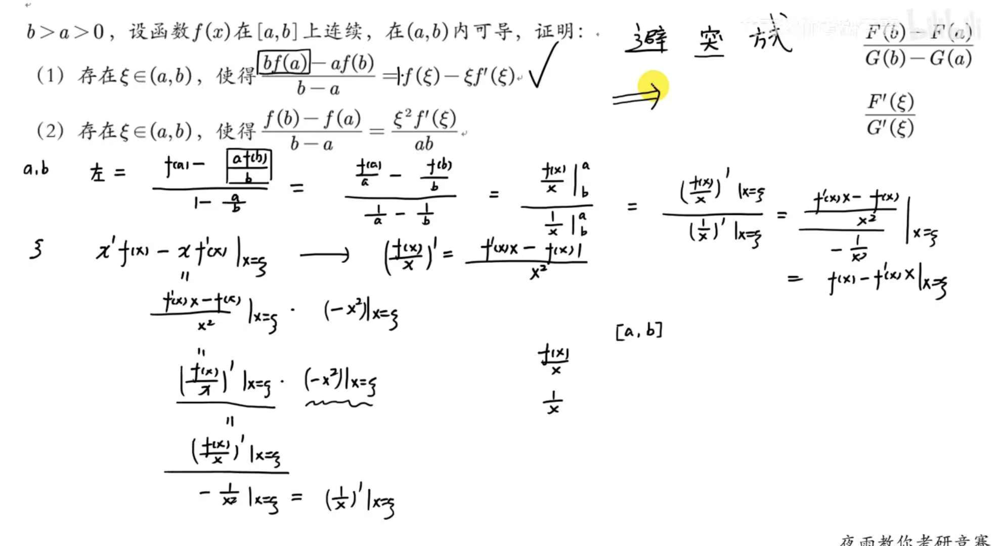

这点非常重要昂==常数K值法解决是不是真正的双中值，当然柯西和拉格朗日要求的就是处理不是真正的双中值==

==遇到两边都有中值就不能两个角度都能入手了，只能从中值入手==和含一个中值有区别，一个中值两个角度，两个中值就只能从中值入手

#### 拉格朗日的几何意义

> 一看到函数相减，就要想到拉格朗日
>
> 我们一般看到x与f中值混合就要想到拉格朗日
>
> 数列收敛即就是limx趋于无穷存在，那么也就是说中值存在结合起来使用‘
>
> 三种形式以及注意范围

比如这个，我们证明xf’x存在，那么我们就可以f’进行中值进行论证 

#### 三大方法解决真正的双中值问题

> 双中值问题本质上是换掉导数

**拉格朗日方法即几何法**：

**插分点方法**：

**消一个中值**：

有时候可以把一个中值当做一个K==常数来解决==

#### 隐藏导数问题

#### 多项式拟合法

> 多项式拟合法可以让式子变成0，化简

这个方法能消掉f$\xi$=k常数问题，把问题简单化

#### 分布积分法

这个方法主要是把中值与fx的积分与xfx的积分联系起来

#### 泰勒中值定理（介值定理）

两个原则，没有出现的消掉，展开点用题目出现的，分为取点和展开点。不知道的就设展开点

> 介值定理除以前面的系数，题目给的点就是取点，导数就是展开点
>
> 一般来说存在往往转化为任意c的问题，设c点任意
>
> 泰勒这块常常把有界转化为绝对值问题
>
> 泰勒对称不要找对称点，要找对称中心
>
> 泰勒这经常还需要根据证明的式子来常常把展开式就行变形来往答案那凑

**泰勒通常与介值定理和对称中心联系起来**

#### 中值极限问题

这个用的少，第二种

### 圆盘结构

在求最左边这个的时候，我们一般用截限法，不用投影穿线，因为这个穿线它分为两部分，没有截限一部这么好使

### 有理分式化简

一般就是比如分母是三阶的，一个二次方一个一次方，找出来几个相乘的，然后二次方分子就是ax+b,一次方就是a，然后用留数求出来系数就好了（注意留数条件：假分式以及最高次方为1）

#### 伯努利与欧拉方程的解法

伯努利解法

一定要把因变量放到最后好观察

### 不定积分

#### 积分列

他的特点是数列的组成里有定积分，遇到这个只能定积分进行分部积分得到an与an-1的关系没有办法！

#### 定积分周期

一个定积分如果上下去掉T，那么周期值不变

一个定积分的起点无关，也是常数

#### 原函数的无间断点问题

当一个fx函数具有有限个间断点，那么不影响原函数的连续性。也就是不定积分的上下限有间断点无所谓，直接忽视掉就好了

#### 分区间去绝对值问题

！这里一般二维可以降一维

比如这里z(x,y)=g(u)，

z对x偏导就是gu导u对x导。

> 积分去绝对值要分三部分，一个是里面，两个是外面，因为这题就是u分区域后x，y小于二分之一，正好属于中间，然后分区间定积分！

如果一个x与t在一个定积分里，且有绝对值，那么根据定积分上下区间，去掉绝对值讨论，在里头讨论，分成0到某个点+某个点到1类似这种

#### 区间压缩和再现公式

> 区间再现一般是定积分求不出来的时候可以考虑用一下

#### 换元注意

**换元换三部分**：被积函数，微分，上下限（上下限是换元后的）

换元两部分：被积函数，微分 （正常的上下限）

### 线性方程组的误区

这个解的结构而言我之前陷入一个误区，就是误以为两个特解减去就能求得齐次，其实是不行的，必须是同一个输入量才能齐次，不同输入就不行

### 雅可比注意的地方

正常来说我们换元法是换的雅可比的绝对值，出现的是新变量du ，dv，下面是消掉的，上面是新出现的

但是在概率论里，雅可比是倒数的绝对值，为什么呢？因为在换元之后变量是dxdy，他没有变成新变量，单纯的换元

那么就是倒数，第二个变量是父母 **注意dudv=雅可比绝对值*dxdy 这个可以转换**

还需要**注意的地方就是这里是u(x,y),v(x,y)才用上边的公式**

**第二种雅可比理解**

反正就是按照第一个雅可比的导数进行讨论就好了，常见的是第一种

这里专门解决的是x=rcos ,y=rsin,x=(u,v),y=(u,v)，这种式子dxdy就等于雅可比绝对值乘以dudv

2. 

### 多元微分整理

#### 质心等换公式

确定∫∫∫ydv=最好就是质心乘以S，这个是最快的

**平面方程**：有四个

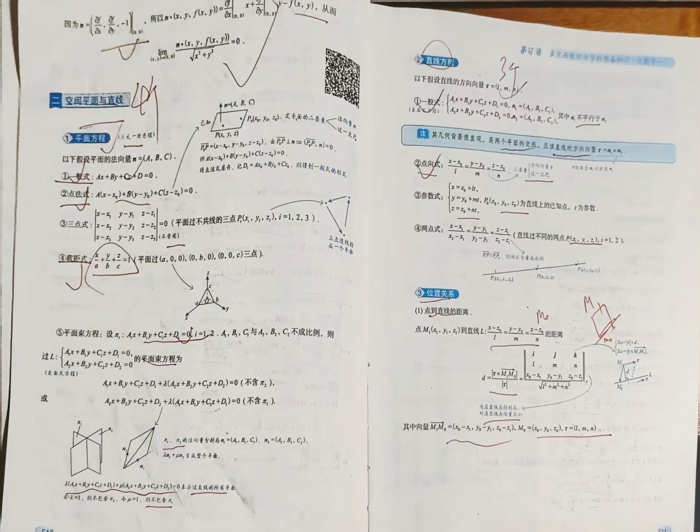

1. 一般式
2. 点法式
3. 截距式
4. 平面束方程

**直线方程**:

1. 一般式
2. 参数式
3. 点向式

**空间曲线方程：**

1. 一般式
2. 参数方程

**投影**：注意在后面点到

常用的曲面方程图像

#### 几何学应用：

**截面法画图**

通过确定每一个z的值来确定一个平面，多画几个，未知的方程式也能变成已知图

**空间曲线的切线与法平面**：

**空间曲面的法线以及切平面**

#### 常见曲线

#### 共面关系

记两条直线的方向向量分别为n1和n2，在两条直线上任取两个点，分别记为A和B。如果 向量AB、n1、n2三个向量的混合积(AB,n1,n2)不为零，那么这两条直线异面，否则共面。

#### 场论有四大点

1. 方向导数：记住是f（x，y，z）的导数，导数就是一个数
2. 梯度就是方向导数的最大值，他是个向量
3. 散度（与高斯密切相关）
4. 旋度（与斯托克斯密切相关

### 多重积分曲线曲面积分整理

> 曲面是z=f（x,y)形式

先看大纲，这里比较多

先来多重积分再到->曲线曲面积分

**三重积分的计算方法**：投影曲线以及定限截面法

投影曲线首先是竖着弄一刀求出来z的范围（用xy表示）然后z轴投影面积表示出来就好了（二重积分）

截面：最左边是z的定值范围，然后切成一个平面D，用xy表示

**多元积分的应用：**

**第一型曲线积分**： 这个是求质量

一般把ds用三个弧微分公式，变成x的上下限（y一阶导，x一阶导，ρ的一阶导）

**快速公式**：

别忘了是倒数的绝对值！

**第一型曲面积分**：这个是求面质量

一般把dS变成根号下（1+Z^`^x方+Z^`^y方）dxdy，然后曲面投影到dxy上

**第二型曲线积分**:这个是力沿着曲线做功（**注意有坑，一般来说我们是dxdy与dS的最优问题**）在给法向量就用dS，这块比较好

1. 一般是y变成x，变成一个定限积分
2. 用格林公式
3. 格林公式判断对出来与路径无关

#### 格林格式挖洞法补充

> 挖洞法的前提试试格林，也就是你格林之后这个面积必须是连通的！如果格林之后这个面积不是连通的那么就需要挖洞了！这个时候才需要挖洞，在挖洞之前可以尝试带入

遇到这种题首先判断这个点是不是奇点，如果是奇点那么挖一个顺时针的洞，这俩部分想加，即一个逆时针和一个顺时针相加为0，整体为0，那么让你求原来的就是L+D -D，一般来说这个L+D就是大概率为0（此时可以用格林公式了），-D当中D是顺时针，那么就变成了D了，所以求得I变成D（逆时针，但是补的时候是顺时针）

**第二型曲面积分**：这个是求场的通量

1. 一般是把dyz，dydz，dxdy把这个曲面分别投影到对应的面上，求三个二重积分比较麻烦

2. 投影定理（这个有两个，还有就是dydz/dxdy=coa/cosz这种

   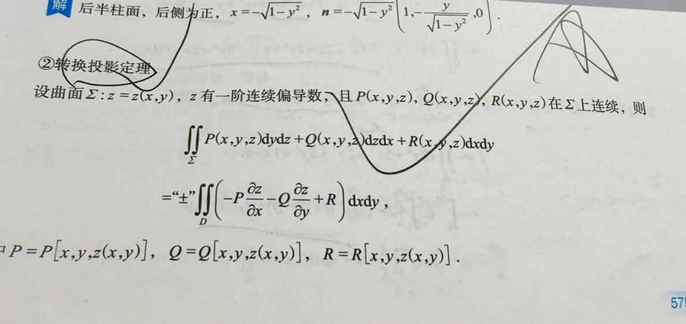

3. 闭曲面用高斯公式

> 两类正向，一类是面正向，上面是正
>
> 一类是高斯正面就是外侧

#### 高斯公式挖洞法

**高斯公式的使用条件！**

跟格林公式挖洞法类似，有时候挖半圆，挖整体看清楚，高斯公式会出现dxdy，dydz，这种最好不要用三部分，因为每次都用移动到对应面，最好的就是法向量，直接变成Pcosa*dS，Qcosb * dS ,这样cosa，cosb就是这个法向量哦

### 空间曲线积分这个是求空间曲线的质量！

直接用斯托克斯公式（一定要注意法向量一定要用右手，围绕逆时针方向来看看）

**斯托克斯注意**：用完斯托克斯之后是一个第二型曲面，那么可能会遇见xzdxdy，dxdy里有不属于xy的第三者变量z，那么此时最好用转换投影法

 **斯托克斯两种方式**

> 我们推荐第三个，好记！

一个是旋度定理求出来的

另外一个是高斯定理求出来的！

### 旋转曲面的求法

#### 旋转曲面的不定积分==误区==

旋转曲面遇到弧一定要考虑形状问题

**求体积**：两个相减或者==πr方ds==

**求弧长**：也要出现ds

**求锥面：**

关键就是找到这几个点，然后核心就是 **夹角**！夹角相等！旋转曲面也可以，太麻烦了！

、

磊哥指点：一般来说就是找两个点，一个曲面点P，一个母线点P0，然后根据这个曲线（根据QP0==Qp用这个向量的模构建曲线）

消掉xyz0的分量，只剩xyz

1. 三个要点
2. 垂直，距离相等，点在曲面上（这个可以用t化简）

### 级数分母出现根号以及谬论

级数分母出现根号一般用有理化来解决，分母简单点，分子复杂点

**谬论**：sin(π$\sqrt{n^2-1}$ 这里n趋于无穷的时候一般人可能以为是sin（πn）这里是不对的，因为抓大头是分子分母，单独对分子是不行的，应该是猜测他是nπ然后+nπ-nπ sin公式展开就好了！

### 投影误区

如果在xoy面上投影那么就是消掉z 就能够得到=》f(x,y)=0,以及z=0

==记住是消掉==

### 点到直线距离解法

一般来说找到直线的方向向量然后找到一个点

点与点组成向量与方向向量点成除以方向向量的模（面积）

### 直线与三轴夹角常见形式

### 空间直线与三轴夹角（方向角/方向余弦）

**方向向量：** 设直线的方向向量为 $\mathbf{v}=(a,b,c)\neq \mathbf{0}$。

**方向角：** 与 $x,y,z$ 轴正向分别成角 $\alpha,\beta,\gamma$。

**方向余弦：**
$$
\cos\alpha=\frac{a}{\sqrt{a^2+b^2+c^2}},\quad
\cos\beta =\frac{b}{\sqrt{a^2+b^2+c^2}},\quad
\cos\gamma=\frac{c}{\sqrt{a^2+b^2+c^2}}.
$$
**夹角：**
$$
\alpha=\arccos\!\Big(\tfrac{a}{\sqrt{a^2+b^2+c^2}}\Big),\quad
\beta =\arccos\!\Big(\tfrac{b}{\sqrt{a^2+b^2+c^2}}\Big),\quad
\gamma=\arccos\!\Big(\tfrac{c}{\sqrt{a^2+b^2+c^2}}\Big).
$$
**恒等式（检验式）：**
$$
\cos^2\alpha+\cos^2\beta+\cos^2\gamma=1.
$$
**小例子：** $\mathbf{v}=(1,2,2)$。
$$
\cos\alpha=\frac{1}{3},\ \cos\beta=\frac{2}{3},\ \cos\gamma=\frac{2}{3}
\quad\Rightarrow\quad
\alpha=\arccos\!\tfrac{1}{3},\ \beta=\gamma=\arccos\!\tfrac{2}{3}.
$$

### 级数收敛总结

题目：遇到傅里叶问题不妨想想an系数来求题目出的级数和

必要条件lim Un=0；级数加括号后收敛（==加括号只会加强收敛性，不一定一定是收敛  有限项不改变收敛性==

`级数定义里Sn可以从某N项开始增加`，注意是正向级数才能用等价无穷小！

> 一般级数的收敛有两种办法，一个是加绝对值之后判断或者放缩进行比较无穷小，要么就是必要性判断

#### 级数半径的特点

级数半径如果求导或者积分，或者乘以x^k^不改变半径，但是可能会改变端点

**遇到括号最好用Sn**

**正项级数的五个收敛性**

1. 比较收敛(==可以用等价无穷小来处理==)

1. 无穷极限收敛

   ==一般遇到极限收敛一定要分母只有Xn，分子有的话就消掉Un，把上面最大的跟下面消掉==

2. 瑕点极限收敛

   p级数和极限审敛法的判断规则一样都是p大于0收敛，瑕积分不一样，是<0收敛

   

   当一个定积分遇到两个瑕点，我们习惯把他在区间找到一个点，让他变成两个定积分，每个定积分有一个瑕点，瑕点是带入瑕点值的

3. 比值

4. 根值

5. 积分收敛

**任意级数收敛	**	

绝对收敛：如果绝对值收敛，那么原级数收敛 `如果绝对不收敛，不能判断原级数不收敛！`

条件收敛：如果绝对值收敛，原级数不收敛

**交错级数**

单调递减  Un为0，如果不满足不能判断此技术不收敛 

**遇到lnx的级数时候怎么办？**：

记住只需要lnx在1,0，正负无穷与x，x分之一这种形式去变，实在不行用公式

x->0,lnx趋于x的任意小负

x->+无穷，lnx趋于x的任意小正

x->1，lnx就是x-1

**常用结论：！！很重要**：

最后一个用公式，我这个是不对的，是0，lnx的指数是1，那么就是发散了，

#### 括号级数

级数收敛的定义是lim n->无穷 Sn=常数，级数是n，如果加个括号变成2n，那么就是偶数，算个级数，分类讨论

#### 收敛域与收敛区间问题

**求收敛域步骤**：

1. 求x 这里求出来的是变量
2. 然后求出来整体X是复杂的式子变成简单的那个式子
3. 第三步新的带入

收敛域要判断端点！

收敛区间不用判断！

 **两个P级**

第一个P是几何P级数，>1为收敛，《=1发散

第二个P级数是极限p级数，上下趋于无穷，消掉n

#### 数列收敛问题

泰勒来证明数列收敛问题！或者比较收敛（正项的)

#### 级数常用结论

**级数逆过去的时候**

一般对f’进行还原，一定是从0到x积分，左边就变成了f(x)-f(0)不要丢掉f0啊

#### 微分方程求无穷级数之和

这个方法比较特殊，因为他是根据级数S（x)的导数与S（X)构建关系，如果一个式子给的是an与an前后项的关系，那么大概率考得就是微分方程求无穷级数了。不过这里有个坑，也是级数变换的难点，就是**Σ前后变换的时候，一定要保证n和X的n是不是符合范围，也就是下标必须有意义，**如果符合了，那么就是相等如果变换后没有定义，那么就是前后不相等。**别忘了求导时候常数会消失**

**级数里不能2n**：这里经常容易犯错的就是Σa$_n$变成Σa$_2n$的时候很自然就直接换了，就是是不行的，因为这个左边也要换，正常来说只能求出来an的表达式，然后求出来a2n，但是注意Σan这个可以被分为Σa2k+a2k-1这个倒是可以的，一奇一偶。也就是说 **级数里不能换元因为要考虑下标位置**

**an**：每次一定要标记范围

#### 反常积分极限无穷等价问题

> 反常积分先看瑕点或者无穷，再用公式，记住的都是无穷公式

当x趋于无穷的时候，fx/n分之一，如果是是个常数，那么就意味着fx是发散，记住一个就是limn趋于无穷n的根号n次方是1，

当x趋于无穷，fx其实是可以等价的，然后不光联想到正向级数的无穷等价问题那个是乘以x的n，这里可以乘以任何一个已知的，然后判断是否是常数，那么就意味着这两个是等价的收敛性。

#### 狄利克雷与阿贝尔判断积分收敛问题

> 如果一个被积函数小于一个收敛的函数，那么积分起来这个积分就是收敛，这点跟级数一样
>
> ==级数和积分的误区：级数在n趋于无穷的时候fx为0，积分在x趋于无穷的时候不一定为0==
>
> 这里专门解决两个相乘的问题！

一个是变限有界，gx单调递减趋于0，则相乘收敛

一个是积分收敛另外一个是单调有界，则相乘为0

狄利克雷也有级数形式

这个是sinx的p级数问题，p<=1条件收敛，>1绝对收敛，cos一样

#### 级数和面积的关系

如果让你求面积，那么就！用级数解决！

#### 狄利克雷收敛问题

注意的就是间断点就要单独弄出来，不是单调点就是写出来这个函数，遇到求和函数问题，我们一般就是把他变成简单区域求出来原函数（注意区间还是点）然后根据左加右减求出来原来区域的原函数

#### 级数放缩公式

#### 与an的问题

### 过直线先想平面束

### 级数展开规律

**一定要注意收敛范围**

**记住两点**

1. ln区间是从1开头

2. 只有arc tanx和ln是有【-1,1] (-1,1] 有闭区间成分

   

   

### 多重积分以及曲面曲线的对称问题

> 曲线对称要小心！！！大概率是不对称的
>
> 对称分两类，一类是定积分二重积分对称，比如被积函数是奇数那么就是0，一类是曲面函数是偶函数，那么就对称

对称分有图和无图：无图简单的用两点法，有图的话直接画了就好了

**普通对称性**

这里核心用两点法解决！如果是多重积分带着dv就好了，如果是曲面曲线带着dxdy这种。

比如我这个，f的偶函数就是0

**轮换对称性**：轮换对称性，就是把积分区域xy互换，如果区域可以，那么就可以相等了

**曲线**：我是有误区的：`比如就是一个逆时针的圆，∫∫xdy，正常关于y对称就是0，但这是错误的，比如第一象限dy是整增，x是正，第二象限，x是负，dy是负，就是正，第四象限dy是正，x是正，第三象限x是负dy是负变成正，所以对称性要这么分析！

1. 曲线走向（积分方向）  
2. \(x\) 的取值符号  
3. \(dy\) 的符号（增量方向）

### 奇点

不可定义点和无定义点

件期望计算的速查表”**（离散、连续、高斯、独立情形），方便你考试/作业直接套用？

**孤立点用定义求**

### 数列极限三大方法

数列收敛：1.单调有界 2.放缩法

1. 单调有界:如果一个函数有界了，且单调，用单调定义，那么可以用，a=f（a),求出来极限

2. 函数递推：这个方法是把xn+1变成fxn，求导算出来单调，然后判断有界，直接用a=fa，**这里的a就是lim n趋于无穷Xn=a**

3. 

4. 压缩映射：这个方法是0<=|xn+1-a|<=r|xn-a|,找到小于1的r，然后就求出来数列极限了

   

   对于单调数列我们一般用这个函数地推法，这个求导，找点然后根据单调收敛很简单就出来了（可能用到归纳法）

   对于不单调数列我们一般用压缩映射，然后用拉格朗日求出来压缩系数小于1，第二种的话是fn变成表达式，a也要变然后放缩成|xn-a|前面的系数为常数。！都是套路

### 黎曼和的统一法

这个一般把n分之i的等价无穷小找到就行了，在n趋于无穷的时候，然后用0-1的定积分

> 如果是二维的话，那么就有两个定积分就好了，但是一定要注意上下限，外界一般是0-1，内界一般看是否j受到i的限制

级数的定积分形式，这里的kesei，怎么找到定积分的上下限呢，这里是a+(k-1)b对应就行了，然后根据定积分公式求就行了！

### 含参变量的积分

> 到这个就个个分离！

$$
公式法（Leibniz 公式）

若 g(x)=∫a(x)b(x)F(x,t) dtg(x)=\displaystyle\int_{a(x)}^{b(x)} F(x,t)\,dt，
g′(x)=∫a(x)b(x)∂F∂x(x,t) dt + F(x,b(x))b′(x) − F(x,a(x))a′(x)\boxed{g'(x)=\int_{a(x)}^{b(x)}\frac{\partial F}{\partial x}(x,t)\,dt \;+\;F\big(x,b(x)\big)b'(x)\;-\;F\big(x,a(x)\big)a'(x)}（需要 ∂F/∂x\partial F/\partial x 存在且可积。）
$$

### 拉格朗日中值定理

在这里用行列式解决，先把fx，fy这个行列式解决了，然后带入辣么大的方程

### 正负无穷积分收敛问题

这种问题不能用常见的对称区间奇函数偶函数解决了，因为正负无穷的收敛速度不同，并不是简单的理解为正负一个值了，有了变化的概念。

==要先判断两个单独区间是否收敛，然后在判断相加的情况单独去算==就比如正无穷之间是发散那么不用想了整体就是发散了

### 微分方程

**全微分方程**

如果一个pdx+qdy=0是全微分方程，那么可以用==不定积分法和曲线积分路径无关来解决==

**更重要的是这个原函数是一个u（x,y）=c!**

全微分最重要的就是Q对x的偏导等于P对Y的偏导才能叫全微分

 **偏微分方程**

比如给了你f对x的偏导+fxy=0，那么你可以把他当做y’+y=0求出来这个y就是fxy只不过c是φ（y）了

**微分方程解的结构问题**

一般来说右边是afx+bgx，y1，y2是f的解，y3,y4是g的解，那么根据y1-y2的系数是a，y3-y4的系数是b就是解，相加就是完整解了

**一阶方程可分离类型！**

> 首先是看几阶，然后找出来特征根，主要是两个方程一减去得到齐次解，然后随便找一个特解就行，这个式子第一个第二个都可以，只是融合之后特征根的都消掉了！

**积化和差**

记住前项后项相减，比如sinacoa，这个一看就是系数是二分之一，然后这个是前项（展开），那么就是相加

比如sina+sinb，这个是一看就是系数是2，然后是加号，那么就是前项就是sincos相乘，cos特殊＋负号

### 伽马公式与递推

伽马是0->正无穷，勘误

